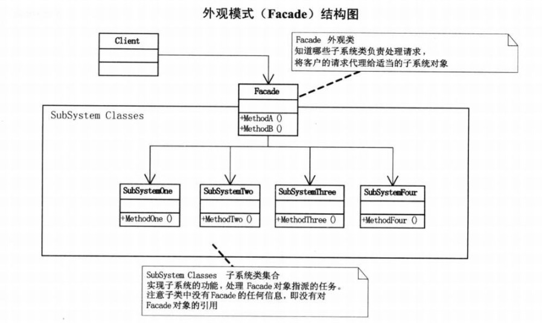

外观模式：为子系统中的一组接口提供一个一致的界面，此模式定义了一个高层接口，这个接口使得这一子系统更加容易使用。



外观类：

```Java
class Fund
{
    private Sokect1 sokect1 = new Sokect1();
    private Sokect2 sokect2 = new Sokect2();
    private Sokect3 sokect3 = new Sokect3();

    public void buyFund()
    {
        System.out.println("买入基金,包括以下操作:");
        sokect1.buySokect();
        sokect2.buySokect();
        sokect3.buySokect();
        System.out.println();
    }

    public void sellFund()
    {
        System.out.println("卖出基金,包括以下操作");
        sokect1.sellSokect();
        sokect1.sellSokect();
        sokect1.sellSokect();
        System.out.println();
    }
}
```


子类：

```Java
class Sokect1
{
    public void buySokect()
    {
        System.out.println("购买股票一!");
    }

    public void sellSokect()
    {
        System.out.println("卖出股票一");
    }
}

class Sokect2
{
    public void buySokect()
    {
        System.out.println("购买股票二!");
    }

    public void sellSokect()
    {
        System.out.println("卖出股票二");
    }
}

class Sokect3
{
    public void buySokect()
    {
        System.out.println("购买股票三!");
    }

    public void sellSokect()
    {
        System.out.println("卖出股票三");
    }
}
```


测试类：

```Java
public class FacadeDemo
{
    public static void main(String[] args)
    {
        Fund fund = new Fund();
        fund.buyFund();
        fund.sellFund();
    }
}
```

输出：

```
买入基金,包括以下操作:
购买股票一!
购买股票二!
购买股票三!

卖出基金,包括以下操作
卖出股票一
卖出股票二
卖出股票三
```

