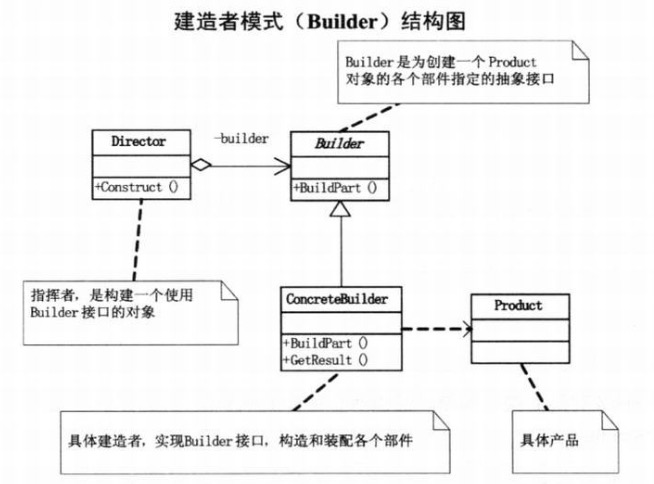

建造者模式：将一个复杂对象的建造与它的表示分离，是得同样的构建过程可以创建不同的表示。



House：产品类，需要建造的产品

```java
class House
{
    private ArrayList<String> parts = new ArrayList<String>();

    public void addPart(String part)
    {
        parts.add(part);
    }

    public void showHous()
    {
        for (String part : parts)
            System.out.println(part);
    }
}
```

Builder：建造House的抽象类，定义了建造各部分的接口

```java
abstract class AbstractHouseBuilder
{
    public abstract void buildWindow();

    public abstract void buildDoor();

    public abstract void buildWall();

    public abstract House getHouse();
}
```

Builder：建造的具体实现了，有不同的实现方式，对每个部件提供具体的建造方式

```Java
class HouseBuilder1 extends AbstractHouseBuilder
{
    private House house = new House();

    public void buildWindow()
    {
        house.addPart("铝合金窗户");
    }

    public void buildDoor()
    {
        house.addPart("铝合金门");
    }

    public void buildWall()
    {
        house.addPart("白色墙");
    }

    public House getHouse()
    {
        return house;
    }
}

class HouseBuilder2 extends AbstractHouseBuilder
{
    private House house = new House();

    public void buildWindow()
    {
        house.addPart("木质窗户");
    }

    public void buildDoor()
    {
        house.addPart("木质门");
    }

    public void buildWall()
    {
        house.addPart("木质纹理墙");
    }

    public House getHouse()
    {
        return house;
    }
}
```

Director：指挥者，负责建造的过程的流程控制，每个步骤需要做什么

```Java
class Director
{
    public void CreateHouse(AbstractHouseBuilder builder)
    {
        builder.buildWall();
        builder.buildWindow();
        builder.buildDoor();
    }
}
```

测试类

```java
public class BuilderDemo
{
    public static void main(String[] args)
    {
        Director director = new Director();
        AbstractHouseBuilder builder1 = new HouseBuilder1();
        AbstractHouseBuilder builder2 = new HouseBuilder2();

        System.out.println("房屋一:");
        director.CreateHouse(builder1);
        House house1 = builder1.getHouse();
        house1.showHous();

        System.out.println("\n房屋二:");
        director.CreateHouse(builder2);
        House house2 = builder2.getHouse();
        house2.showHous();
    }
}
```

输出结果：

```
房屋一:
白色墙
铝合金窗户
铝合金门

房屋二:
木质纹理墙
木质窗户
木质门
```