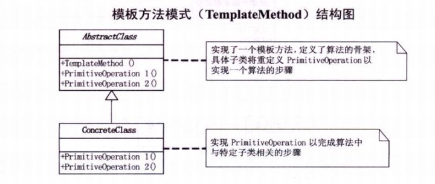

> 模板方法模式，定义一个操作中的算法骨架，而将一些不走延迟到子类中。模板方法使得子类可以不改变一个算法的结构即可重定义该算法的某些特定步骤。

模板方法模式是通过把不变行为版移到超类中，去除子类中的重复代码，提供了一个很好的代码复用平台。



抽象的模板类：把所有重复的代码集成到模板方法中

```java
abstract class AbstractClass
{
    public abstract void primitiveOperation1();

    public abstract void primitiveOperation2();

    public void templateMethod()
    {
        primitiveOperation1();
        primitiveOperation2();
        System.out.println("模板方法");
    }
}
```

具体实现类一：

```Java
class ConCreateClassA extends AbstractClass
{
    public void primitiveOperation1()
    {
        System.out.println(this.getClass().getName() + " 操作一");
    }
    public void primitiveOperation2()
    {
        System.out.println(this.getClass().getName() + " 操作二");
    }
}
```

具体实现二：

```Java
class ConCreateClassB extends AbstractClass
{
    public void primitiveOperation1()
    {
        System.out.println(this.getClass().getName() + " 操作一");
    }

    public void primitiveOperation2()
    {
        System.out.println(this.getClass().getName() + " 操作二");
    }
}
```

测试类：

```Java
public class TemplateDemo
{
    public static void main(String[] args)
    {
        AbstractClass a = new ConCreateClassA();
        AbstractClass b = new ConCreateClassB();
        a.templateMethod();
        b.templateMethod();
    }
}
```

**模版方法模式的结构**

模版方法模式由一个抽象类和一个（或一组）实现类通过继承结构组成，抽象类中的方法分为三种：

- **抽象方法：**父类中只声明但不加以实现，而是定义好规范，然后由它的子类去实现。
- **模版方法：**由抽象类声明并加以实现。一般来说，模版方法调用抽象方法来完成主要的逻辑功能，并且，模版方法大多会定义为final类型，指明主要的逻辑功能在子类中不能被重写。
- **钩子方法：**由抽象类声明并加以实现。但是子类可以去扩展，子类可以通过扩展钩子方法来影响模版方法的逻辑。
- 抽象类的任务是搭建逻辑的框架，通常由经验丰富的人员编写，因为抽象类的好坏直接决定了程序是否稳定性。


下面用一个排序算法的例子说明：

抽象的排序算法类：定义了一个抽象排序算法方法，和一个显示排序结果的模板方法类。

```Java
abstract class AbstractSort
{
    public abstract void sort(int[] arr);

    public void showSortResult(int[] arr)
    {
        sort(arr);
        System.out.println("排序后结果:");
        for (int i = 0; i < arr.length; i++)
            System.out.print(arr[i] + " ");
        System.out.println();

    }
}
```

冒泡排序算法的实现类：

```Java
class BubleSort extends AbstractSort
{
    public void sort(int[] arr)
    {
        int len = arr.length;
        for (int i = 0; i < len - 1; i++)
        {
            for (int j = 0; j < len - i - 1; j++)
            {
                if (arr[j] > arr[j + 1])
                {
                    int temp = arr[j];
                    arr[j] = arr[j + 1];
                    arr[j + 1] = temp;
                }

            }
        }
    }
}
```

选择排序的实现类：

```Java
class InsertSort extends AbstractSort
{
    public void sort(int[] arr)
    {
        int len = arr.length;
        for (int i = 1; i < len; i++)
        {
            int temp = arr[i];
            int j = i - 1;
            while (j >= 0 && temp < arr[j])
            {
                arr[j + 1] = arr[j];
                j--;
            }
            arr[++j] = temp;
        }
    }
}
```

测试类：

```Java
public class TemplateDemo
{
    public static void main(String[] args)
    {
        AbstractSort bubleSort = new BubleSort();
        bubleSort.showSortResult(new int[]{4, 6, 1, 6, 3, 6, 9, 2, 0});
        AbstractSort insertSort = new InsertSort();
        insertSort.showSortResult(new int[]{6, 3, 5, 1, 4, 7, 9, 4, 2, 0});
    }
}
```

结果：

```
排序后结果:
0 1 2 3 4 6 6 6 9 
排序后结果:
0 1 2 3 4 4 5 6 7 9 
```


参考：http://www.importnew.com/15546.html