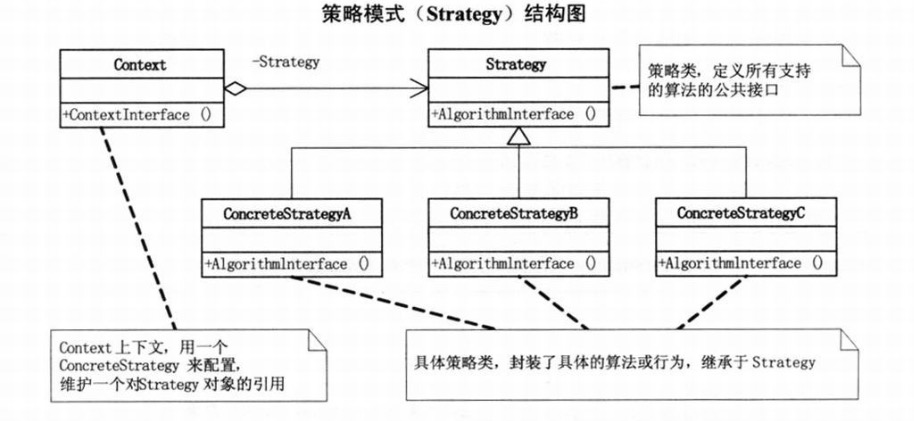

> 策略模式定义：它定义了算法家族，分别封装起来，让他们之间可以相互替换，此模式让算法的变化不会影响到使用算法的客户

下图是策略模式的结构图：





**使用场景：**

某商场对不同会员实行不同的优惠策略：

1. 初级会员，对于购买的所有商品全部98折
2. 中级会员，对于购买的所有商品全部8折
3. 高级会员，对于购买的所欲商品全部65折

抽象的折扣类：

```Java
interface MemberStrategy
{
    double calcPrice(double price);
}
```

初级、中级、高级会员的具体折扣类：

```Java
class PrimaryMemberStrategy implements MemberStrategy
{
    public double calcPrice(double price)
    {
        System.out.println("初级会员优惠:98折");
        return price * 0.98;
    }
}

class IntermediateMemberStrategy implements MemberStrategy
{
    public double calcPrice(double price)
    {
        System.out.println("中级会员优惠:8折");
        return price * 0.8;
    }
}

class AdvanceMemberStrategy implements MemberStrategy
{
    public double calcPrice(double price)
    {
        System.out.println("高级会员优惠:65折");
        return price * 0.65;
    }
}
```

价格环境类：

```Java
class PriceContext
{
  	//持有一个具体的策略对象
    private MemberStrategy strategy;

    public PriceContext(MemberStrategy strategy)
    {
        this.strategy = strategy;
    }
	//计算对应策略后的价格
    public double getMoney(double price)
    {
        return strategy.calcPrice(price);
    }
}
```

客户端测试类：

```Java
public class StrategyDemo
{
    public static void main(String[] args)
    {
        MemberStrategy strategy = new IntermediateMemberStrategy();
        PriceContext context = new PriceContext(strategy);
        double money = 78.6;
        System.out.print("原价:" + money + " \n");
        System.out.printf("会员折扣后优惠:%.2f", context.getMoney(money));
    }
}
```


策略模式是一种定义一系列算法的方法，从概念上来看，所有这些算法完成的都是相同的工作，只是实现不同，它可以以相同的方式调用所有的算法，减少了各种算法类与使用算法类之间的耦合。

**策略模式的优点**

1. 策略模式提供了管理相关的算法族的办法。策略类的等级结构定义了一个算法或行为族。恰当使用继承可以把公共的代码移到父类里面，从而避免代码重复。
2. 使用策略模式可以避免使用多重条件(if-else)语句。多重条件语句不易维护，它把采取哪一种算法或采取哪一种行为的逻辑与算法或行为的逻辑混合在一起，统统列在一个多重条件语句里面，比使用继承的办法还要原始和落后。

**策略模式的缺点**

1. 客户端必须知道所有的策略类，并自行决定使用哪一个策略类。这就意味着客户端必须理解这些算法的区别，以便适时选择恰当的算法类。换言之，策略模式只适用于客户端知道算法或行为的情况。
2. 由于策略模式把每个具体的策略实现都单独封装成为类，如果备选的策略很多的话，那么对象的数目就会很可观。