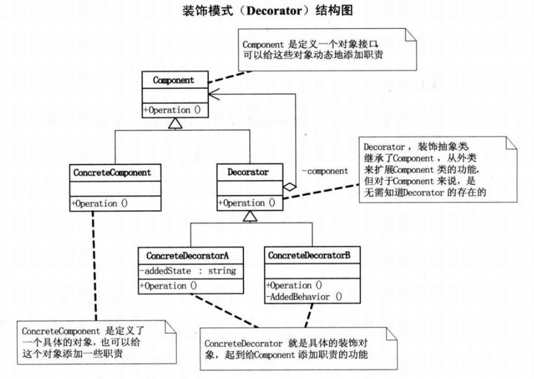

> 装饰器模式：在不必改变原有类文件和使用继承的情况下，动态的扩展一个对象的功能。他是通过创建一个包装对象也就是装饰来包裹真实的对象。

装饰器模式：在不改变接口的前提下，动态的扩展对象的功能。

代理模式：在不改变接口的前提下，控制对象的访问

下面是装饰器的结构图：



下面通过一个例子来说明装饰器模式的用法：

抽象的person类

```Java
abstract class Person
{	//显示人的信息
    public abstract void show();
}
```

具体的Man类，继承自person

```Java
class Man extends Person
{	//人的姓名
    private String name;
    public Man(String name)
    {
        this.name = name;
    }
    @Override
    public void show()
    {
        System.out.println(name + "的装扮");
    }
}
```

抽象装饰类

```Java
abstract class Decorator extends Person
{
  	//这是装饰器模式的核心
    private Person person;
    public void setPerson(Person person)
    {
        this.person = person;
    }

    @Override
    public void show()
    {
        this.person.show();
    }
}
```

具体的装饰类：

```Java
//T恤装饰类
class TshirtsDecorator extends Decorator
{
    @Override
    public void show()
    {
        super.show();
        System.out.println("装扮了T恤!");
    }
}
//鞋子装饰类
class ShoesDecorator extends Decorator
{
    @Override
    public void show()
    {
        super.show();
        System.out.println("装扮了鞋子!");
    }
}
//裤子装饰类
class TouserDecorator extends Decorator
{
    @Override
    public void show()
    {
        super.show();
        System.out.println("装扮了裤子!");
    }
}
```

测试类：

```Java
public class DecoratorDemo
{
    public static void main(String[] args)
    {
        Person man = new Man("张三");
      	//给man装饰上T恤
        TshirtsDecorator tperson = new TshirtsDecorator();
        tperson.setPerson(man);
      	//给前面的装饰好的man 继续装饰裤子
        TouserDecorator touserPerson = new TouserDecorator();
        touserPerson.setPerson(tperson);
      	//给前面的装饰好的man 继续装饰鞋子
        ShoesDecorator sperson = new ShoesDecorator();
        sperson.setPerson(touserPerson);
      	//此时sperson装饰好了T恤、裤子、鞋子，显示全部的装扮
        sperson.show();
    }
}
```

显示结果：

```
张三的装扮
装扮了T恤!
装扮了裤子!
装扮了鞋子!
```