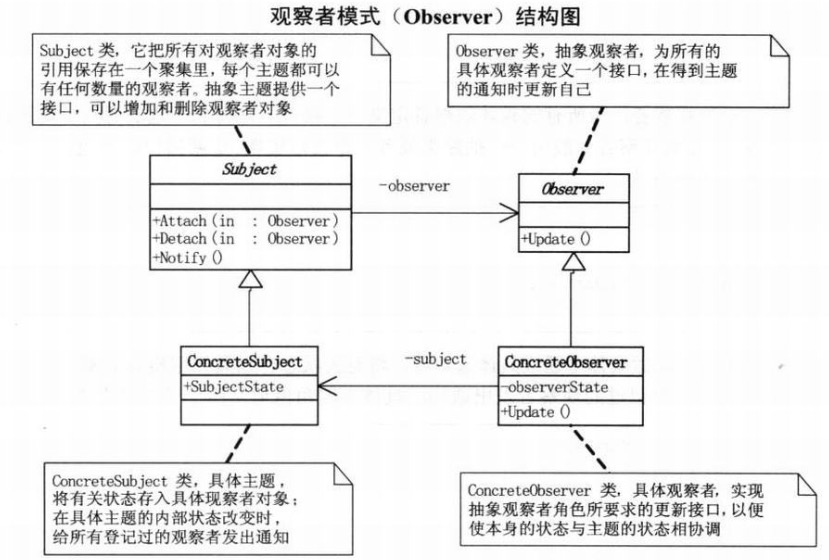

**观察者模式：**观察者模式有佳作发布-订阅模式，观察者模式定义了一种一对多的依赖关系，让多个观察者对象同时监听某一个主题对象。这个主题对象在状态发生变化时，会通知所有观察者对象，使他们能够自动更新自己。




- Subject：抽象主题（抽象被观察者），抽象主题角色把所有观察者对象保存在一个集合里，每个主题都可以有任意数量的观察者，抽象主题提供一个接口，可以增加和删除观察者对象。
- ConcreteSubject：具体主题（具体被观察者），该角色将有关状态存入具体观察者对象，在具体主题的内部状态发生改变时，给所有注册过的观察者发送通知。
- Observer：抽象观察者，是观察者者的抽象类，它定义了一个更新接口，使得在得到主题更改通知时更新自己。
- ConcrereObserver：具体观察者，是实现抽象观察者定义的更新接口，以便在得到主题更改通知时更新自身的状态。


下面是一个微信工作号发布-订阅的一个例子：

抽象的观察者

```Java
abstract class Observer
{
    public abstract void update(String message);
}
```

具体的观察者对象：微信用户

```Java
class WechatUser extends Observer
{
    private String userName;

    public WechatUser(String userName)
    {
        this.userName = userName;
    }

    public void update(String message)
    {
        System.out.println(this.userName + " " + message);
    }
}
```

抽象的主题类：

```Java
abstract class Subject
{
    public abstract void attach(Observer observer);

    public abstract void detach(Observer observer);

    public abstract void notify(String message);
}
```

具体的一个主题，主题可以有多个，这里列举了一个

```Java
class WechatSubject extends Subject
{
    private ArrayList<Observer> users = new ArrayList<Observer>();
    private String name;

    public WechatSubject(String name)
    {
        this.name = name;
    }

    public void attach(Observer observer)
    {
        users.add(observer);
    }

    public void detach(Observer observer)
    {
        users.remove(observer);
    }

    public void notify(String message)
    {
        for (Observer user : users)
        {
            user.update(name + message);
        }
    }
}
```

测试类：

```Java
public class ObserverDemo
{
    public static void main(String[] args)
    {
        Observer user1 = new WechatUser("张三");
        Observer user2 = new WechatUser("李四");
        Observer user3 = new WechatUser("王五");

        Subject subject = new WechatSubject("科技前沿");
        subject.attach(user1);
        subject.attach(user2);
        subject.attach(user3);
        subject.notify("添加了一篇文章<<云计算>>");
        System.out.println();
        subject.notify("添加了一篇文章<<大数据时代>>");
    }
}
```

测试输出：

```
张三 科技前沿添加了一篇文章<<云计算>>
李四 科技前沿添加了一篇文章<<云计算>>
王五 科技前沿添加了一篇文章<<云计算>>

张三 科技前沿添加了一篇文章<<大数据时代>>
李四 科技前沿添加了一篇文章<<大数据时代>>
王五 科技前沿添加了一篇文章<<大数据时代>>
```