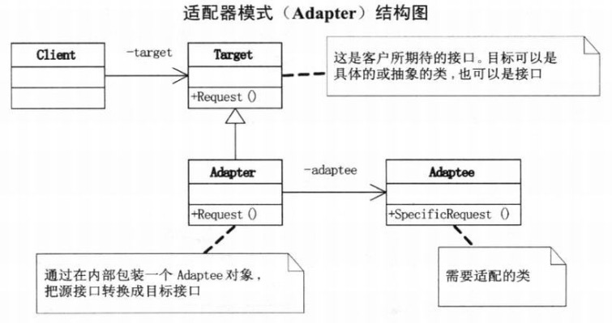

**适配器模式**：将一个类的接口转换成客户希望的另一个接口，Adapter模式使得原本由于接口不兼容而不能一起工作的那些类可以一起工作。



被适配的对象，即含有特殊功能的类，客户端需要调用这个类中的特殊功能，但是因为接口不匹配，所以不能调用，

```java
/**
 * 被适配的对象,含有特殊的功能
 */
class Adaptee
{
    public void spacialRequest()
    {
        System.out.println("被适配的对象,具有的特殊功能");
    }
}
```

适配器，

```java
/**
 * 适配器对象
 */
class Adapter extends Adaptee implements Target
{
    public void request()
    {
        super.spacialRequest();
    }
}
```

抽象的目标类

```java
/**
 * 目标对象接口
 */
interface Target
{
    void request();
}
```

抽象目标类的具体实现，只含有普通的功能

```java
/**
 * 目标对象的实现,含有的是普通的功能
 */
class ConcreateTarget implements Target
{
    public void request()
    {
        System.out.println("普通的需求");
    }
}
```

测试类

```java
public class AdapterDemo
{
    public static void main(String[] args)
    {
        Target commonTarget = new ConcreateTarget();
        commonTarget.request();
        Target adapter = new Adapter();
        adapter.request();
    }
}
```


```
普通的需求
被适配的对象,具有的特殊功能
```