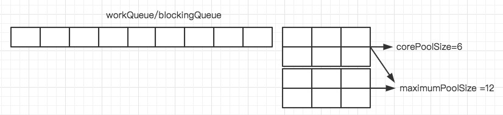

>当处理大并发请求时，由于创建线程比较耗时，故引入线程池。线程池是存放线程的容器，用户请求到来前可以提前创建好线程，请求到来时便可以直接执行任务。

线程池示意图：




```Java
public ThreadPoolExecutor(int corePoolSize,
                              int maximumPoolSize,
                              long keepAliveTime,
                              TimeUnit unit,
                              BlockingQueue<Runnable> workQueue,
                              ThreadFactory threadFactory,
                              RejectedExecutionHandler handler) {
        if (corePoolSize < 0 ||
            maximumPoolSize <= 0 ||
            maximumPoolSize < corePoolSize ||
            keepAliveTime < 0)
            throw new IllegalArgumentException();
        if (workQueue == null || threadFactory == null || handler == null)
            throw new NullPointerException();
        this.corePoolSize = corePoolSize;
        this.maximumPoolSize = maximumPoolSize;
        this.workQueue = workQueue;
        this.keepAliveTime = unit.toNanos(keepAliveTime);
        this.threadFactory = threadFactory;
        this.handler = handler;
    }
```

**corePoolSize**：线程池中保留的线程数（包括空线程），注意线程池中的线程数并不是一创建达到corePoolSize，而是在请求到达时逐步创建，最后数目达到corePoolSize。请求任务执行完毕后，若线程数<corePoolSize，则会保持当前数目。

**maximumPoolSize**：线程池中可以容纳的最大线程数

**keepAliveTime：**当线程数据超过corePoolSize时，且线程任务执行完毕后，过keepAliveTime后剩余的线程将会注销

**TimeUnit**：keepAliveTime的时间单位

**workQueue**：阻塞队列(缓冲队列)，线程池中线程数目达到达到corePoolSize后，新来的任务请求会放到缓冲队列中，采用的是FIFO模式

* 常用的是：java.util.concurrent.ArrayBlockingQueue
* LinkedBlockingQueue
* SynchronousQueue

**ThreadFactory**：制造线程的工厂

**handler**：饱和策略，当线程池中线程达到maximumPoolSize，且缓冲队列也满了之后，对新来的请求采取的策略。


#### 请求任务执行策略

* 当请求任务数小于corePoolSize时，直接在线程池创建线程，并将任务放入线程中执行
* 当请求任务数大于corePoolSize，并且剩余的请求数小于阻塞队列长度时，将任务放入阻塞队列
* 若maximumPoolSize大于corePoolsize，当阻塞队列满了后还有请求任务到来，则在线程池中创建新的线程执行。
* 若线程池中的线程数等于maximum，且阻塞队列也满了还有任务到来，则用线程饱和策略处理。

#### 线程池饱和策略

当线程池中的缓冲队列满了，同时线程池中线程数量也达到了maximum，这时候如何还有请求过来，就会采用RejectedExecutionHandler饱和策略来应对。具体饱和策略包括下面几种：

* AbortPolicy：终止策略，抛出RejectedExecutionException异常，同时处理完线程池和缓冲队列中的请求
* DiscardPolicy：抛弃策略，抛弃新来的请求，其他一切照常
* DiscardOldestPolicy:抛弃旧任务策略，将队列头元素删除，然后将新来的请求放入队尾
* CallerRunsPolicy：调用者运行策略，既不抛弃任务也不抛出异常，直接运行任务的run方法，即将任务退回给调用线程池的线程直接运行。使用该策略时线程池饱和后将由调用线程池的主线程自己来执行任务，**因此在执行任务的这段时间里主线程无法再提交新任务，从而使线程池中工作线程有时间将正在处理的任务处理完成**。


#### 创建线程池的其他方法

通过Executors类中的静态方法创建ExecutorSevice

* Executors.newFixedThreadPool();

* Executors.newSingleThreadExecutor();

* Executors.newCachedThreadPool();

* Executors.newScheduledThreadPool();