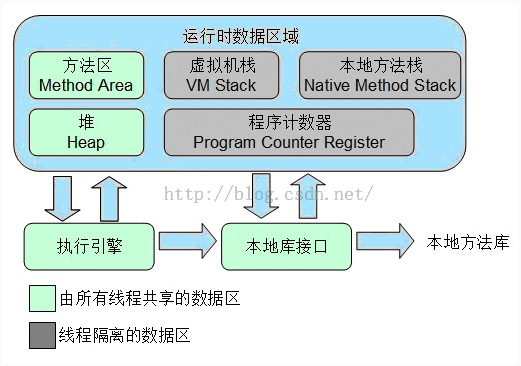

Java虚拟机在运行的过程中会把他管理的内存划分为不同的数据区域，每个区域都有自己用途，而且创建和销毁的时间都不同。主要包括以下几大块内容

* 程序计数器

  ​	程序计数器是一块比较小的内存空间，它的作用可以看做是当前线程所执行的字节码的行号指示器。Java虚拟机的多线程是通过为每个线程轮流分配处理器的时间片实现的，在任何时刻一个处理器（单核的）只能执行一条程序指令。因此为了线程切换后能回到原来的执行位置，每条线程都需要一个独立的线程计数器，每个线程之间的计数器互不影响。

* 虚拟机栈

  ​	Java虚拟机栈也是线程私有的，它的生命中周期与线程相同。虚拟机栈描述的是Java方法执行的内存模型，每个方法执行的时候都会同时创建一个栈帧，用于存储局**部变量表**、**操作栈**、**动态链接**、**方法出口**等信息。每一个方法被调用直至执行完成的过程，就对应着一个栈帧在虚拟机栈中从入栈道出栈的过程。

  ​	局部变量表存放了编译期可知的各种基本数据类型（boolean、byte、char、short、int、float、long、double）、对象引用（reference类型），它不等同于对象本身，根据不同的虚拟机实现，它可能是一个指向对象起始地址的引用指针，也可能指向一个代表对象的句柄或者其他与此对象相关的位置）和returnAddress类型（指向了一条字节码指令的地址）。

* 本地方法栈

  本地方法栈和虚拟机栈很类似，区别就是虚拟机栈是为Java方法服务，而本地方法栈是为虚拟机使用的**Native**方法服务。

* java 堆

  ​	对于大多数的应用来说，Java堆是Java虚拟机锁管理的内存中最大的一块。Java堆是被所有线程共享的一块内存区域，在虚拟机启动时创建。此内存区域的唯一目的就是存放对象实例，几乎所有对象实例都在这里分配内存。所有对象和数组都要在堆上分配。

* 方法区

  方法区和Java堆一样，是各个线程共享的内存区域，它用于存储已被虚拟机加载的类信息、常量、静态变量、即时编译器编译后的代码等数据。

  ​

  ​

JVM 配置：

-Xms:初始堆的大小  默认：物理内存的1/64

-Xmx:最大堆的大小  默认：物理内存的1/4

-Xmn:新生代大小      默认：物理内存的1/64

-Xss	:每个线程的堆栈大小    默认：1.5之后默认是1M   之前是256K

-XX:PermSize:  永久代的大小    默认：物理内存1/64

-XX:MaxPermSize：永久代的最大值   默认：物理内存的1/4

-XX:SurvivorRadio：Eden和survivor的比例  默认：8：1

