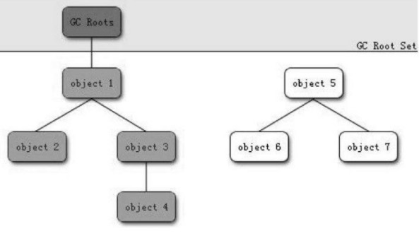

#### 一、如何确定对象已过期（垃圾）

1. 引用计数法

   当对象创建的时候就给对象创建一个对象引用计数器。每当有一个地方引用到这个对象的时候计数加1，当引用失效的时候计数器减1；任何时候只要计数器的值为0，则表明这个对象是不可能被使用的，即该对象已经过期，成为死亡对象。

   **缺点：**无法解决循环引用的问题。

   ```Java
   Object obj1 = new Object();
   Object obj2 = new Object();
   obj1 = obj2;
   obj2 = obj1;
   obj1=null;
   obj2=null;
   ```

   obj1和obj2最后都指向了null，说明这两个对象引用都失效了。但是由于obj1和obj2相互引用，两者的引用计数不为0，所以obj1和obj2不会被回收。

   Java虚拟机中一般都没有使用这种方法来进行内存管理。

2. 可达性分析

   目前主流的编程语言(java,C#等)的主流实现中,都是称通过可达性分析(Reachability Analysis)来判定对象是否存活的。这个算法的基本思路**就是通过一系列的称为“GC Roots”的对象作为起始点,从这些节点开始向下搜索,搜索所走过的路径称为引用链(Reference Chain),当一个对象到GC Roots没有任何引用链相连(用图论的话来说,就是从GC Roots到这个对象不可达)时,则证明此对象是不可用的。**如下图所示，对象object 5、object 6、object 7虽然互相有关联,但是它们到GC Roots是不可达的,所以它们将会被判定为是可回收的对象。

   

在Java语言中,可作为GC Roots的对象包括下面几种:

- 虚拟机栈(栈帧中的本地变量表)中引用的对象。
- 方法区中类静态属性引用的对象。
- 方法区中常量引用的对象。
- 本地方法栈中JNI(即一般说的Native方法)引用的对象。


#### 二.被GC判断为”垃圾”的对象一定会回收吗

即使在可达性分析算法中不可达的对象,也并非是“非死不可”的,这时候它们**暂时处于“缓刑”阶段,要真正宣告一个对象死亡,至少要经历两次标记过程**:如果对象在进行可达性分析后发现没有与GC Roots相连接的引用链,那它将会被第一次标记并且进行一次筛选,**筛选的条件是此对象是否有必要执行finalize()方法。当对象没有覆盖finalize()方法,或者finalize()方法已经被虚拟机调用过,虚拟机将这两种情况都视为“没有必要执行”。(即意味着直接回收)**

如果这个对象被判定为有必要执行finalize()方法,那么**这个对象将会放置在一个叫做F-Queue的队列之中,并在稍后由一个由虚拟机自动建立的、低优先级的Finalizer线程去执行它。**这里所谓的“执行”是指虚拟机会触发这个方法,但并不承诺会等待它运行结束,这样做的原因是,如果一个对象在finalize()方法中执行缓慢,或者发生了死循环(更极端的情况),将很可能会导致F-Queue队列中其他对象永久处于等待,甚至导致整个内存回收系统崩溃。

**finalize()方法是对象逃脱死亡命运的最后一次机会,稍后GC将对F-Queue中的对象进行第二次小规模的标记,如果对象要在finalize()中成功拯救自己——只要重新与引用链上的任何一个对象建立关联即可**,譬如把自己(this关键字)赋值给某个类变量或者对象的成员变量,那在第二次标记时它将被移除出“即将回收”的集合;**如果对象这时候还没有逃脱,那基本上它就真的被回收了。**

```Java
public class FinalizeEscapeGC {
    public static FinalizeEscapeGC SAVE_HOOK = null;

    public void isAlive() {
        System.out.println("yes,i am still alive:)");
    }

    @Override
    protected void finalize() throws Throwable {
        super.finalize();
        System.out.println("finalize mehtod executed!");
        FinalizeEscapeGC.SAVE_HOOK = this;
    }

    public static void main(String[] args) throws Throwable {
        SAVE_HOOK = new FinalizeEscapeGC();
        // 对象第一次成功拯救自己
        SAVE_HOOK = null;
        System.gc();
        // 因为finalize方法优先级很低,所以暂停0.5秒以等待它
        Thread.sleep(500);
        if (SAVE_HOOK != null) {
            SAVE_HOOK.isAlive();
        } else {
            System.out.println("no,i am dead:(");
        }
        // 下面这段代码与上面的完全相同,但是这次自救却失败了
        SAVE_HOOK = null;
        System.gc();
        // 因为finalize方法优先级很低,所以暂停0.5秒以等待它
        Thread.sleep(500);
        if (SAVE_HOOK != null) {
            SAVE_HOOK.isAlive();
        } else {
            System.out.println("no,i am dead:(");
        }
    }
}
```

> finalize mehtod executed!
> yes,i am still alive:)
> no,i am dead:(

SAVE_HOOK对象的finalize()方法确实被GC收集器触发过,并且在被收集前成功逃脱了。另外一个值得注意的地方是,代码中有两段完全一样的代码片段,执行结果却是一次逃脱成功,一次失败,这是因为**任何一个对象的finalize()方法都只会被系统自动调用一次,如果对象面临下一次回收,它的finalize()方法不会被再次执行,因此第二段代码的自救行动失败了。**因为finalize()方法已经被虚拟机调用过,虚拟机都视为“没有必要执行”。(即意味着直接回收)

#### 三、典型垃圾回收算法

1. 标记清除算法（Mark-sweep）

   当堆中的有效内存耗尽时，就会停止整个系统，调用标记清除算法，主要是做两件事：

   * 遍历所有GC Roots 把可达的对象标记为存活对象。
   * 把未标记存货的对象清除

   **缺点：**

   * 效率相对比较低，造成stop-the-world时间过长
   * 因为无用对象内存空间不是连续的，清除之后内存也不是连续的，容易造成内存碎片。

2. 复制算法（copying）（一般适用于新生代GC）

   复制算法是为了改进标记清除算法。将内存分为两块，每次只用其中的一块，在垃圾回收的时候，通过GCRoots标记存活对象，并将存活对象复制到另一块空间，同时将原先的内存空间全部清除。与上述算法相比，复制算法消除了内存碎片，提高了回收效率。

   **缺点**

   * 复制算法每次只用到了一块内存空间，造成了内存的浪费。尤其是在存活对象非常低的情况小，将内存分为两份，浪费很严重。
   * 标记清除算法不适合存活对象较多的情况（如老年代）

   ​

3. 标记整理算法（Mark-Compact）(适用于老年代GC)

   标记整理算法是考虑了标记清除算法效率低和复制算法内存空间浪费提出的改进算法。标记整理算法是在GC的时候，用GCRoots标记存活的对象，并将这些对象压缩到内存一段安装内存地址次序依次排序，使存活的对象在内存空间连续存放，然后末端的内存全部清除。

   * 标记整理算法可以解决内存碎片和内存利用率问题，但是标记整理算法效率不高。

   ​

4. Generational Collection（分代收集）算法

   现在的Java虚拟机并不是只采用一种垃圾回收机制，而是采用分代收集算法。Java虚拟机将内存根据对象存活的周期划分为几块，一般是把堆内存分为**新生代**、**老年代**。短命对象放在新生代中，长命对象放在年老代中。对于不同的代，采用不同的收集算法：

   **新生代**：存活对象较少，采用复制算法

   **老年代**：存活对象较多，采用标记-清除算法 或者标记-整理算法

   ​

   一般来说是将新生代划分为一块较大的Eden空间和两块较小的Survivor空间，每次使用Eden空间和其中的一块Survivor空间，当进行回收时，将Eden和Survivor中还存活的对象复制到另一块Survivor空间中，然后清理掉Eden和刚才使用过的Survivor空间。

   Eden：Survivor：Survivor=8：1：1；三块空间比例一般按8：1：1

   ​

   在堆区之外（方法区）还有一个代就是**永久代**（Permanet Generation），它用来存储class类、常量、方法描述等。对永久代的回收主要回收两部分内容：废弃常量和无用的类。

#### 四、典型的垃圾收集器

**新生代收集器：**

1. Serial(串行GC)收集器

   Serial收集器是一个新生代收集器，单线程执行，使用复制算法。它在进行垃圾收集时，必须暂停其他所有的工作线程(用户线程)。是Jvm client模式下默认的新生代收集器。对于限定单个CPU的环境来说，Serial收集器由于没有线程交互的开销，专心做垃圾收集自然可以获得最高的单线程收集效率。

   ​

2. ParNew(并行GC)收集器

   ParNew收集器其实就是serial收集器的多线程版本，除了使用多条线程进行垃圾收集之外，其余行为与Serial收集器一样。

   ​

3. Parallel Scavenge(并行回收GC)收集器

   Parallel Scavenge收集器也是一个新生代收集器，它也是使用复制算法的收集器，又是并行多线程收集器。parallel Scavenge收集器的特点是它的关注点与其他收集器不同，CMS等收集器的关注点是尽可能地缩短垃圾收集时用户线程的停顿时间，而parallel Scavenge收集器的目标则是达到一个可控制的吞吐量。吞吐量= 程序运行时间/(程序运行时间 + 垃圾收集时间)，虚拟机总共运行了100分钟。其中垃圾收集花掉1分钟，那吞吐量就是99%。

   ​

**老年代收集器**：

4. Serial Old(串行GC)收集器

   Serial Old是Serial收集器的老年代版本，它同样使用一个单线程执行收集，使用“标记-整理”算法。主要使用在Client模式下的虚拟机。

   ​

5. Parallel Old(并行GC)收集器

   Parallel Old是Parallel Scavenge收集器的老年代版本，使用多线程和“标记-整理”算法。

   ​

6. CMS(Concurrent Mark Sweep，并发GC)收集器

   CMS(Concurrent Mark Sweep)收集器是一种以获取最短回收停顿时间为目标的收集器。大致分为4步：

   > ①.初始标记(CMS initial mark)

   > ②.并发标记(CMS concurrenr mark)

   > ③.重新标记(CMS remark)

   > ④.并发清除(CMS concurrent sweep)

   其中初始标记、重新标记这两个步骤任然需要停顿其他用户线程。初始标记仅仅只是标记出GC ROOTS能直接关联到的对象，速度很快，并发标记阶段是进行GC ROOTS 根搜索算法阶段，会判定对象是否存活。而重新标记阶段则是为了修正并发标记期间，因用户程序继续运行而导致标记产生变动的那一部分对象的标记记录，这个阶段的停顿时间会被初始标记阶段稍长，但比并发标记阶段要短。

   由于整个过程中耗时最长的并发标记和并发清除过程中，收集器线程都可以与用户线程一起工作，所以整体来说，CMS收集器的内存回收过程是与用户线程一起并发执行的。

   CMS收集器的优点：并发收集、低停顿，但是CMS还远远达不到完美，器主要有三个显著缺点：

   CMS收集器对CPU资源非常敏感。在并发阶段，虽然不会导致用户线程停顿，但是会占用CPU资源而导致引用程序变慢，总吞吐量下降。CMS默认启动的回收线程数是：(CPU数量+3) / 4。

   CMS收集器无法处理浮动垃圾，可能出现“Concurrent Mode Failure“，失败后而导致另一次Full  GC的产生。由于CMS并发清理阶段用户线程还在运行，伴随程序的运行自热会有新的垃圾不断产生，这一部分垃圾出现在标记过程之后，CMS无法在本次收集中处理它们，只好留待下一次GC时将其清理掉。这一部分垃圾称为“浮动垃圾”。也是由于在垃圾收集阶段用户线程还需要运行，
   即需要预留足够的内存空间给用户线程使用，因此CMS收集器不能像其他收集器那样等到老年代几乎完全被填满了再进行收集，需要预留一部分内存空间提供并发收集时的程序运作使用。在默认设置下，CMS收集器在老年代使用了68%的空间时就会被激活，也可以通过参数-XX:CMSInitiatingOccupancyFraction的值来提供触发百分比，以降低内存回收次数提高性能。要是CMS运行期间预留的内存无法满足程序其他线程需要，就会出现“Concurrent Mode Failure”失败，这时候虚拟机将启动后备预案：临时启用Serial Old收集器来重新进行老年代的垃圾收集，这样停顿时间就很长了。所以说参数-XX:CMSInitiatingOccupancyFraction设置的过高将会很容易导致“Concurrent Mode Failure”失败，性能反而降低。

   最后一个缺点，CMS是基于“标记-清除”算法实现的收集器，使用“标记-清除”算法收集后，会产生大量碎片。空间碎片太多时，将会给对象分配带来很多麻烦，比如说大对象，内存空间找不到连续的空间来分配不得不提前触发一次Full  GC。为了解决这个问题，CMS收集器提供了一个-XX:UseCMSCompactAtFullCollection开关参数，用于在Full  GC之后增加一个碎片整理过程，还可通过-XX:CMSFullGCBeforeCompaction参数设置执行多少次不压缩的Full  GC之后，跟着来一次碎片整理过程。

**收集新生代和老年代**

1. G1收集器（Garbage First)）

   G1(Garbage First)收集器是JDK1.7提供的一个新收集器，G1收集器基于“标记-整理”算法实现，也就是说不会产生内存碎片。还有一个特点之前的收集器进行收集的范围都是整个新生代或老年代，而G1将整个Java堆(包括新生代，老年代)。