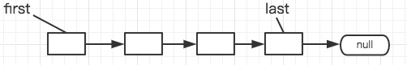
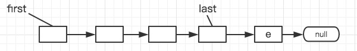
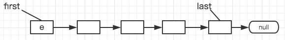

### 集合类介绍

- #### ArrayList（非线程安全）

  - ArrayList底层采用数组存放数据

  - 创建时可以指定初始容量的大小，若不指定则默认是10.

  - ArrayList扩容是1.5倍的增长

    ```Java
    int newCapacity = oldCapacity + (oldCapacity >> 1);
    //将数组内容拷贝到新创建的数组中，并返回新创建数组的引用
    elementData = Arrays.copyOf(elementData, newCapacity);
    ```

  - arrayList不是线程安全的容器

  - 当数组元素已经达到数组容量时才会发生扩容

- #### Vector（线程安全）

  - Vector与ArrayList实现基本相同，当时Vector是线程安全的，每个操作方法中加了synchronized关键字，属于线程安全的容器

  - 创建Vector时可以指定初始容量，也可以指定发生扩容时扩容的大小。若没指定初始容量大小默认是10；若没有指定扩容的大小，默认是两倍增长，否则

    ```Java
    int newCapacity = oldCapacity + ((capacityIncrement > 0) ?
                                             capacityIncrement : oldCapacity);
    ```

- #### LinkedList（非线程安全）

  - LinkedList底层实现是通过链表，每个元素是一个Node结点

    ```Java
    private static class Node<E> {
            E item;
            Node<E> next;
            Node<E> prev;

            Node(Node<E> prev, E element, Node<E> next) {
                this.item = element;
                this.next = next;
                this.prev = prev;
            }
        }
    ```

  - 定义两个变量first、last分别指向链表的头结点和尾结点

  - 实现了Queue 接口

    - offer(E e) 操作调用add方法，将元素插入队列的尾部

      

      添加元素e之后

      

    - poll操作删除队列头元素，删除的是first结点

    - element操作返回队列头结点，即first结点，如果first==null 抛出异常

    - peek操作返回队列头结点，即first结点，如果first==null 则返回null

  - 实现了Stack功能

    - push添加元素，注意是在链表的头结点处插入元素

      

    - pop 操作是删除链表的头结点

    - peek 操作返回链表的头结点