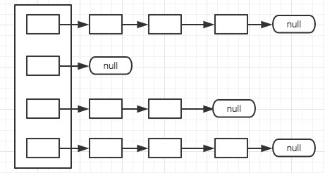
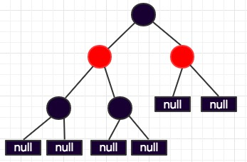
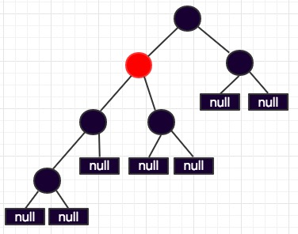
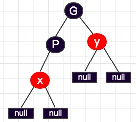
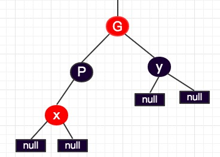
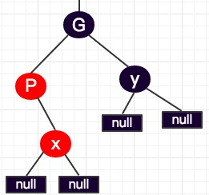
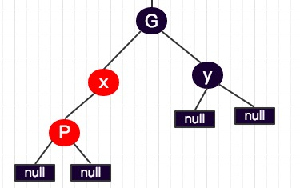
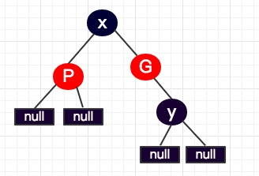

### HashMap（非线程安全）

- HashMap底层由一个EntrySet数组构成，每个EntrySet都是一个链表

  ```Java
  	static class Entry<K,V> implements Map.Entry<K,V> {
          final K key;
          V value;
          Entry<K,V> next;
          int hash;
     		Entry(int h, K k, V v, Entry<K,V> n) {
              value = v;
              next = n;
              key = k;
              hash = h;
          }
   		 ……
  	}
  ```

  

- loadFactor，加载因子，默认值是0.75。当map中的元素个数size>=table.length*loadFactor时，hashMap 会进行扩容。如果loadFactor过小，则空间浪费比较严重；若loadFactor过大，则hashmap冲突的概率会加大，造成一些EntrySet链表过长。

- 创建hashMap时可以指定初始容量和加载因子，默认初始容量为16，加载因子为0.75

- 计算元素o 在table数组中的下标，其中h是根据o.key计算的hash值，length是指数组的长度

  ```Java
    static int indexFor(int h, int length) {
          return h & (length-1);
      }
  ```

- hashMap中的key和value都可以为null，当key==null时，该元素会放在table下标为0的位置上。

  ```java
  if (key == null)
      return putForNullKey(value);
  ```

  ```java
  private V putForNullKey(V value) {
      for (Entry<K,V> e = table[0]; e != null; e = e.next) {
        		//如果map中原来已经存在key值为null的元素，则更新value值
              if (e.key == null) {
                  V oldValue = e.value;
                  e.value = value;
                  e.recordAccess(this);
                  return oldValue;
              }
          }
          modCount++;
    		// hash值为0，key=null  value=value  在table中位置index=0
          addEntry(0, null, value, 0);
          return null;
  }
  ```

- map中添加新元素时，是将元素添加在链表头。

  ```java
  	void addEntry(int hash, K key, V value, int bucketIndex) {
        	//threshold = table.length * loadFactor  判断是否需要扩容
          if ((size >= threshold) && (null != table[bucketIndex])) {
              resize(2 * table.length);
              hash = (null != key) ? hash(key) : 0;
              bucketIndex = indexFor(hash, table.length);
          }
          createEntry(hash, key, value, bucketIndex);
      }
  ```

  ```java
  	//创建一个新的结点，插入链表头。即创建新元素时是插入链表头的。
  	void createEntry(int hash, K key, V value, int bucketIndex) {
          Entry<K,V> e = table[bucketIndex];
        	//table[bucketIndex]表示的是链表头，链表头指向了新建的结点，同时新节点的next指针指向			了原来的链表头结点。
          table[bucketIndex] = new Entry<>(hash, key, value, e);
          size++;
      }	
  ```

- map扩容是原来table长度的2倍。扩容时，需要遍历原来的map，将每个元素重新计算hash值和在新table的中位置，再放入新的table中。

  ```Java
  void transfer(Entry[] newTable, boolean rehash) {
          int newCapacity = newTable.length;
          for (Entry<K,V> e : table) {
              while(null != e) {
                  Entry<K,V> next = e.next;
                  if (rehash) {
                      e.hash = null == e.key ? 0 : hash(e.key);
                  }
                	//计算元素在新table中的位置
                  int i = indexFor(e.hash, newCapacity);
                	//newTable[i]是其中一个链表的链表头
                  e.next = newTable[i];
                  newTable[i] = e;
                  e = next;
              }
          }
      }
  ```


---

### LinkedHashMap(非线程安全)

继承自HashMap，在HashMap的基础之上维护着一条双向链表。LinkedHashMap中每个元素Entry<K,V>中包含一个before和一个after指针。同时LinkedHashMap中还有一hearder指针。LinkedhashMap中还有一个标志位accessOrder，当这个位false时，链表是按节点的插入顺序排列的，当为true时，是按访问顺序排序的。

LinkedHashMap可以实现LRU（latest recently used）算法，将最近使用的放入表头


### Hashtable(线程安全)

- HashTable是线程安全的容器，而HashMap是非线程安全的

- HashTable 继承自Dictionary类，该类自Java1.0就已经存在；HashMap继承自**AbstractMap**,这个抽象类是是在1.2才加入的

- Hashtable 不允许key和value为空值null；HashMap允许key和value为空值null。

- Hashtable的hash函数不同

  ```Java
  private int hash(Object k) {
          // hashSeed will be zero if alternative hashing is disabled.
          return hashSeed ^ k.hashCode();
      }
  ```

- HashTable 默认初始容量是11，加载因子默认是0.75

- HashTable计算index方法与HashTable不同

  ```Java
  //hashtable 计算index
  int index = (hash & 0x7FFFFFFF) % tab.length;
  // HashMap 计算下标
  return h & (length-1);
  ```

- HashTable扩容时原来table数组长度的两倍加1

  ```Java
  int newCapacity = (oldCapacity << 1) + 1;
  ```

---


### TreeMap(非线程安全)

> Treemap 底层是通过红黑树算法实现的，想要了解TreeMap的实现必须先对红黑树有一定了解，下面先介绍一下红黑树的相关概念

#### 红黑树简介

红黑树是一种自平衡的二叉查找树，具有二叉树的所有特性。红黑树具有如下五点性质

1. 结点要么是红色要么是黑色
2. 根节点是黑色
3. 每个叶子结点是黑色
4. 从根节点到叶子结点的所有路径上不能有两个连续的红色结点
5. 从任一结点到其每个叶子结点的所有路径都包含相同数目的黑色结点




​											红黑树



​							      普通二叉树，根节点的左右子树不平衡

#### TreeMap介绍

##### TreeMap相关定义

TreeMap中包含信息中比较重要的有如下这些

```Java
//比较器，用于比较结点的大小
private final Comparator<? super K> comparator;
//根节点
private transient Entry<K,V> root = null;
//元素的个数
private transient int size = 0;
//map修改次数
private transient int modCount = 0;
```

对叶子结点的定义如下：

```Java
static final class Entry<K,V> implements Map.Entry<K,V> {
        K key;
        V value;
        Entry<K,V> left = null;
        Entry<K,V> right = null;
        Entry<K,V> parent;
  		//新生成的结点都是黑色的
        boolean color = BLACK;
  
        Entry(K key, V value, Entry<K,V> parent) {
            this.key = key;
            this.value = value;
            this.parent = parent;
        }
}
```

##### TreeMap添加元素方法put

添加元素的时候首先判断root结点是否为空，如果是空直接创建新的结点作为map的根节点；如果不为空，则根据比较器（若创建TreeMap时未指定比价器，则以key的字典序作为比较器）找到元素的位置。寻找元素位置时是对二叉搜索树进行查找，key>node 则查找右子树，key<node查找左子树，key==node 直接更新node的value值。

```Java
public V put(K key, V value) {
        Entry<K,V> t = root;
  		//根节点为空
        if (t == null) {
            compare(key, key); // type (and possibly null) check
            root = new Entry<>(key, value, null);
            size = 1;
            modCount++;
            return null;
        }
        int cmp;
        Entry<K,V> parent;
        // split comparator and comparable paths
        Comparator<? super K> cpr = comparator;
  		//创建TreeMap时已经指定比较器
        if (cpr != null) {
            do {
                parent = t;
                cmp = cpr.compare(key, t.key);
              	//父节点大于新加的结点，则遍历左子树
                if (cmp < 0)
                    t = t.left;
              	//父节点小于新加结点，则遍历右子树
                else if (cmp > 0)
                    t = t.right;
                else
               //父节点等于新加结点，则直接更新父节点的value值
                    return t.setValue(value);
            } while (t != null); //循环结束还没找到结点key和新节点key相等，此时parent指向了叶子结点
        }
        else {
            if (key == null)
                throw new NullPointerException();
          	//未指定比较器，则比较器设为字典序
            Comparable<? super K> k = (Comparable<? super K>) key;
          	//结点位置查找过程和上面一样
            do {
                parent = t;
                cmp = k.compareTo(t.key);
                if (cmp < 0)
                    t = t.left;
                else if (cmp > 0)
                    t = t.right;
                else
                    return t.setValue(value);
            } while (t != null);
        }
  		//如果遍历后还未找到key,则创建新节点，新节点的parent指向前面遍历后的最后一个叶子结点
        Entry<K,V> e = new Entry<>(key, value, parent);
  		//如果新节点的key小于parent的key,则新节点作为parent的左孩子，反之作为右孩子
        if (cmp < 0)
            parent.left = e;
        else
            parent.right = e;
  		// 添加完新节点后 需要对这棵树进行调整平衡
        fixAfterInsertion(e);
        size++;
        modCount++;
        return null;
    }
```

上面的put方法只是将新节点插入了适当的位置，保证了此时的二叉树是二叉搜树，但它不一是平衡二叉树。所以在插入新节点后有一个修正操作fixAfterInsertion(e)，修正操作就是保证二叉树是平衡二叉树。

 修改后 


 修改后   

最后修改成 

```Java
private void fixAfterInsertion(Entry<K,V> x) {
  		//将新插入的结点设为红色
        x.color = RED;
		// 循环直到 x不是根结点，且x的父节点不为红色
        while (x != null && x != root && x.parent.color == RED) {
          	//如果结点x的父节点P  是P的父节点G的左子树
            if (parentOf(x) == leftOf(parentOf(parentOf(x)))) {
              	
                Entry<K,V> y = rightOf(parentOf(parentOf(x)));
                if (colorOf(y) == RED) {
                    setColor(parentOf(x), BLACK);
                    setColor(y, BLACK);
                    setColor(parentOf(parentOf(x)), RED);
                    x = parentOf(parentOf(x));
                } else {
                    if (x == rightOf(parentOf(x))) {
                        x = parentOf(x);
                        rotateLeft(x);
                    }
                    setColor(parentOf(x), BLACK);
                    setColor(parentOf(parentOf(x)), RED);
                    rotateRight(parentOf(parentOf(x)));
                }
              //否则结点x的父节点P  是P父节点G的右子树     G
            } else {                          //    y   P
              	//                                        x   x可能是左子树也可能是右子树
                Entry<K,V> y = leftOf(parentOf(parentOf(x)));
                if (colorOf(y) == RED) {
                    setColor(parentOf(x), BLACK);
                    setColor(y, BLACK);
                    setColor(parentOf(parentOf(x)), RED);
                    x = parentOf(parentOf(x));
                } else {
                  	//如果x是P的左孩子
                    if (x == leftOf(parentOf(x))) {
                        x = parentOf(x);
                        rotateRight(x);
                    }
                    setColor(parentOf(x), BLACK);
                    setColor(parentOf(parentOf(x)), RED);
                    rotateLeft(parentOf(parentOf(x)));
                }
            }
        }
        root.color = BLACK;
    }
```


TreeMap 查找复杂度是O(logN)，HashMap的查找复杂度是O(1)，查找效率来说HashMap 效率更高。但是TreeMap存储的数据是有序的，而HashMap存储的数据是无序的。