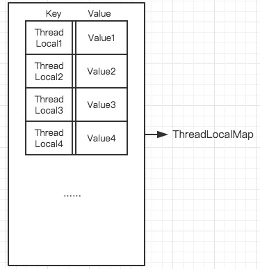

> ThreadLocal 为每个线程提供一个变量的独立副本，每个线程对ThreadLocal变量的修改不会相互影响。它为给每个线程提供一个获取存放变量的一个key。

ThreadLocal类中定义了一个内部数据结构ThreadLoalMap，ThreadLocalMap是用来存放每个线程的ThreadLocal变量值Value。但是ThreadLocal中并没有定义ThreadLocalMap变量，ThreadLocalMap是在线程中定义的，用来存放每个线程中的多个ThreadLocal所对应的Value值。下面是Thread类中定义的ThreadLocalMap成员变量

```Java
ThreadLocal.ThreadLocalMap threadLocals = null;
```

ThreadLocaMap是一个Entry数组，Entry中包含key和Value，其中key就是threadLocal，并且key是弱引用的。Entry结构定义如下

```Java
static class Entry extends WeakReference<ThreadLocal> {
            /** The value associated with this ThreadLocal. */
            Object value;

            Entry(ThreadLocal k, Object v) {
                super(k);
                value = v;
            }
        }
```



​	如上图是其中一个Thread中的ThreadLocalMap数据结构的示意图，其中key是ThreadLocal，Value是ThreadLocal变量在其中一个线程的值。

​	因为每个线程中都有这么一个ThreadLocalMap，所以当线程对ThreadLocal变量进行修改时，其实就是对Thread本身的ThreadLocalMap进行修改

### ThreadLocal中的方法

* set()

  ```java
  public void set(T value) {
    		//获取当前线程
          Thread t = Thread.currentThread();
    		//获取当前线程的ThreadLocalMap
          ThreadLocalMap map = getMap(t);
    		//如果Map不存在则创建
          if (map != null)
              map.set(this, value);
          else
              createMap(t, value);
      }
  ```

  getMap(t)是获取Thread中的ThreadLocalMap变量

  ```Java
  ThreadLocalMap getMap(Thread t) {
    		//返回线程中的ThreadLocalMap变量
          return t.threadLocals;
      }
  ```

  createMap是给Thread创建一个ThreadLocalMap，并将值放入Map中

  ```Java
  void createMap(Thread t, T firstValue) {
          t.threadLocals = new ThreadLocalMap(this, firstValue);
      }
  ```

* get()

  ```java
  public T get() {
          Thread t = Thread.currentThread();
          ThreadLocalMap map = getMap(t);
          if (map != null) {
            	//通过key ThreadLocal找到Map中的对应的Entry
              ThreadLocalMap.Entry e = map.getEntry(this);
              if (e != null)
                	//返回Entry中的值
                  return (T)e.value;
          }
          return setInitialValue();
      }
  ```

  getEntry()查找方法和HashMap中查找有点类似，都是通过HashCode 来定位。但是两者计算hash值得方法不同，而且如果并命中的话接下来的查找过程也不同。

  ```Java
  private Entry getEntry(ThreadLocal key) {
    			//通过threadLocalHashCode计算在其在数组中的位置
              int i = key.threadLocalHashCode & (table.length - 1);
              Entry e = table[i];
              if (e != null && e.get() == key)
                  return e;
              else //如果对应的位置上不是要找的值，则会进行下一步操作
                  return getEntryAfterMiss(key, i, e);
          }
  ```

  如果计算的index不命中的话，会往下一直查找

  ```Java
  private Entry getEntryAfterMiss(ThreadLocal key, int i, Entry e) {
              Entry[] tab = table;
              int len = tab.length;

              while (e != null) {
                  ThreadLocal k = e.get();
                  if (k == key)
                      return e;
                  if (k == null)
                      expungeStaleEntry(i);
                  else
                    	// 
                      i = nextIndex(i, len);
                  e = tab[i];
              }
              return null;
          }
  ```

  nextIndex()会让下标值加1，如果大于len则变成0

  ```Java
  private static int nextIndex(int i, int len) {
              return ((i + 1 < len) ? i + 1 : 0);
          }
  ```


**ThreadLocal使用**

```Java
public class Test
{
	public static void main(String[] args)
	{
		ThreadLocal<Integer> num = new ThreadLocal<>();
		num.set(1);
		new Thread(new MyRunnable(num, 5)).start();
		new Thread(new MyRunnable(num, 8)).start();
		System.out.println(Thread.currentThread().getName() + " " + num.get());
	}
}

class MyRunnable implements Runnable
{
	ThreadLocal<Integer> num;
	private int value;

	public MyRunnable(ThreadLocal<Integer> num, int value)
	{
		this.num = num;
		this.value = value;
	}

	@Override
	public void run()
	{
		num.set(value);
		System.out.println(Thread.currentThread().getName() + " " + num.get());
	}
}
```

输出：

```
main 1
Thread-1 8
Thread-0 5
```