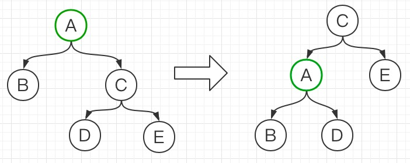
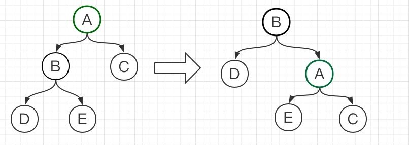
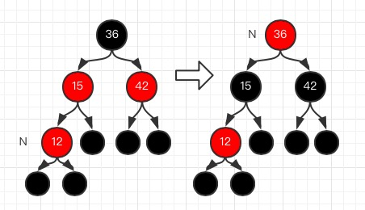
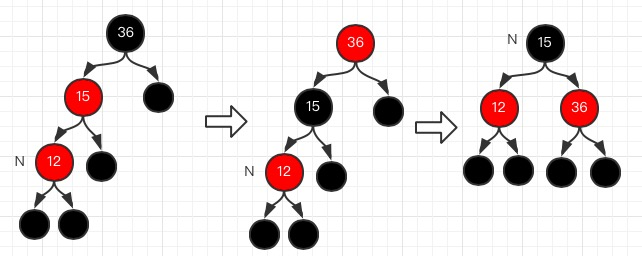
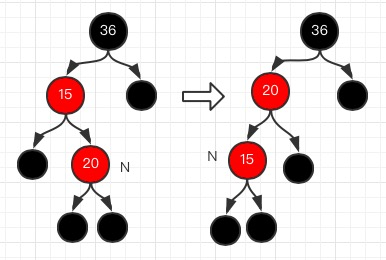
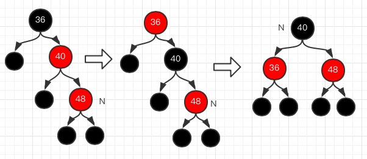
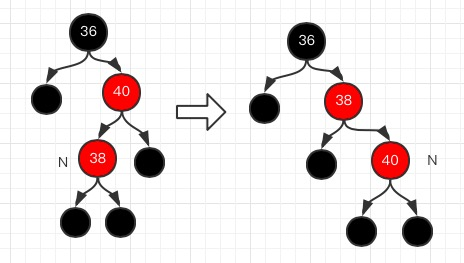
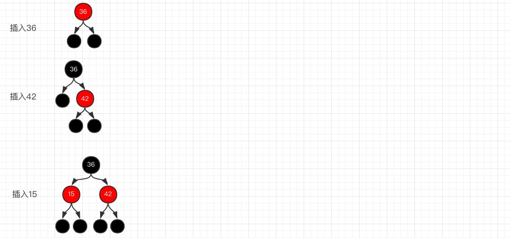
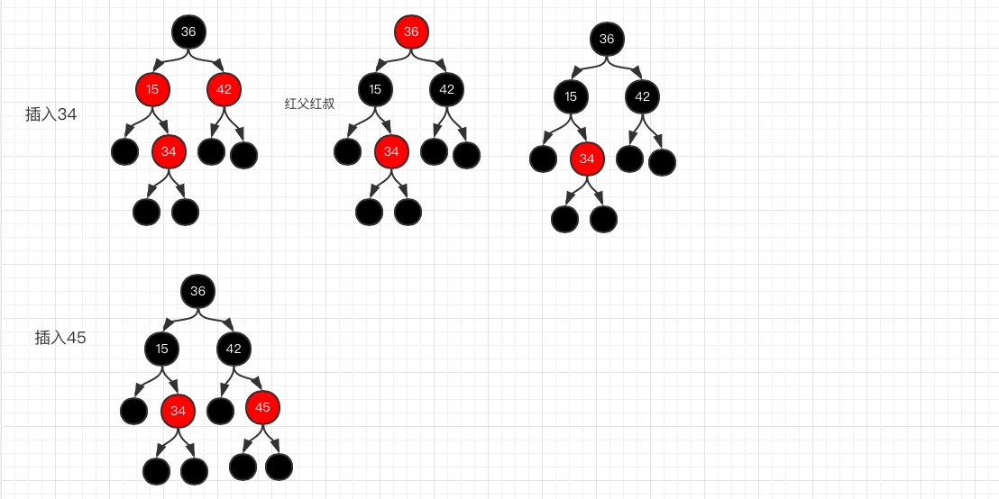
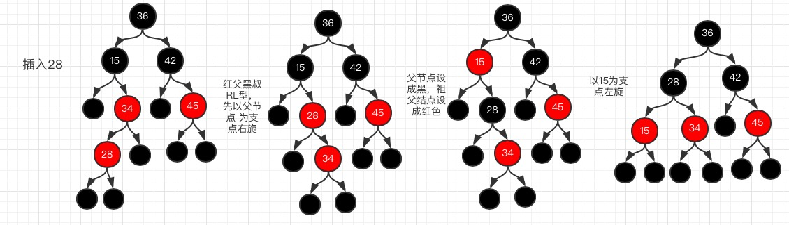

### 红黑树的性质

1. 根节点是黑色的
2. 红黑树中只有红色结点和黑色结点
3. 叶子结点时黑色的
4. 从根节点到叶子节点之间的路径上不能出现连续两个红色结点
5. 从任意结点到叶子结点的路径上黑色结点个数相同。

### 红黑树的基本操作：左旋、右旋

#### 左旋

​	以根节点A作为基点进行左旋：

​									左旋效果图

#### 右旋

​	以根节点A作为基点进行右旋：

​									右旋效果图

### 红黑树结点添加

​	红黑树添加新节点，必须将新加结点设成红色，因为这样能够保证从任一点到其叶子结点的路径黑色结点个数相同。因此添加新节点可能会违背红黑树的性质1和性质4，故需对其进行旋转和着色操作。具体操作分为以下几点

#### 1. 添加结点为根结点

​	操作：直接将当前结点置成黑色即可

#### 2.黑父

​	操作：这种情况下红黑树的性质没有发生变化，不用改变

#### 3.红父

##### 红父红叔

​	当前结点的父亲结点和叔叔结点都是红色，此时只需将父亲结点和叔叔结点设成黑色，祖父结点设成红色。然后将祖父结点设成当前结点，循环进行操作

如图，新插入结点12，其父亲结点15和叔叔结点42都是红色的。因此将父亲结点和叔叔结点设成黑色，将祖父结点36设成红色。接着讲祖父结点36设成当前结点，进行循环操作

##### 红父黑叔

* LL型红父黑叔

  当父亲结点在祖父结点的左侧，且当前结点也在父亲结点的左侧，即是LL型的结构。

  具体操作：

  1. 将父亲结点设成黑色
  2. 将祖父结点设成红色
  3. 以祖父结点为支点进行左旋操作
  4. 把父亲结点设成当前结点进行循环操作。

  

  如图新插入结点12，父亲结点15是红色，叔叔结点是黑色。先着色，然后左旋

  ​

* LR型红父黑叔

  当父亲结点在祖父结点的左侧，且当前结点也在父亲结点的右侧，即是LR型的结构。

  具体操作如下：

  1. 将父亲结点设成当前结点
  2. 以新的当前结点为支点进行左旋，将LR型结构编程LL型结构
  3. 以新的当前结点进行循环操作（后面是按LL型进行变换）

  ​

* RR型红父黑叔

  当父亲结点在祖父结点的右侧，且当前结点也在父亲结点的右侧，即RR型结构。

  具体操作如下：

  1. 将父亲结点设成黑色
  2. 将祖父结点设成红色
  3. 以祖父结点为支点进行左旋操作
  4. 将父亲结点设成当前结点，然后进行循环操作

  ​

  ​如图，先对父节点和祖父结点着色，父亲结点40设成黑色，祖父结点36设成红色。接着以36为支点进行，进	行左旋操作。

* RL型红父黑叔

  当父亲结点在祖父结点的右侧，且当前结点在父亲结点的左侧，即RL型结构。

  具体操作如下：

  1. 将父亲结点设为当前结点
  2. 以新的当前结点为支点进行右旋操作
  3. 以新的当前结点为进行循环操作（后面是按RR型进行操作）

  

下面是添加结点的一个过程：

### 红黑树结点删除

