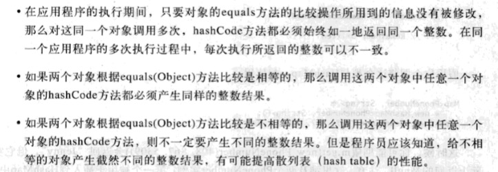
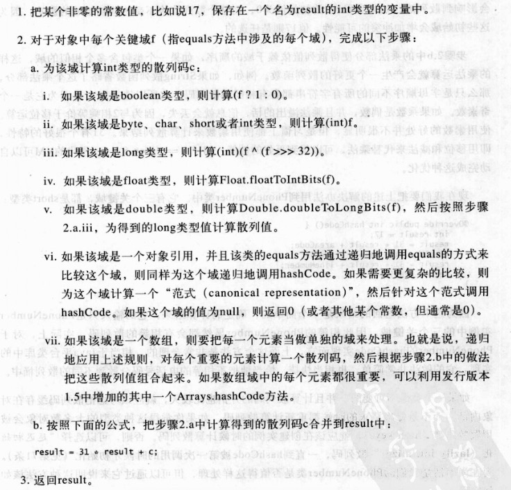

# Effective Java 阅读笔记

#### 第一条：用静态工厂方法代替构造器

```java
public static Book getNewInstance()
{
  	return new Book();
}
```


#### 第二条：遇到多个构造器参数时要考虑用构造器


调用方法：

```java
NutritionFacts cocaCola = new NutritionFacts.Builder(240,8).calories(100).sodium(35).carbohydrate(27).build();
```


#### 第三条：用私有构造器或者枚举类型强化singleton属性

```java
public class Elvis
{
    public static final Elvis INSTANCE = new Elvis();
    private Elivs(){}
}
```

保证了Elvis对象的唯一性，一旦被实力化只能存在一个Elvis对象。

```java
public class Elvis
{
    private static final Elvis INSTANCE = new Elvis();
    private Elivs(){}
    public static Elvis getInstance()
    {
      return INSTANCE;
    }
}
```


#### 第四条：通过私有构造器强化不可实例化的能力

```java
public class UtiltyClass
{
  	private UtiltyClass(){}
  	public static void methods(){……}
}
```

工具类一般不能实例化，所以将构造器私有化，防止 用户实例化工具类。


#### 第五条：避免创建不必要的对象

```java
String s = new String("i am a boy!");
```

"i am a boy!"本身就是一个String对象，这相当于创建了两个String对象。尤其注意基本类型的自动装箱和拆箱功能。

```java
/*错误做法
Long num = 10000L;  
*/
long num = 1000L;
```


#### 第六条：消除过期对象的引用

* stack 弹出数据之后及时置空。
* 一但元素被释放，则该元素包含的任何对象引用都应该被清空。


#### 第七条：避免使用终结方法


#### 第八条：覆盖equals时请遵守通用的约定

* 自反性：对于任何非null得引用值x,x.equals(x)必须返回true
* 对称性：对于任何非null的引用值x和y，当且仅当y.equals(x)返回true时，x.equals(y)必须返回true
* 传递性：x.equals(y)=true   y.equals(z)=true   ——> x.equals(z)=true
* 一致性：对于任何非null的引用值x和y，只要equals的比较操作在对象中所用的信息没有被修改，多次调用x.equals(y)必须始终返回true或false。


#### 第九条：覆盖equals时总要覆盖hashCode

​	每个覆盖了equals方法的类中，也必须覆盖hashCode方法。如果不这样做的话就会违反Object，hashCode的通用约定。

​	约定内容如下：



​	hashCode计算应该把每个equals比较的域都考虑进去，但是如果一个域值可以根据另一个域值推到出来则可以将其中一个域值排除。

​	其中一种计算方法如下：



```java
@override
public int hashCode()
{
  	int result =17;
  	result = 31*result + areaCode;
  	result = 31*result + prefix;
  	result = 31*result + lineNumber;
  	return result;
}
```


#### 第十条：始终要覆盖toString方法


#### 第十一条：谨慎的覆盖clone方法


