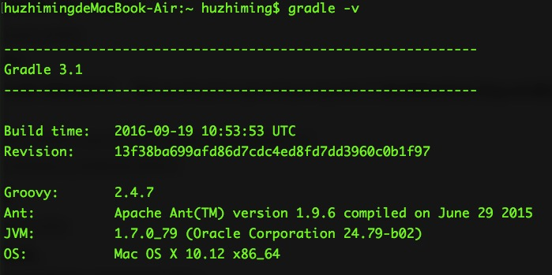
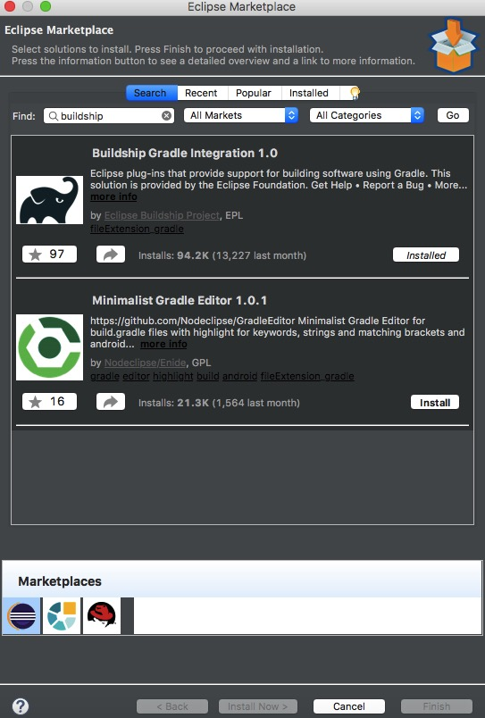
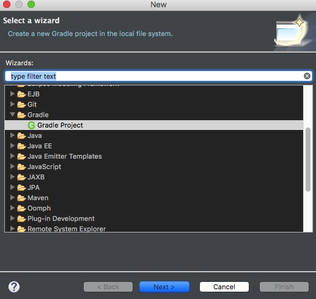
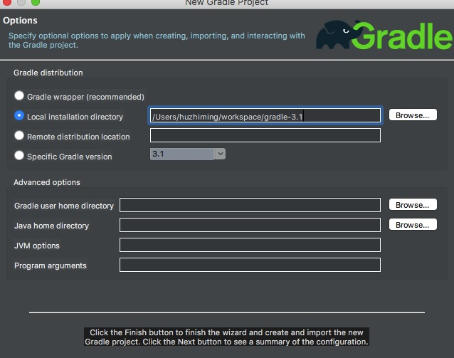
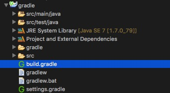
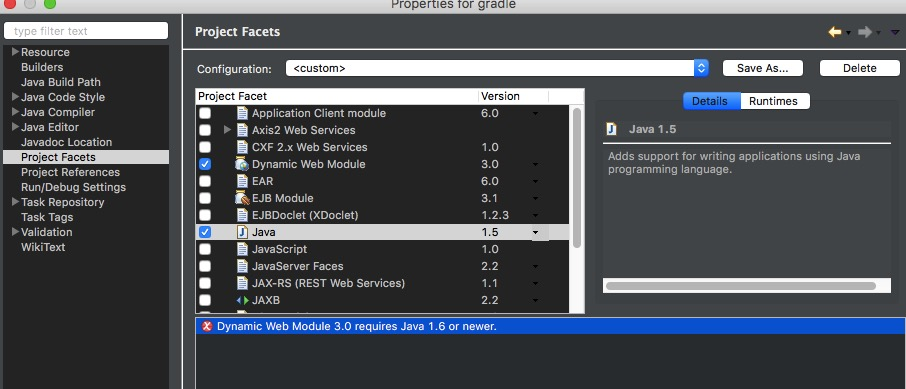
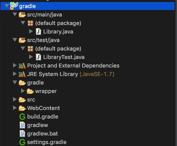

# Mac系统中eclipse 配置gradle

#### 一、gradle 简介

​	Gradle是一个基于Apache Ant和Apache Maven概念的项目自动化建构工具。它使用一种基于Groovy的特定领域语言(DSL)来声明项目设置，抛弃了基于XML的各种繁琐配置。(项目自动化构建工具，摘自百度百科)


#### 二、Mac系统下安装gradle

* 首先从网上下载最新的gradle([ gradle下载地址 ](http://services.gradle.org/distributions) )，我这边下载的3.1版本。

* 安装gradle。Mac系统下载好gradle解压，将解压出来的gradle文件夹拷贝到你想安装gradle的路径下即可。

* 配置gradle的环境变量。输入下面命令：

  >sudo vim ~/.bash_profile
  >
  >输入mac的密码

  编辑配置文件（在最下面添加即可），将/Users/huzhiming/workspace/gradle-3.1路径替换成你自己的gradle路径即可

  > export GRADLE_HOME=/Users/huzhiming/workspace/gradle-3.1
  >
  > export PATH=$GRADLE_HOME/bin:$PATH

  保存配置文件后，

  > source ~/.bash_profile

  使配置文件立即生效。

* 检测gradle是否安装配置成功。打开命令行，输入：

  > gradle -v

   

  输入回车之后显示如上图所示，则表明gradle安装配置成功。


#### 三、eclipse安装buildship插件

* 打开eclipse，选择 help->Eclipse MarketPlace，在搜索栏中输入BuildShip，可以搜索到如下结果。

   

  选择第一个安装即可，由于我的已经安装过了所以显示installed。一直点下一步即可。安装完成之后重启eclipse。

#### 四、创建gradle项目

* eclipse中buildship插件安装完成重启后，选择新建项目，创建gradle项目

   


* 一直下一步，直到选择gradle安装路径，这里选择你安装的gradle路径即可。

   

* 项目创建完成后，项目结构如下图所示

   

  1)src/main/java：里面是主要的Java代码

  2)src/test/java：这是junit等测试代码

  接下来就是配置build.gradle文件了。

  ```groovy
  // Apply the java plugin to add support for Java
  apply plugin: 'java'

  // In this section you declare where to find the dependencies of your project
  repositories {
      // Use 'jcenter' for resolving your dependencies.
      // You can declare any Maven/Ivy/file repository here.
      jcenter()
  }

  // In this section you declare the dependencies for your production and test code
  dependencies {
      // The production code uses the SLF4J logging API at compile time
      compile 'org.slf4j:slf4j-api:1.7.21'

      // Declare the dependency for your favourite test framework you want to use in your tests.
      // TestNG is also supported by the Gradle Test task. Just change the
      // testCompile dependency to testCompile 'org.testng:testng:6.8.1' and add
      // 'test.useTestNG()' to your build script.
      testCompile 'junit:junit:4.12'
  }
  ```

  > **apply plugin** : 'java':指定项目为java项目，项目编译(在项目提示符下执行：gradle build)时生成项目的jar包。 

  > **repositories**: 指定仓库使用。 

  > **dependencies**: 项目依赖定义，compile为编译级别依赖，还有testCompile为测试级别的依赖等。 

  ​

#### 五、将gradle创建的Java项目转换成web项目

选中项目——>properties——>project Facets



选中Dynamic web Module 和Java，如果出现上图中的错误（Dynamic Web Module 3.0 requires Java 1.6 or newer），则将Java选项中的版本调成你安装的对应版本，前提是的安装的JDK或JRE版本达到要求。转换成web项目之后，项目结构变成如下结构：

 

接下来配置gradle文件：

```groovy
apply plugin: 'java'
apply plugin: 'war'
apply plugin: 'jetty'
apply plugin: 'eclipse-wtp'

repositories {
    jcenter()
    //定义从本地的lib文件夹中寻找依赖的jar包
    flatDir {
        dirs "lib"
    }
}

dependencies {
	def springVersion = '4.3.3.RELEASE'
	def hibernateVersion ='4.3.11.Final';
    compile "org.slf4j:slf4j-api:1.7.21"
    
    compile "org.springframework:spring-context:${springVersion}"
    compile "org.springframework:spring-webmvc:${springVersion}"
    compile "org.springframework:spring-beans:${springVersion}"
    compile "org.springframework:spring-aop:${springVersion}"
    compile "org.springframework:spring-jdbc:${springVersion}"
    compile "org.springframework:spring-tx:${springVersion}"
    compile "org.springframework:spring-aspects:${springVersion}"
    compile "org.springframework:spring-orm:${springVersion}"
    compile "org.hibernate:hibernate-core:${hibernateVersion}";
    
    compile group: 'commons-dbcp', name: 'commons-dbcp', version: '1.2.2'
    compile group: 'mysql', name: 'mysql-connector-java', version: '5.1.40'
    
    testCompile "junit:junit:4.12"
}

//定义任务将下载的jar包拷贝到webroot/WEB-INF的lib文件夹下
task copyJars(type: Copy) {
  from configurations.compile
  into "webContent/WEB-INF/lib"
}
```

> **apply plugin: 'war'**：指定web项目，项目编译(在项目提示符下执行：gradle build)时生成项目的war包。 

> **apply plugin: 'jetty'**：加入jetty的支持，代码修改后直接执行命令gradle jettyRun即可运行web项目。

> **task copyJars(type: Copy) **:定义任务将下载的jar包拷贝到webContent/WEB-INF的lib文件夹下

