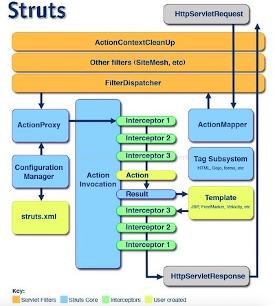

# struts2 知识点

#### Struts2工作流程



1. 客户端创建一个指向servlet容器（Tomcat）的请求
2. 这个请求会经过一系列的过滤器，如ActionContextCleanUp
3. 接着会调用FilterDispatcher，FilterDispatcher询问ActionMapper是否要调用某个Action。FilterDispatcher是控制器的核心。
4. 如果ActionMapper决定需要调用某个action，则FilterDispatcher就把请求的处理交给ActionProxy
5. ActionProxy同ConfigurationManager询问框架的配置文件，一般是从Struts.xml配置文件中读取，找到需要调用的类。
6. ActionProxy创建一个ActionInvocation实例
7. ActionInvocation实例使用命名模式来调用，在调用Action过程中，会涉及到相关的拦截器的调用。
8. 一旦Action执行完毕，ActionInvocation负责根据Struts.xml中的配置找到对应的返回结果，返回结果通常是jsp或者其他模板，但是也可能是指向其他Action的链。
9. 相应返回的结果通过我们的web.xml配置中的过滤器
10. 如果ActionContextCleanUp是当前使用的，则FilterDispatecher将不会清理sreadlocal ActionContext;如果ActionContextCleanUp不使用，则将会去清理sreadlocals。


#### Interceptor拦截器

interceptor拦截器在容器启动时候完成初始化。注意：必须是Action引用了的interceptor才会被初始化，只定义但是Action没有引用的Interceptor是不会被初始化的。

拦截器的配置：

```XML
<package name="front" namespace="/" extends="struts-default,json-default">
		<interceptors>
			<interceptor name="testInterceptor" class="com.hzm.bbs.interceptor.TestInterceptor"></interceptor>
			<interceptor name="loginInterceptor" class="com.hzm.bbs.interceptor.LoginInterceptor"></interceptor>
		</interceptors>

		<action name="User_*" class="com.hzm.bbs.action.UserAction"
			method="{1}">
			<result type="json">
				<param name="root">jsonResult</param>
			</result>
			<!-- 自定义拦截器 -->
			<interceptor-ref name="testInterceptor">
                <!--拦截器中定义参数-->
				<param name="site">localhost:8080/test</param>
			</interceptor-ref>
			<interceptor-ref name="loginInterceptor"></interceptor-ref>
			<!--注意，每一个action都有一个默认的拦截器，如果指定了自定义的拦截器，那么默认的拦截器就失去作用了，所以这里要再加上默认的拦截器--> 
			<interceptor-ref name="defaultStack"></interceptor-ref>
		</action>
</package>
```

拦截器在包package下面声明拦截器，在action的result标签下面引用。

Interceptor样例

```Java
package com.hzm.bbs.interceptor;

import com.opensymphony.xwork2.ActionInvocation;
import com.opensymphony.xwork2.interceptor.Interceptor;

@SuppressWarnings("serial")
public class LoginInterceptor implements Interceptor
{
  	private String site;//拦截器中定义的参数
	public String getSite()
	{
		return site;
	}
	public void setSite(String site)
	{
		this.site = site;
	}
	@Override
	public void destroy()
	{
		System.out.println("LoginInterceptor destory!");
	}

	@Override
	public void init()
	{	//容器初始化的时候调用
		System.out.println("LoginInterceptor init!");
      	System.out.println("site:" + getSite());//调用拦截器中定义的参数
	}

	@Override
	public String intercept(ActionInvocation invocation) throws Exception
	{
		// TODO Auto-generated method stub
		System.out.println("before Action!");
		String reString=invocation.invoke();//要执行的action
		System.out.println("after Action!");
		return reString;
	}
}
```

#### Filter过滤器

在请求web.xml时，检测URL是否符合某个过滤器，当符合时会先执行过滤器器中的doFilter()方法，在doFilter()方法中可以对用户信息进行校验，或者对请求参数等进行修改校验等。

*注意*：过滤器是在拦截器之前执行，过滤器执行完毕后才进入拦截器中

在web.xml文件中配置过滤器

```xml
	<!--自定义过滤器 -->
	<filter>
		<filter-name>LoginFilter</filter-name>
		<filter-class>com.hzm.bbs.interceptor.LoginFilter</filter-class>
	</filter>
	<filter-mapping>
		<filter-name>LoginFilter</filter-name>
		<url-pattern>/*</url-pattern>
	</filter-mapping>
```

自定义Filter：

```java
package com.hzm.bbs.interceptor;

import java.io.IOException;
import javax.servlet.Filter;
import javax.servlet.FilterChain;
import javax.servlet.FilterConfig;
import javax.servlet.ServletException;
import javax.servlet.ServletRequest;
import javax.servlet.ServletResponse;
import javax.servlet.http.HttpServletRequest;
import javax.servlet.http.HttpSession;

public class LoginFilter implements Filter
{
	@Override
	public void destroy()
	{
		// TODO Auto-generated method stub
	}

	@Override
	public void doFilter(ServletRequest request, ServletResponse response, FilterChain chain)
			throws IOException, ServletException
	{
		HttpServletRequest request2 = (HttpServletRequest) request;
		HttpSession session = request2.getSession();
      	//判断用户是否登录
		if (session.getAttribute("user") == null)
			System.out.println("用户还未登录");
		else	//已登录则放行
			chain.doFilter(request, response);
	}

	@Override
	public void init(FilterConfig arg0) throws ServletException
	{
		// TODO Auto-generated method stub
	}
}

```

chain.doFilter(request,response):作用是将请求转发给过滤器链上下一个对象,这里的下一个对象指的是下一个filter，如果没有filter那就是你请求的资源。

一般filter都是一个链,web.xml 里面配置了几个就有几个。一个一个的连在一起 

request -> filter1 -> filter2 ->filter3 -> .... -> request resource.


#### 拦截器与过滤器的区别

* 拦截器是基于Java反射机制，而过滤器只是函数回调
* 拦截器只有在请求action的时候才会调用，而过滤器任何请求都可以调用
* 拦截器不依赖于servlet容器，而过滤器依赖于servlet容器
* 拦截器可以访问action上下文、值栈里的对象，而过滤器不能


