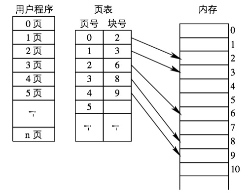
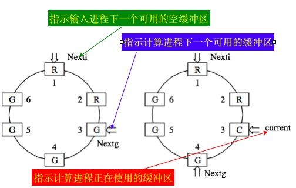
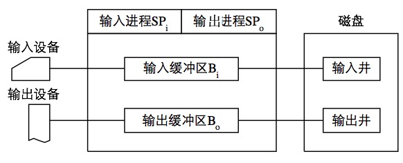
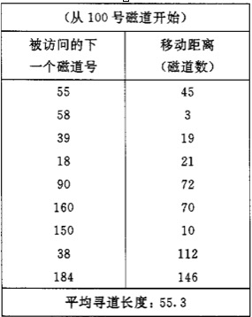

### 1. 进程管理

#### 1.1 进程基本概念

##### 程序顺序执行的特征

- 顺序性：每一个操作必须在下一个操作开始之前结束


- 封闭性：程序运行时独占全机资源，资源的状态只有本程序才能改变
- 可在现性

<!--more-->

##### 前趋图

有向无环图

- **作用：**用于描述程序段或进程间执行的前后顺序。
- **结点：**表示程序段或进程，或一条语句**
- **有向边：**表示结点之间的偏序(前驱)关系

##### 并发执行时的特征

- 间断性**——“**停停走走**”**
- 失去封闭性**——**原因：多个程序共享资源
- 不可再现性

##### 进程的定义与特征

- 结构性（PCB）

  进程实体 = 程序 + 进程控制块(PCB)

  程序=数据段+程序段

- 动态性


- - 进程实质是进程实体的一次执行过程
  - 体现在 “由创建而生，由调度而执行，由撤销而亡”


- 并发性
- 独立性
- 异步性

###### 进程的定义

*进程是进程实体的运行过程，是系统进行资源分配和调度的一个独立单位。*

###### 进程和程序的区别与联系

- 区别
  - 进程是动态概念，强调的是执行，有创建、有撤销，存在是暂时的。程序是一静态概念，程序是指令的有序集合，“永远”存在；
  - 进程具有并发性，而程序没有；
  - 进程是接受计算机资源的基本单位，程序不是。
- 联系
  - 进程是程序在数据集上的一次执行
  - 一个程序可对应多个进程，一个进程可包括多个程序。

###### 进程的三种状态

- 就绪状态
- 执行状态
- 阻塞状态

#### 1.2 进程控制

进程控制是进程管理中最基本的功能

- 用于创建新进程
- 终止一个已完成的进程
- 终止一个无法运行下去的进程 (Kill)
- 负责进程的状态转换 (就绪执行)

#### 1.3进程图

描述一个进程家族关系的有向树


#### 1.4 经典进程同步问题

##### 生产者消费者问题

###### 记录型信号量方法

- 生产者

  ```c
   var  mutex,empty,full:semaphore:=1,n,0；// 定义信号量
          buffer:array[0,…,n-1] of item;    // 定义缓冲区
          in, out : integer :=0,0;                // 定义下标指示变量
  begin  //生产者如何执行(如何往缓冲区放东西)
        repeat
           产生一个商品放入nextp中;
           wait(empty); //等待缓冲区有地方
           wait(mutex); //等待可以使用缓冲区
           buffer[in] := nextp;
           in := (in + 1) mod n;
           signal(mutex); //告诉其他进程：缓冲区可以使用了
           signal(full);     //告诉其他进程：缓冲区中多了一个商品
        until false;
   end
  ```

- 生产者

  ```c
  begin //消费者如何执行(如何从缓冲区取东西)
     repeat
         wait(full); //等待缓冲区有商品
         wait(mutex); //等待可以使用缓冲区
         nextc := buffer[out];
         out := (out + 1) mod n;
         signal(mutex); //告诉其他进程: 缓冲区可以使用了
         signal(empty); //告诉其他进程: 缓冲区空出一个地方
         消费商品 nextc; 
     until false;
  end;
  ```

  > 注意
  > wait(mutex)和signal(mutex)必须成对出现
  > empty、full的wait、signal也要成对出现
  > 注意多个wait的顺序不能颠倒。

###### 利用and信号量解决

```c
生产者:
      …
     Swait(empty,mutex);
     buffer[in] := nextp;
     in := (in + 1) mod n;
     Ssignal(mutex,full);
消费者:
    Swait(full,mutex); 
    nextc := buffer[out];
    out := (out + 1) mod n;
    Ssignal(mutex,empty); 
    …
```


##### 哲学家进餐问题

###### 利用记录型信号量

```c
var chopstick:array[0,…,4] of semaphore;
    所有信号量初始值为1；
    repeat   //第i个哲学家的活动
       wait(chopstick[i]);                   //拿左筷子
       wait(chopstick[(i+1) mod 5]); //拿右筷子
       吃饭;
       signal(chopstick[i]);                //放左筷子
       signal(chopstick[(i+1) mod 5]); //放右筷子
       思考;
    until false; 
```

**缺点：**

如果每个人开始都先拿自己左边的筷子，可能导致人手一根筷子，而拿不到第二根筷子，从而全部阻塞，引起死锁。

###### and信号量

```c
var chopstick: array[0,…,4] of semaphore;
    所有信号量全部初始化为1;
    repeat
       Swait(chopstick[i], chopstick[(i+1) mod 5]);
        吃饭;
       Ssignal(chopstick[(i+1) mod 5], chopstick[i]);
      思考；
    until false;
```


#### 1.5 进程通信

##### 进程通信类型

- 共享存储系统
- 消息传递系统
- 管道通信系统

#### 1.6 线程和进程的区别与联系

- 调度

  - 线程是调度的基本单位
  - 进程是资源拥有的基本单位

- 拥有资源

  - 线程不拥有系统资源，但是可以访问其隶属进程的系统资源，从而获得系统资源

- 并发性

  - 支持多进程的系统中，不仅不同进程之间可以并发，同一进程中的线程也支持多并发

- 系统开销

  - 进程切换时的时空开销大
  - 线程切换时，只需保存和设置少量信息，因此开销很小

  ​

### 2. 处理机调度和死锁

#### 2.1 调度算法

- 先来先服务（FIFS）调度算法
- 短作业优先调度算法（SJF、SPF）
- 高优先权调度算法（FPF）
  - 静态优先权：创建进程时分配，保持不变
  - 动态优先权：随进程的执行或等待时间的增加而改变（防止长进程长期霸占）


- 高响应比优先调度算法
  - 动态优先权
    - 优先权=（等待时间+要求服务时间）/要求服务时间
    - 响应比=响应时间/要求服务时间
- 基于时间片的轮转调度算法——分时系统


#### 2.2 实时调度

实时调度与其他系统的区别：处理和控制的正确性不仅取决于计算的结果，还取决于计算和处理结果产生的时间。

##### 实时调度算法

- 最早截止时间优先（EDF）

- 最低松弛度优先算法（LLF）

  松弛度=完成截止时间-剩余运行时间-当前时间

#### 2.3 产生死锁的原因和必要条件

死锁：多个进程在运行过程中，因争夺资源二造成的一种僵局。这种僵局若无外力作用无法再向前推进。

产生死锁的原因：

- 资源竞争
- 进程推进顺序非法

死锁产生的必要条件

- 互斥条件
- 请求和保持条件
- 不剥夺条件
- 环路等待条件

#### 2.4 预防死锁的方法

- 摒弃请求和保持条件，规定所有进程在开始之前，都必须一次性申请其在整个运行过程中所需的全部资源，只要有一种资源不够，便不分配。
- 摒弃不剥夺条件，进程可以逐个申请资源，一旦申请的资源无法满足，立即释放已经保持的所有资源
- 摈弃环路等待条件

银行家算法：避免死锁 

资源有序分配法：预防死锁 

资源分配图化简法：检测死锁 

撤销进程法：解决死锁


### 3. 存储器管理

#### 3.1 程序的装入和链接

##### 程序装入

- 绝对装入方式

  程序中使用绝对地址，可编译时给出也可以有程序员直接赋予

- 可重定位装入方式

  在装入是对程序中的指令和数据进行修改

- 动态运行时装入方式

  执行代码是再进行地址转换

##### 程序的链接

- 静态链接
- 装入时动态链接
- 运行时动态链接

#### 3.2 连续分配方式

- 单一连续分配

  - 把内存分为系统区和用户区两部分

- 固定分区分配

  - 把用户区划分成若干个大小固定的分区，每个分区只放一个进程
  - 当一个分区空闲时，可以选择一个新的进程进入那里运行

- 动态分区分配：根据进程的实际需要，动态分配内存空间

  - 首次适应算法（FF）

    以地址递增次序链接空闲分区，从链首开始查找，找到第一个满足请求大小的分区，从中划出请求大小的空间，余下的仍留在链中。

  - 循环首次适应算法

    由FF算法演变而成的。 从上次找到的空闲分区的下一个空闲分区查找。

  - 最佳适应算法

    分区按容量大小递增顺序排列，找到能满足分配的最小空闲分区。

- 动态重定位分区分配

##### 对换

定义：吧暂时不用的程序及其数据的部分或全部从内存移到外存上，以便腾出必要的空间

- 整体对换（进程对换）
- 部分对换（页面对换、分段对换）

#### 3.3 基本分页存储管理方式

##### 页面与页表

###### 页面与物理块

- 把进程的逻辑地址空间分成若干大小相等的片，称之为页面或页，编号从0开始。
- 把内存的存储空间也划分成与页相同大小的片，这些片称为物理块或页框，编号从0开始




#### 3.4 基本分段存储管理方式

###### 分页和分段的主要区别

- 页是信息的物理单位，分页是为消减内存的碎片，提高内存的利用率。分页仅是由于系统管理的需要。 段则是信息的逻辑单位，它含有一组其意义相对完整的信息。分段的目的是为了能更好地满足用户的需要。 


- 页的大小固定，由系统决定，由系统把逻辑地址划分为页号和页内地址两部分，是由机器硬件实现的，因而在系统中只能有一种大小的页面；段的长度不固定，决定于用户所编写的程序，由编译程序编译源程序时，根据信息的性质来划分。

#### 3.5 页面置换算法

**抖动：**系统一直忙于页面的调入**/**调出，以致大部分**CPU**时间都用于处理缺页中断和页面淘汰上，很少能顾及到用户进程的实际执行的现象称为**“**抖动”

***注意***：缺页中断不一定引起页面淘汰。只有内存中没有空闲块时，缺页中断才会引起页面淘汰

##### 最佳置换算法

从内存中移出永远不再需要的页面；如无这样的页面存在，则应选择最长时间不需要访问的页面

##### 先进先出置换算法（FIFO）

总是选择进程中驻留时间最长的页淘汰，即先进入内存的页面先淘汰出内存。

##### 最近最久未使用置换算法（LRU）

选择最近一段时间内最久不用的页面进行淘汰


### 4. 设备管理

#### 4.1 I/O控制方式

##### 程序控制方式

忙——等待方式。

##### 中断驱动方式

​       **中断时以字节为单位进行控制的**

- - 进程要启动**I/O**设备工作时，由**CPU**向该设备控制器发出一条**I/O**命令，然后便可立即返回继续执行原来的任务。
  - 设备控制器按照命令要求去控制指定设备。此时，**CPU**与**I/O**设备并行操作。
  - 设备处理完数据后，便产生一个中断信号。此时，**CPU**便转而处理该信号。

##### DMA方式

传输的基本单位是**数据块**，CPU与I/O设备之间每次传送至少一个数据块。仅在传送一个或多个数据块的开始或结束时才需要CPU干涉。

- **DMA**工作过程
- - 以从磁盘读入数据为例：

1. 1. 1. 从磁盘读入数据块时，**CPU**将一条读指令送至磁盘控制器的命令寄存器**(CR)**中。
      2. 将数据读入的内存起始目标地址送入内存地址寄存器（**MAR**）中；将读数据的字**(**节**)**数送入数据计数器**(DC)**中
      3. 将磁盘的源地址送至**DMA**控制器的**I/O**逻辑中。
      4. 然后，启动**DMA**控制器进行数据传送，以后，**CPU**便可去处理其它任务。
      5. 此后，整个数据传送过程便由**DMA**控制器进行控制。
      6. 当**DMA**控制器已从磁盘读入一个字**(**节**)**的数据并送入数据寄存器**(DR)**后，将该字**(**节**)**传送到指定的内存单元中。
      7. 接着便对**MAR**内容加**1**，将**DC**内容减**1**。
      8. 若减**1**后**DC**内容不为**0**，表示传送未完，便继续传送下一个字**(**节**)**；
      9. 否则，由**DMA**控制器发出中断请求。
2. DR：数据寄存器，用于暂存数据
3. MAR：内存地址寄存器，存放数据的源/起始目标地址
4. DC：数据计数器，存放本次CPU要读或写的字节数
5. CR：命令/状态寄存器，接收从CPU发来的I/O命令或有关控制信息或设备状态

##### I/O通道控制方式

1. 1. 指令类型单一，主要局限于对**I/O**操作
   2. 没有自己的内存，通道程序放在内存里

- 在设置了通道后，**CPU**只需向通道发送一条**I/O**指令。通道在收到该指令后，便从内存中取出本次要执行的通道程序，然后执行该通道程序，仅当通道完成了规定的**I/O**任务后，才向**CPU**发中断信号

#### 4.2 缓冲管理

##### 引入缓冲

- 缓和CPU与I/O设备间速度不匹配的矛盾
- 减少对CPU的中断频率
- 提高CPU和I/O设备之间的并行性

##### 单缓冲和双缓冲

###### 单缓冲

每当用户进程发出一个I/O请求时，OS便在内存总位置分配一个缓冲区

**max(磁盘到缓冲区，CPU处理) + 缓冲区到用户区 **

###### 双缓冲区

设备输入时，先将数据送入缓冲区1，装满后转向缓冲区2

##### 循环缓冲

在循环缓冲中包括多个缓冲区，每个缓冲区的大小相同

作为输入的多缓冲区可分为三种类型：

- 空缓冲区**R**
- 已装满数据的缓冲区**G**
- 计算进程正在使用的工作缓冲区**C**




##### 缓冲池

公用缓冲池，池中设立多个缓冲区，为多个进程共享，以提高利用率


#### 4.3 设备分配

##### SPOOLing技术

- 脱机输入/输出技术是利用专门的外围控制机，将低速I/O设备上的数据传送到高速磁盘上，或者相反。
- SPOOLing技术的实质是模拟脱机输入、输出

###### 基本方法

- 用一个进程将设备输入的数据暂存到磁盘上
- 用另一个进程把暂存在磁盘上的数据传送到设备上

###### spooling 系统组成部分

1. 输入井、输出井

   磁盘上的两块大存储区，用于暂存输入、输出的数据

2. 输入缓冲区、输出缓冲区

   位于内存中，作用是缓和CPU和设备之间的速度差异

3. 输入进程、输出进程

   - 输入进程：利用输入缓冲区为中介，吧输入设备的数据存入输入井

   - 输出进程：将用户数据存入输出井，设备空闲时再将输出井中的数据利用输出缓冲区送入设备

     

   ​

#### 4.4 磁盘存储器管理

##### 磁盘调度算法

1. 先来先服务（FCFS）

   根据进程请求访问磁盘的先后次序进行调度

   

2. 最短寻道时间优先（SSTF）

   首先满足访问的磁道与当前所在磁道之间距离最短的进程。但是这种算法不能保证平均寻道时间最短

   - 进程饥饿现象
     - 因为只要不断有新进程的请求到达，且其所要访问的磁道与当前磁道之间的距离较近，新进程的I/O请求必然优先满足。致使老进程的请求长期无法得到满足

3. 扫描算法（SCAN）

   - 当磁头正在自里向外移动时，**SCAN**算法所考虑的下一个访问对象，应是要访问的磁道既在当前磁道之外，又是距离最近的。
   - 这样自里向外地访问，直至再无更外的磁道需要访问时，才将磁头换向为自外向里移动

4. 循环扫描算法（CSCAN）

   磁头只做单向移动。例如总是自里向外，当磁头移到最外的磁道并访问完后，磁头立即返回最里要访问的磁道。

### 5. 文件管理

#### 5.1 文件逻辑结构

##### 文件逻辑结构的类型

1. 有结构文件

2. 无结构文件（流式文件）

   Unix系统吧所有文件都看做流式文件

##### 顺序文件

记录可以任意顺序排列

##### 索引文件

##### 顺序索引文件

##### 直接文件和hash文件


#### 外存分配方式

##### 连续分配方式

文件存储于连续的盘块上

##### 链接分配

通过盘块上的链接指针，把保存在不同盘块上的各文件部分链接起来


