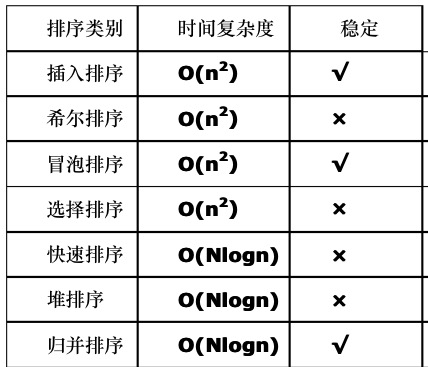
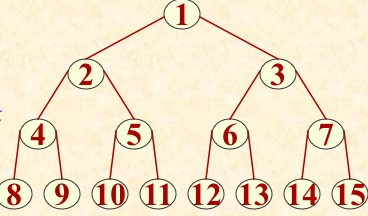
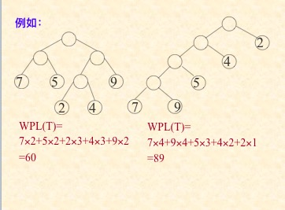
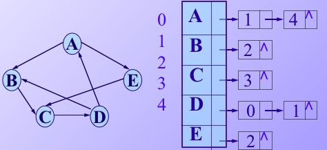

#### 9.查找

##### 折半查找(已排好序)

平均查找长度ASL=log2(n+1)-1

<!--more-->

##### 顺序表查找

平均查找长度（n+1）/2

##### 二叉排序树（二叉搜索树、二叉查找树）

* 若它的左子树不为空，则左子树上的所用结点的值都小于它的根节点的值
* 若它的又子数不为空，则又子树上的所有结点的值都大于他的根节点的值
* 他的左右子树也分别为二叉排序树。

按中序遍历二叉排序树得到的一定是一个递增序列。


##### 平衡二叉树（AVL数）（查找时间复杂度O(logn)）

* 要么是空树
* 它的左子树和右子树都是平衡二叉树，且左子树和右 子树的深度之差的绝对值不超过1
* 平衡因子：该节点的左子树的深度减去它的右子树的深度，则平衡二叉树上的所有结点的平衡因子只能是-1、1、0


##### B-树

主要用作文件的索引

一棵** m** 阶的B-树，或为空树，或为满足下列特性的m叉树：

* 所有非叶结点均至少含有⎡**m/2**⎤棵子树，至多含有   **m** 棵子树；
* 根结点或为叶子结点，或至少含有两棵子树；


* 所有非终端结点含有下列信息数据：

  （n，A0，K1，A1，K2，A2，…Kn，An）   其中：**K****i**为**关键字，**且均自小至大有序排列，即：**K1< K2< … < Kn ； Ai为指向子树根结点的指针，且指针Ai-1所指子树上所有关键字均小于Ki  ； An 所指子树上所有关键字均大于Kn ；

* 树中所有叶子结点均不带信息，且在树中的同一层次上；


##### B+树

适用于文件系统，适合顺序查找和随机查找。

##### 哈希表

###### 处理冲突的方法

* 开放地址法

  Hi=(H(key)+di)mod m

  * 线性探测再散列：di=1,2,3,4……  
  * 二次探测再散列：di=1^2,-1^2,2^2,-2^2 ……  
  * 伪随机探测在散列：di=伪随机数  

* 再哈希法

* 链接地址法

* 建立一个公共溢出区

#### 10.排序



##### 插入排序

```c
void InsertionSort ( SqList &L ) {
  // 对顺序表 L 作直接插入排序。
   for ( i=2; i<=L.length; ++i ) 
       if (L.r[i].key < L.r[i-1].key) {
       L.r[0] = L.r[i];            // 复制为监视哨
       for ( j=i-1; L.r[0].key < L.r[j].key;  -- j )
           L.r[j+1] = L.r[j];        // 记录后移
       L.r[j+1] = L.r[0];        // 插入到正确位置   
    }
} // InsertSort	
```


##### 希尔排序


```c
void ShellInsert ( SqList &L, int dk ) {//对顺序表L作一
//趟希尔插入排序，dk 为增量  
   for ( i=dk+1; i<=n; ++i )
      if ( L.r[i].key< L.r[i-dk].key) {
        L.r[0] = L.r[i];            // 暂存在L.r[0]
        for (j=i-dk;  j>0&&(L.r[0].key<L.r[j].key); j-=dk)
           L.r[j+dk] = L.r[j];  // 记录后移，查找插入位置
        L.r[j+dk] = L.r[0];                // 插入
      } // if
} // ShellInsert

void ShellSort (SqList &L, int dlta[], int t)
{  // 按增量序列dlta[0..t-1]对顺序表L作希尔排序
     for (k=0; k<t; ++t)
         ShellInsert(L, dlta[k]);
             //一趟增量为dlta[k]的插入排序
} // ShellSort
```


##### 堆排序

堆： 根都大于等于左右子树  或者 根都小于等于左右子树

* ki<=K(2*i)  and Ki<=K(2*i+1)  ===>小顶堆

* ki>=K(2*i)  and Ki>=K(2*i+1)  ===>大顶堆

  ​	样例输入：{49，38，65，97，76，13，27，49}


​								  创建初始堆


​							输出堆顶后创建新堆的过程

#### 6.树和二叉树

##### 定义

**结点:**数据元素及若干指向其子树的分支

**结点的度:**结点拥有的子树的数目

**树的度:**树中所有结点的度的最大值

**叶子结点:**度为零的结点

**分支结点:**度不为零的结点

**孩子**：结点子树的根节点称为该节点的孩子结点

**双亲**：该节点称为子树孩子的双亲

**双亲**：同一个双亲的孩子之间称为兄弟

**祖先**：从根节点到该节点所经分支上的所有结点

**层次**：从根开始定义，根为第一层，根的孩子为第二层

**堂兄弟**：其双亲在同一层的结点互为堂兄弟

**树的深度**：树中结点的最大层次称为树的深度或高度


##### 二叉树

**定义**：二叉树或为**空树**，或是由一个**根结点**加上**两棵**分别称为**左子树**和右子树的、**互不交的二叉树**组成。

###### 二叉树的性质

* 在二叉树的第i层上最多有2^(i-1)个结点
* 深度为k的二叉树上最多含2^k - 1个结点
* 对任何一棵二叉树，若它含有**n0 **个叶子结点、**n2 **个度为 2的结点，则必存在关系式：**n0 = n2+1**。
* 二叉树的度数+1=二叉树的结点树

**满二叉树**：指的是深度为**k**且含有**2^k-1**个结点的二叉树。

**完全二叉树**：树中所含的 **n **个结点和满二叉树中编号为 1 至 n 的结点一一对应。


​											完全二叉树	



​												满二叉树

###### 二叉树遍历

* 先根遍历：根左右

* 中序遍历：左根右

* 后续遍历：左右根

    已知先序遍历和中序遍历可求出后序遍历，已知后序遍历和中序遍历可求出先序遍历

    已知先序遍历和后序遍历不能求出先序遍历

###### 二叉树遍历算法

```c
Status PreOrderTraverse( BiTreee T, Status ( * Visit)(TElemType e) ) { //采用二叉链表存储结构， Visit是对数据元素操作的应用//函数，先序遍历二叉树T的递归算法，对每个数据元素调用//函数Visit。最简单的Visit函数是：
 //       Status PrintElement(TElemType e){  //输出元素e的值
 //             printf( e );                                     //实用时，加上格式串
 //             return OK;
 //   }
 //调用实例： PreOrderTraverse( T, PrintElement);
if (T) {
  if (Visit(T->data ))
    if (PreOrderTraverse(T->lchild, Visit))
      if (PreOrderTraverse(T->rchild, Visit))     return OK;
   return ERROR;
 }else  return OK;
}// PreOrderTraverse
```

###### 统计叶子结点个数

```c
void CountLeaf (BiTree T,  int& count){
   if ( T ) {
      if ((!T->lchild)&& (!T->rchild))
         count++;     // 对叶子结点计数
      CountLeaf( T->lchild, count);  
      CountLeaf( T->rchild, count); 
   } // if
} // CountLeaf
```

###### 计算二叉树的深度

```c
int Depth (BiTree T ){ // 返回二叉树的深度
   if ( !T )    depthval = 0;
   else   {
     depthLeft = Depth( T->lchild );
     depthRight= Depth( T->rchild );
     depthval = 1 + (depthLeft > depthRight  ?
                               depthLeft : depthRight);
   } 
   return depthval;
}
```

###### 表达式与二叉树之间的关系


###### 线索二叉树

定义：线索二叉树就是在二叉树链表结构中添加两个标志位，LTag、RTag.

* LTag=0时，Lchild指针指向其左孩子，LTag=1时，Lchild指针指向其前驱
* RTag=0时，Rchild指针指向其右孩子   RTag=1时，Rchild指针指向其后继

**线索化**：以某种次序遍历使其变为线索二叉树的过程称为线索话。


##### 树和森林

###### 树的存储结构

**孩子兄弟表示法**：以二叉链表作为树的存储结构，链表中的两个链域分别指向该节点的第一个孩子结点和下一个兄弟结点。


###### 森林和二叉树的转化


​	森林和二叉树转换采用孩子兄弟表示法，每棵树的根节点看作是兄弟。


​	二叉树转换成森林，从根节点出发，每个右结点分支断开，即做分支变成树。即AE之间断开，EG之间断开

##### 哈夫曼树（最优二叉树）

###### 定义

**路径长度**：从树中的一个结点到另一个结点之间的分支构成这两个结点之间的路径，路径上的分支数目称为路径长度。

**树的路径长度**：是指从树的根到每一个结点的路径长度之和。

**结点的带权路径长度**：是该结点到树根之间的路径长度与结点上权的乘积。

**树的带权路径长度：**是树中所有叶子结点的带权路径长度之和

**哈夫曼树：**带权路径长度最小的二叉树称为哈夫曼树 



​									带权路径介绍

###### 构造哈夫曼树

* 结点带权值和编号集合依次排开，选取权值最小的两个结点构造一颗二叉树，根节点为两个结点权值之和。两个结点分别为左右子树，并且子树权值大于右子树权值或者相反，但是每次得保持一致。
* 将上面两个结点和放入集合中，并且将两个结点从集合中移除。
* 重复第一个步骤。当集合中只剩一个结点时结束。


#### 7、图

##### 定义

**图**：图是由一个顶点集 V 和一个弧集 R构成的数据结构

\<v,w>表示从 v 到 w 的一条弧，并称 v 为**弧尾**，w 为**弧头**。


假设图中有 **n** 个顶点，**e** 条边，则

* 含有 **e=n(n-1)/2 **条边的无向图称作**完全图**；
* 含有 **e=n(n-1) **条弧的有向图称作 **有向完全图**；
* 若边或弧的个数 **e<nlogn**，则称作**稀疏图**，否则称作**稠密图**。


假若顶点**v **和顶点**w **之间存在一条边，则称顶点**v** 和**w** 互为**邻接点**，

边**(v,w)**** **和顶点**v **和**w** 相**关联**。

**度**：和顶点**v **关联的**边的数目**定义为顶点v的**度**。


有向图中：

* 顶点的**出度**：以顶点v为弧尾的弧的数目；
* 顶点的**入度**：以顶点v为弧头的弧的数目。
* 顶点的度(TD)=出度(OD)+入度(ID)。


**路径长度：**路径长度是指路径上的边或弧的数目

**回路或环**：第一个顶点和最后一个顶点相同的路径称为环或回路

**简单路劲：**序列顶点不重复出现的路径称为简单路径

**简单环或简单回路**：除了第一个和最后一个顶点外，其余的顶点不重复出现的回路称为简单回路或简单环

*无向图中*

**连通图：**对于图中的任意两个顶点都是连通的，称这个图是连通图

**连通分量**：无向图中的极大连通子图

*有向图中*

**强连通图** ：对于图中每一对顶点vi和vj,从vi到vj和从vj到vi都存在路径，则称图是强连通图

**强连通分量**：有向图中的极大强连通子图


##### 图的存储

###### 数组表示法（邻接矩阵法）


**无向图的邻接矩阵一定是对称矩阵，而有向图的邻接矩阵则不一定为非对称矩阵** .

###### 邻接表


​								无向图的邻接矩阵



​								有向图的邻接矩阵

##### 图的遍历

###### 深度优先搜索

​	从图中某个顶点V0 出发，访问此顶点，然后依次从V0的各个未被访问的邻接点出发深度优先搜索遍历图，直至图中所有和V0有路径相通的顶点都被访问到；若此时图中尚有顶点未被访问，则另选图中一个未曾被访问的顶点作起始点，重复上述过程，直到图中所有顶点都被访问到为止。


​	访问次序：v1—>v2—>v4—>v8—>v5—>v3—>v6—>v7

深度优先算法：定义一个数组存放顶点是否被访问

```c
void DFSTraverse(Graph G, Status (*Visit)(int v)) {
   // 对图 G 作深度优先遍历。
  VisitFunc = Visit;   
  for (v=0; v<G.vexnum; ++v) 
     visited[v] = FALSE; // 访问标志数组初始化
  for (v=0; v<G.vexnum; ++v) 
     if (!visited[v])  DFS(G, v);
              // 对尚未访问的顶点调用DFS
}
void DFS(Graph G, int v) {
   // 从顶点v出发，深度优先遍历图 G
    visited[v] = TRUE;   VisitFunc(v);//访问第v个顶点
    for(w=FirstAdjVex(G, v);  w>=0; w=NextAdjVex(G,v,w))
        if (!visited[w])  DFS(G, w);     
       // 对v的尚未访问的邻接顶点w， 递归调用DFS
} // DFS
```

###### 广度优先搜索

遍历类似于树的层次遍历

* 从图中的某个顶点V0出发，并在访问此顶点之后依次访问V0的所有**未被访问**过的邻接点，之后**按这些顶点被访问的先后次序依次访问它们的邻接点**，直至图中所有和V0有路径相通的顶点都被访到。
* 若此时图中尚有顶点未被访问，则另选图中一个未曾被访问的顶点作起始点，重复上述过程，直至图中所有顶点都被访问到为止。


​	广度优先搜索：V1—>V2—>V3—>V4—>V5—>V6—>V7—>V8.

```c
 void BFSTraverse(Graph G,  Status (*Visit)(int v))
 {
  //按广度优先非递归遍历图G，使用辅助队列Q和
 //访问标志数组visited
   for (v=0; v<G.vexnum; ++v)
       visited[v] = FALSE;  //初始化访问标志
   InitQueue(Q);       // 置空的辅助队列Q
   for ( v=0;  v<G.vexnum;  ++v )
      if ( !visited[v]) // v 尚未访问
      {          
           visited[v] = TRUE;  Visit(v);    // 访问v
        EnQueue(Q, v);             // v入队列
        while (!QueueEmpty(Q))  
        {
           DeQueue(Q, u);  // 队头元素出队并置为u
           for(w=FirstAdjVex(G, u); w>=0;w=NextAdjVex(G,u,w))
              if ( ! visited[w])  
              {  //W为u的尚未访问的邻接顶点
                 visited[w]=TRUE;  Visit(w);
                 EnQueue(Q, w); // 访问的顶点w入队列
              } // if
        } // while
      } 
  } // BFSTraverse
```


##### 最小生成树

最小生成树：构造网的一棵最小生成树，即：在 e 条带权的边中选取 n-1 条边（不构成回路），使“**权值之和**”为最小

###### 普里姆算法

取图中任意一个顶点 v 作为生成树的根，之后往生成树上添加新的顶点 w。在添加的顶点 w 和已经在生成树上的顶点v 之间必定存在一条边，并且该边的权值在所有连通顶点 v 和 w 之间的边中取值最小。之后继续往生成树上添加顶点，直至生成树上含有 n-1 条边为止。


算法的时间复杂度是O(n^2),与网中的边数无关，因此适合求边**稠密的网的最小生成树**

###### 克鲁斯卡算法

先构造一个只含 n 个顶点的子图 SG，然后从权值最小的边开始，若它的添加不使SG 中产生回路，则在 SG 上加上这条边，如此重复，直至加上 n-1 条边为止。


算法的时间复杂度O(eloge),e为边的数目，适用于稀疏图。

##### 有向无环图的应用

**有向无环图**：一个无环的有向图称为有向无环图。简称（DAG）


###### 拓扑排序

定义：由某个集合上的一个偏序得到该集合上的一个全序，这个操作称之为拓扑排序

所谓偏序关系就是如果A-->B成立 ， 但是从B-->A 不成立

* 从有向图中选取一个**没有前驱**的顶点，并输出之；
* 从有向图中**删去此顶点以及所有以它为尾的弧**；
* 重复上述两步，直至图空，或者图不空但找不到无前驱的顶点为止。后一种情况说明有向图中存在环。


###### 关键路径

路径长度最长的路径就是关键路径。

**最早发生时间**：从v1到vi的最长路径长度叫做事件vi的最早发生时间

**最迟发生时间**：在不推迟项目进度的情况下，最晚发生的时间。

**关键活动**：最早发生时间和最迟发生时间相同的活动叫做关键活动。

关键路径上的活动都是关键活动


##### 最短路径

###### 从某个顶点到其余各个顶点的最短路径。（迪杰斯特拉算法）


