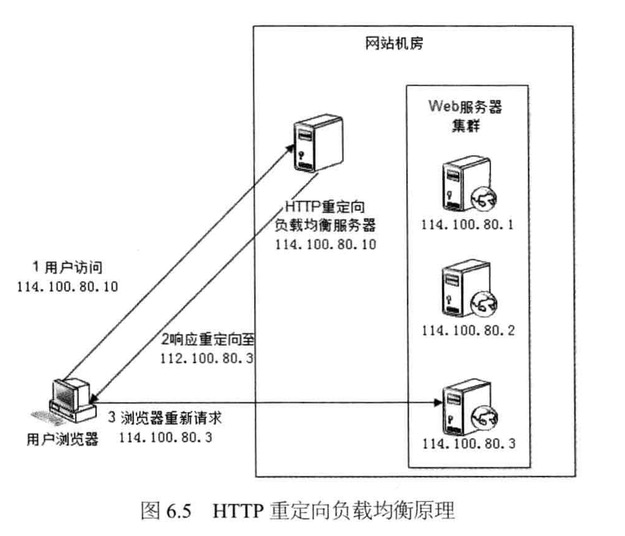
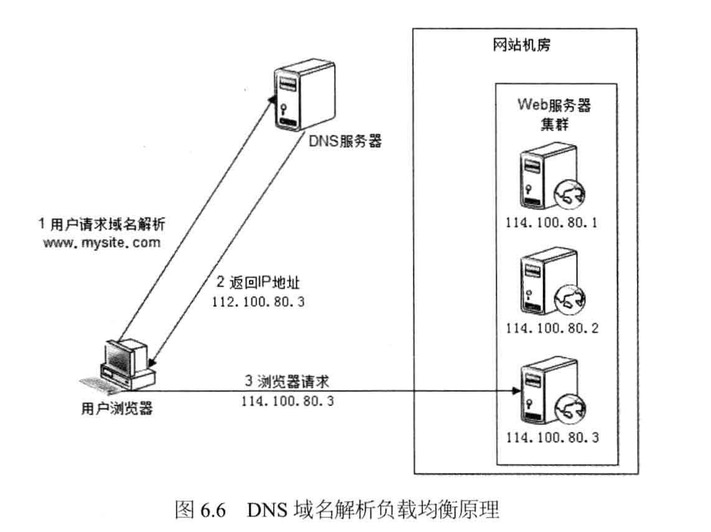
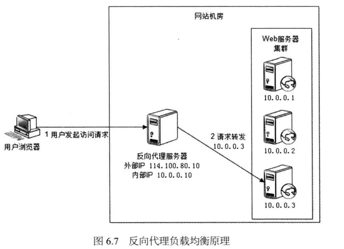
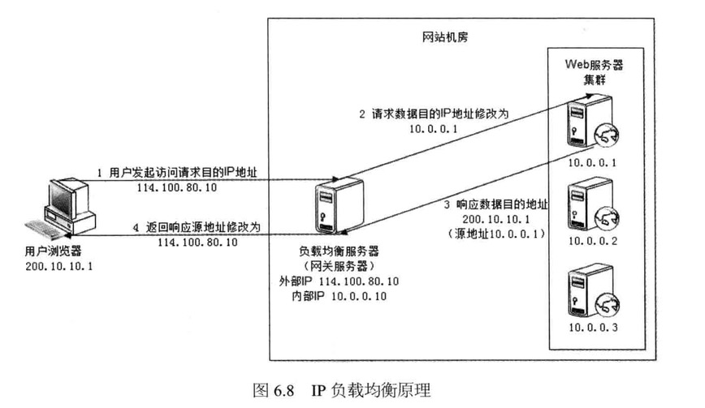
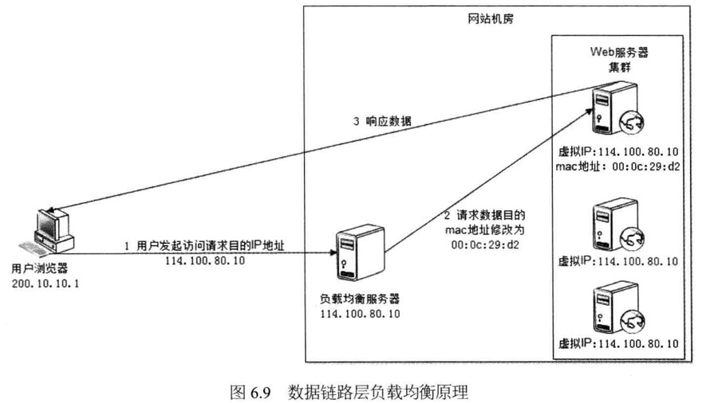
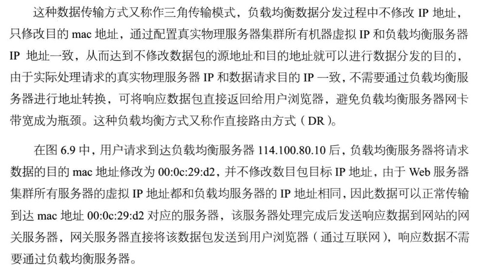

### 负载均衡的几种方式

​	负载均衡是网站架构必不可少的基础手段，不但可以实现网站的伸缩性，同时还可以改善网站的可用性。负载均衡的方式有以下几种：

* Http重定向负载均衡
* DNS域名解析负载均衡
* 反向代理负载均衡
* IP负载均衡
* 数据链路层负载均衡

#### Http重定向负载均衡

Http重定向服务器唯一功能就是根据用户的http请求计算一台真实的web服务器地址，并将该web服务器地址写入http重定向相应中返回给用户浏览器。

这种方案的有点事比较简单，缺点是浏览器每次请求都需要两次请求服务器才能完成，性能较差。重定向服务器自身处理能力可能成为瓶颈。

#### DNS域名解析负载均衡

DNS服务器中配置了多个A 记录：

www.mysite.com IN A 114.100.80.1;

www.mysite.com IN A 114.100.80.2;

www.mysite.com IN A 114.100.80.3;

每次域名解析请求都会根据负载均衡算法计算一个不同的IP地址返回，这样A记录中配置的多个服务器就构成一个集群，并实现负载均衡。

**优点：**将负载均衡的工作转交给DNS，省掉了网络管理维护负载均衡服务器的麻烦，同时许多DNS还支持基于地理位置的域名解析，即会将域名解析成距离用户地理位置最近的服务器地址，这样可加快用户访问速度，改善性能。

**缺点：**目前DNS是多级解析，每一级DNS都可能缓存A记录，当下线某台服务器后，即使修改了DNS的A记录，要使其生效也需要较长的时间，这段时间DNS依然会将域名解析到已经下载的服务器，导致访问失败。而且DNS负载均衡的控制权在域名服务商那里，网站无法对其做更多改善和更强大的管理。

一般大型网站总是部分使用DNS域名解析，利用域名解析作为第一级负载均衡，即域名解析得到的一组服务器实际上同样是负载均衡服务器，这组内部的负载均衡服务器在进行负载均衡，将请求分发到真是的web服务器上。

#### 反向代理负载均衡

#### IP负载均衡

用户请求数据包到达负载均衡服务器114.100.80.10后，负载均衡服务器在操作系统内核进程获取网络数据报，根据负载均衡算法计算得到一台真实web服务器10.0.0.1，然后将数据目的IP地址修改为10.0.0.1，不需要通过用户进程处理。处理完成之后，响应数据报回到负载均衡服务器，负载均衡服务器再将数据报源地址修改为自身的IP地址发送给用户浏览器。

真实web服务器如何将响应数据包返回给负载均衡服务器，方案是：在负载均衡服务器修改目的IP地址的同时修改源地址，将数据报原地址设为自身IP，这样web服务器的响应会再回到负载均衡服务器。

**缺点**：所有请求响应都必须经过负载均衡服务器，对于下载或者视频等服务，负载均衡服务器会成为瓶颈。

#### 数据链路层负载均衡

### 负载均衡算法

* 轮询

  所有请求被依次分发到每台应用服务器上。

* 加权轮询

  在轮询的基础上，按照配置的权重将请求分发到每个服务器上，高性能的服务器能分配到更多的请求

* 随机

  请求被随机分配到各个应用服务器上

* 最少连接

  记录每个应用服务器正在处理的连接请求数，将新的请求分发到最少连接的服务器上。

* 源地址散列

  根据请求来源的IP地址进行Hash计算，得到应用服务器，这样来自同一个IP地址的请求总在一个服务器上处理。

