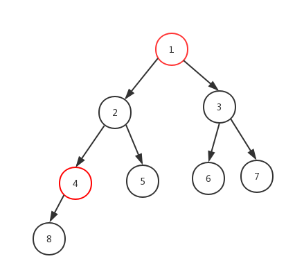

# 二叉树的下一个结点

> 题目：给定一个二叉树和其中的一个结点，请找出中序遍历顺序的下一个结点并且返回。注意，树中的结点不仅包含左右子结点，同时包含指向父结点的指针。



思路：主要分为两类：第一类是该结点有右孩子，找到右子树中第一个左孩子结点如图1的话下一个结点就是6；

第二类是右子树为空，递归查找该节点是父节点的左孩子，如图 8的话下一个结点时4，5的下一个结点时1.

```Java
/*
public class TreeLinkNode {
    int val;
    TreeLinkNode left = null;
    TreeLinkNode right = null;
    TreeLinkNode next = null;

    TreeLinkNode(int val) {
        this.val = val;
    }
}
*/
public class Solution 
{
    public TreeLinkNode GetNext(TreeLinkNode pNode)
    {
        if(pNode.right!=null)
            return getRightFirst(pNode.right);
        else 
            return getLeftFirst(pNode,pNode.next);
    }
    
  	//找到PNode是父节点head的左孩子
    public TreeLinkNode getLeftFirst(TreeLinkNode pNode,TreeLinkNode head)
    {
        if(head==null)
            return null;
        else if(head.left==pNode)
            return head;
        else
            return getLeftFirst(head,head.next);
    }
    
    //获取PNode右子树的第一个结点
    public TreeLinkNode getRightFirst(TreeLinkNode pNode)
    {
        if(pNode.left==null)
            return pNode;
        else
            return getRightFirst(pNode.left);
    }
}
```