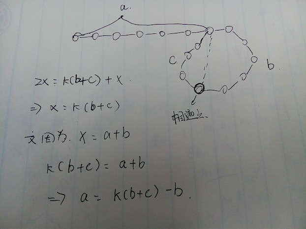

# 链表中环的入口结点

> 题目：一个链表中包含环，请找出该链表的环的入口结点。


#### 解法一：

去环法，定义两个指针privious和next，初始时prvious指向头结点，next指向privious的下一个结点。两个指针同步往下移动，将privious指向空，next指向下一个结点。这样访问过的几点全部断开，最后到达的结点一定是环的入口

```java

public class Solution 
{
    public ListNode EntryNodeOfLoop(ListNode pHead)
    {
        if(pHead==null)
            return null;
        ListNode privious = pHead;
        ListNode next =pHead.next;
        if(next==null)
            return null;
        while(next!=null)
        {
        	privious.next=null;
            privious = next;
            next =next.next;
        }
        return privious;
    }
}
```


#### 解法二



a表示除去环的长度，b+c表示环的长度，fast指针每次走两步，slow指针每次走一步。故在相遇的时候有

2x=x+(b+c)*k，其中x表示slow走的距离，k表示走的圈数。可能快fast指针走了好几圈才相遇。又因为x=a+b,

x=(b+c)*k=a+b    ===>  a=(b+c) \*k-b;

由上图可知两个指针一个从头结点出发，一个从相遇结点出发，一定会在环的入口相遇。期间可能走了多圈。

```java

public class Solution 
{
    public ListNode EntryNodeOfLoop(ListNode pHead)
    {
        if(pHead==null)
            return null;
        ListNode p1 = getMeetingNode(pHead);
        if(p1==null)
            return null;
        
        ListNode p2 = pHead;
        while(p1!=p2)
        {
            p1=p1.next;
            p2=p2.next;
        }
        return p1;
    }
    
    //查找相遇结点
    public ListNode getMeetingNode(ListNode pHead)
    {
        //快指针每次走两步，慢指针每次走一步
    	ListNode fast = pHead;
        ListNode slow = pHead;
        while(slow!=null && fast.next!=null)
        {
            fast = fast.next.next;
            slow = slow.next;
            if(fast==slow)
                return fast;
        }
        return null;
    }
}
```