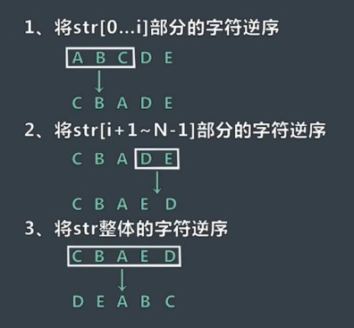
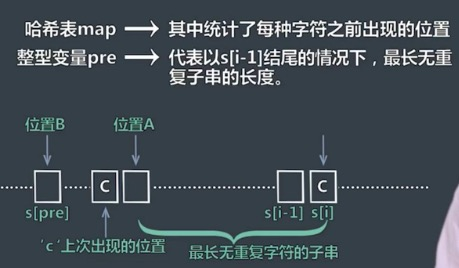

# 3. 字符串问题

#### 1.判断一棵树是否包含另一个数的拓扑结构

给定两棵树的头结点t1、t2，判断t1中是否有与t2树拓扑结构完全相同的子树。

思路：对两棵树分别进行遍历（前、中、后任选一种），得到两个序列字符串str1,str2。判断str1中是否包含str2即可。


#### 2.判断字符串是否是旋转词

给定两个字符串str1、str2，判断str1和str2是否互为旋转词。旋转词：将字符串前面任意长的字符移动到字符串的末尾。

思路：首先判断str1和str2的长度是否相等，相等在进行下一步。str1+str1生成一个新的字符串str,检测str2是否是str的子串即可。

#### 3.字符串逆序调整

将str字符串中0到i的字符移动到末尾，要求空间复杂度O(1).



#### 4.判断左括号和右括号配对问题

()(())()())  左括号和右括号匹配

(()()()   不匹配

思路：用一个变量num记录左括号的个数，当遇到左括号时num++,遇到右括号时num—，如果遍历过程中出现num\<0则返回false.如果遍历完成num==0 返回true，num\>0 返回false.


#### 5.求字符串中最长无重复子串问题

如字符串abcddab，最长无重复子串是abcd



```java
	public static int getMaxNoneRepeatStringLength(String str)
	{
		if (str == null || str.equals(""))
			return 0;
		HashMap<Character, Integer> map = new HashMap<>();
		map.put(str.charAt(0), 0);
		// pre 表示以str[i-1]字符串结尾的最长无重复子串
		int pre = 1;
		int max = 1;
		for (int i = 1; i < str.length(); i++)
		{
			char c = str.charAt(i);
			int temp = 0;
			if (map.containsKey(c))
			{
				temp = i - map.get(c);
				temp = temp > pre + 1 ? pre + 1 : temp;
			} else
				temp = pre + 1;
			pre = temp;
			max = max > temp ? max : temp;
			map.put(c, i);
		}
		return max;
	}
```