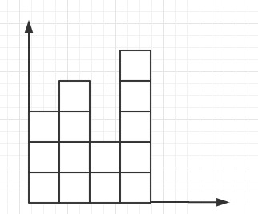

# 求两个柱子围城的面积

题目：

​	给定一个非负数的数组，数组中的每个值代表一个柱子的高度，柱子的宽度是 1。两个柱子之间可以围成一个面积，**规定:面积=两根柱子的最小值\*两根柱子之间的距离**。比如数组[3,4,2,5]。3 和 4 之间围成的面积为 0，因为两个柱子是相邻的，中间没有距离。3 和2 之间围成的面积为 2，因为两个柱子的距离为 1，且 2 是最短的柱子，所以面积=1\*2。3 和 5 之间围成的面积为 6，因为两个柱子的距离为 2，且 3 是最短的柱子，所以面积=3*2。求在一个数组中，哪两个柱子围成的面积最大，并返回值。
要求:实现时间复杂度 O(N)，额外空间复杂度 O(1)的解法



思路：定义两个指针head、tail，分别指向头和尾，面积S = min(head,tail)*(head 到tail的距离)。计算完成之后，当head<tail则head向前移动，反之tail 向中间移动。循环计算最大值

* ​

  head=3      tail=5

  {3、4、2、5}

  s=3*2=6

* ​

  head=4      tail=5

  {3、4、2、5}

  s=4*1=4

…………

```java
	public static int getMaxValue(int[] arr)
	{
		int res = 0;
		int head = 0;
		int tail = arr.length - 1;
		while (head < tail)
		{
			int min = 0;
			if (arr[head] < arr[tail])
			{
				min = arr[head];
				head++;
			} else
			{
				min = arr[tail];
				tail--;
			}
			int s = min * (tail - head);
			res = s > res ? s : res;
		}
		return res;
	}
```