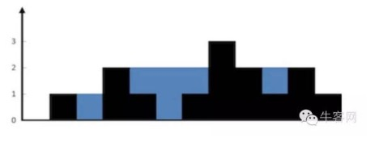

# 求数组容器装水问题

> 给定一个非负数的数组，代表一个容器。例如数组[0,1,0,2,1,0,1,3,2,1,2,1]，就是以下图形中黑色的部分。如果用这个容器接水的话，请问可以接多少水?还以这个数组为例，可以接 6 格水，就是以下图形中蓝色的部分。要求:实现时间复杂度 O(N)，额外空间复杂度 O(1)的解法



思路：对每一格装水量进行计算，第i格能装水的量 :

​			value[i]=Min{max{arr[0],arr[1],……arr[i-1]}, max{arr[i+1],arr[i+2],……arr[n]}} - arr[i];

即value[i] 就是找i左边最大值和i右边的最大值，取这两个最大值得较小值最为瓶颈，最后减去arr[i]，就是它的装水量。

#### 解法一

```java
	public static int getWater(int[] arr)
	{
		int res = 0;
      	//用数组leftMax 记录从0到i-1中最大的数
		int[] leftMax = new int[arr.length];
      	//用数组rightMax 记录从i+1到n中的最大值
		int[] rightMax = new int[arr.length];
		int max = 0;
		for (int i = 0; i < arr.length; i++)
		{
			leftMax[i] = max = max < arr[i] ? arr[i] : max;
		}
		max = 0;
		for (int i = arr.length - 1; i >= 0; i--)
		{
			rightMax[i] = max = max < arr[i] ? arr[i] : max;
		}

		for (int i = 1; i < arr.length - 1; i++)
		{
          	//求两个最大值中的较小值
			int min = leftMax[i - 1] > rightMax[i + 1] ? rightMax[i + 1] : leftMax[i - 1];
          	//如果较小值小于当前值，则不进行计算
			res += min > arr[i] ? (min - arr[i]) : 0;
		}
		return res;
	}
```


#### 解法二

```java
	public static int getWater1(int[] arr)
	{
		int res = 0;
		int[] rightMax = new int[arr.length];
		int max = 0;
		for (int i = arr.length - 1; i >= 0; i--)
		{	//计算从i+1 到n 最大值
			rightMax[i] = max = arr[i] > max ? arr[i] : max;
		}
      	//max 存放从0到 i-1中的最大值
		max = arr[0];
		for (int i = 1; i < arr.length - 1; i++)
		{	//求出左侧和右侧两遍最大值中的较小值
			int min = max > rightMax[i + 1] ? rightMax[i + 1] : max;
			res += min > arr[i] ? (min - arr[i]) : 0;
			// 更新左侧的最大值
			max = arr[i] > max ? arr[i] : max;
		}
		return res;
	}
```


#### 解法三：

思路：用leftMax记录当前左侧访问到的的最大值，用rightMax记录当前访问到的右侧最大值。

1. ​

   leftMax=6                                       rightMax=7

   `6`、5、7、4、3……5、7、3、9、8、`7`

     	left=5                                     right=8

   当leftMax<rightMax时，左侧的成为瓶颈，计算left=5所能盛水的量 value= leftMax-5=1，left向前移动

2. ​

   leftMax=6                                       rightMax=7

   `6`、5、10、4、3……5、7、3、9、8、`7`

     	left=10                                   right=8

   leftMax还是大于rightMax，还是左侧的是瓶颈，计算left=10所能盛水的量，由于leftMax<left，所以不能盛水，更新leftMax=10，left向前移动

3.  

   leftMax=10                                      rightMax=7

   6、5、`10`、4、3……5、7、3、9、8、`7`

     		left=4                               right=8

   leftMax大于rightMax，右侧成为瓶颈,计算right=8的盛水量，rightMax<right,所以不能盛水，更新rightMax=8，right向前移动

   ………………

```Java
	public static int getWater2(int[] arr)
	{
		int res = 0;
		int leftMax = arr[0], rightMax = arr[arr.length - 1];
		int left = 1, right = arr.length - 2;
		while (left < right)
		{	
			if (leftMax <= rightMax)
			{	//左侧最大值小于右侧最大值，计算left的盛水量
				if (leftMax > arr[left])
					res += leftMax - arr[left];
				else	//leftMax小于left 则更新最大值
					leftMax = arr[left];
				left++;
			} else
			{
				if (rightMax > arr[right])
					res += rightMax - arr[right];
				else
					rightMax = arr[right];
				right--;
			}
		}
		return res;
	}
```