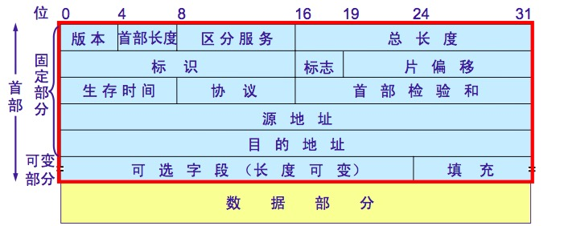

### 因特网组成###

#### （一）边缘部分

* 客户-服务器方式
* 对等连接方式（P2P）:两个主机通信时不区分哪个是服务请求方还是服务提供方。

<!--more-->

#### （二）核心部分

* 路由器：实现分组交换的关键构建，其任务是转发收到的分组。
  * 电路交换：建立连接（占用通信资源）——>通话（占用通信资源）——>释放链接（归还通信资源）
  * 分组交换：采用存储转发方式，把数据报文划分成等长的数据，每组数据前加上必要的控制信息组成的包头构成一组报文。单个分组传送到相邻结点，存储下来后查找转发表。转发到下一个结点。
  * 报文交换：整个报文先传到相邻的结点，全部信息存储下来后查找转发表，转发到下一个结点。


### 计算机网络的分类

#### （一）按网络的作用范围划分

*   广域网
*   城域网
*   局域网

#### （二）按使用者划分

* 公用网
* 专用网


###计算机网络体系结构

​	

|     应用层     |                |          |
| :---------: | :------------: | :------: |
|     表示层     |      应用层       |   应用层    |
|     回话层     |                |          |
|     运输层     |      运输层       |   运输层    |
|     网络层     |     网际层IP      |   网络层    |
|    数据链路层    |     网络接口层      |  数据链路层   |
|     物理层     |                |   物理层    |
| **OSI七层协议** | **TCP/IP四层协议** | **五层协议** |

---


### 物理层

##### 信道与电路

信道一般表示某一个方向传送信息的媒体，而一条通信线路往往包含一条发送信道和一条接收信道。

##### 通信的三种基本方式

* 单线通信（单工通信）：只能有一个方向的通信而没有反方向的交互。
* 双向交替通信（半双工通信）：双方都可以发送信息，但不能双方同时发送（也不能同时接收）。
* 双向同时通信（全双工通信）：双方可以同时发送和接收消息。

##### 信道复用技术

* 频分复用：频分复用的所有用户在同样的时间占用不同的带宽资源
* 时分复用：时分复用的所用用户是在不同的时间占用同样的频带宽度


---


### 数据链路层

#### 三个基本问题

* 封装成帧：在一段数据的前后分别添加首部和尾部构成数据帧。首部加SOH尾部加EOT
* 透明传输：表示无论什么样的比特组合的数据都能通过这个数据链路层。如果数据中出现SOH和EOT就在前面加上转义字符“ESC”，如果数据中出现转义字符，就再前面再加一个转义字符。接收端看到有转义字符就将前面的转义字符删掉。
* 差错检测：传输过程中容易发生错误，需要对数据进行检验。数据链路层广泛使用**循环冗余检验**（CRC）

##### 循环冗余检验（CRC cyclic redundancy check）

* 数据M*2^n,即在数据M后面加上n个0。列如11001101，假设n=3 —》 11001101000。

* 对做乘法后的数据M除以事先商量的除数。除数长度是n+1.除数p(X)叫做生成多项式。常用的生成多项式有如下：

  * CRC8=X^8+X^5+X^4+X^0
  * CRC-CCITT=X^16+X^12+X^5+X^0
  * CRC16=X^16+X^15+X^2+X^0
  * CRC12=X^12+X^11+X^3+X^2+X^0
  * CRC32=X^32+X^26+X^23+X^22+X^16+X^12+X^11+X^10+X^8+X^7+X^5+X^4+X^2+X^1+X^0

  如果数据M=10101001，多项式选用CRC8，则除数p=110001。除数选定之后长度是6位，所以n=6-1=5,即数据M后面加上5个0。

* 用数据M除以P，除的过程中采用模2运算。模2运算中的加减法都不考虑借位和进位列如：1111+1010=0101.

* 得到的余数R就作为冗余码拼接到数据M的后面发送出去。这种为了检错而添加的冗余码称为**帧检验序列(FCS)** 

```Java

    		 10001110
      ----------------------
110001) 1100110100000
        110001
       ------------
         000100
         000000
       ------------
          001001
          000000
       ------------
           010010
           000000
       ------------
            100100
            110001
       ------------
             101010
             110001
       ------------
              110110
              110001
       --------------
               001110
               000000
        --------------
                01110 <---R(余数)，作为FCS
```

##### 循环冗余检验（CRC）和帧检验序列（FCS）的区别

CRC是一种检错方法，FCS是添加在数据后面的冗余码

数据链路层如果仅采用循环冗余检验CRC差错检验技术的话，可以这么认为**凡是接收端在数据链路层接收到的数据帧均无差错。**

#### 点对点协议（PPP）

##### 透明传输问题

* 异步传输
  * 将信息字段中出现的每一个 0x7E 字节转变成为 2 字节序列(0x7D, 0x5E)
  * 若信息字段中出现一个 0x7D 的字节, 则将其转变成为 2 字节序列(0x7D, 0x5D)
     * 若信息字段中出现 ASCII 码的控制字符(0x0a，即数值小于 0x20 的字符)，则将其转变成为 2 字节序列(0x7D, 0x2a)，如0x03 变为 (0x7D, 0x23)	
* 同步传输
  * 发送端，只要发现有 5 个连续 1，则立即填入一个 0。接收端对帧中的比特流进行扫描。每当发现 5 个连续1时，就把这 5 个连续 1 后的一个 0 删除

#### 使用广播信道的数据链路层

##### CSMA/CD（载波监听多点接入/碰撞检测）

* 多点接入：表示许多计算机以多点接入的方式
  连接在一根总线上
* 载波监听：是指每一个站在发送数据之前先要检测一下总线上是否有其他计算机在发送数据，如果有，则暂时不要发送数据，以免发生碰撞。
   * 碰撞检测：计算机边发送数据边检测信道上的信号电压大小	

###### 争用期

​	以太网的端到端往返时延 2τ 称为争用期，或碰撞窗口。经过争用期还没检测到碰撞，才能肯定这次发送不会发生碰撞

###### 二进制指数类型退避算法

* 基本退避时间，2τ
* 重传所需时延从{0，1，……，2^k^ -1}中选择。其中k=min{重传次数，10}，当重传次数大于10的时候，k=10;
* 当重传次数达到16次仍然不能成功时，应丢弃该帧。
* 例如重传次数=3，{0，1，2，3，4，5，6，7} 从这些数字中选择一个。


###### 争用期长度

* 以太网取51.2	μs 为争用期的长度
* 对于 10 Mb/s 以太网，在争用期内可发送512 bit，即 64 字节
   * 以太网在发送数据时，若前 64 字节没有发生冲突，则后续的数据就不会发生冲突	

###### 最短有效帧长

以太网规定了最短有效帧长为 64 字节，凡长度小于 64 字节的帧都是由于冲突而异常中止的无效帧

###### 强化碰撞

当发送数据的站一旦发生碰撞，立即停止发送数据，再继续发送若干比特的人为干扰信号，强化碰撞

---


### 网络层（网际层IP）

地址解析协议（ARP）、网际控制报文协议（ICMP）、网际组管理协议（IGMP）

#### IP地址的分类

A类地址：以0开头，第一个字节范围：0~127；网络号8位，主机号24位  子网掩码255.0.0.0

B类地址：以10开头，第一个字节范围：128~191；网络号16位，主机号16位  子网掩码255.255.0.0

C类地址：以110开头，第一个字节范围：192~223；网络号24位，主机号8位  子网掩码255.255.255.0

D类地址：以1110开头，第一个字节范围为224~239；多播地址

#### 无分类编址

192.168.34.256/16:表示前16位是网络前缀，后面16位是主机号。/后面表示网络前缀占的位数

IP={《网络前缀》,《主机号》}

子网掩码1的个数与网络前缀的个数相同。


#### IP数据报的格式

* 一个IP数据报有首部和数据两部分组成
* 首部的前一部分是固定长度，共20字节，是所有IP数据报必须具有的。
* 在首部的固定部分的后面是一些可选字段，其长度是可变的。



* 版本号4位，指IP协议的版本，目前是4（ipv4）
* 首部长度4位，可表示的最大值是15，1个单位是4字节，因此首部最长可以是60字节
* 区分服务8位，一般不使用
* 总长度16位，值首部和数据的总长度，单位字节。最大长度是65535，但是不能超过最大传送单元MTU
* 标识16位，用来产生数据报的标识
* 标志3位，第一位没用；第二位DF，DF=0时才允许有分片；第三位MF，MF=1后面有分片，MF=0后面没有分片
* 片偏移12位，该片在原数据段中的位置，以8字节为单位。
* 生存时间8位，数据报在网络中可通过的路由器数


#### 地址解析协议（ARP）

已知一个机器的IP地址，需要寻找其相应的硬件地址(Mac地址)。

**ARP高速缓存**：每一个主机都设有一个ARP高速缓存，里面存放了本局域网上的各个主机和路由器的IP地址到硬件地址的映射表。

注意：ARP是解决同一个局域网上的主机或路由的IP地址和硬件地址的映射问题。


#### 子网划分

IP地址原先分为网络号和主机号

子网划分就是将主机号划分为子网号和主机号。

IP地址={《网络号》,《子网号》,《主机号》}；

**子网掩码作用：**把子网掩码和IP地址做与(AND)运算就得出该IP的网络地址。网络地址就是该设备所在网络中的唯一确定地址。

例题：已知IP地址是141.14.72.24，子网掩码是255.255.192.0，求网络地址

```java
141.1 4.01001000.24
255.255.11000000.0
------------------- 与运算
141.1 4.01000000.24  -->141.14.64.0(网络地址)
这个IP是B类地址，网络号16位、子网号2位、主机号14位。
```


##### 无分类编址CIDR

IP地址={<网络前缀>，<主机号>}

CIDR还使用斜线记法，在IP地址后面加上“/”，同时后面接上网络前缀的所占位数。

128.14.12.0/20—— 表示的地址块有2^12^个地址，斜线后面的20表示网络前缀的位数。


#### 因特网路由选择协议

##### 内部网关协议RIP


##### 内部网关协议OSPF

OSPF（open shortest path first）:开放最短路径优先


---

### 运输层

#### 用户数据报协议UDP


#### TCP传输控制协议

建立连接：


释放连接：


#### linux下侦测主机到目的主机之前所经过的路由的命令。

- **traceroute** ：命令用来探测路由经过.. 
- **ping** ：命令用来检测两部主机之间的传输信道是否畅通，或远程主机是否正常.. 
- **route**：命令用来显示目前本机路由表的内容，并且还可以针对路由表中的记录来进行相应的添加、删除或修改等操作。 
- **ifconfig**：命令用来来检测和设置本机的网络接口。


#### TCP和UDP的区别和应用场景

|      |                   TCP                    |                   UDP                    |      |
| :--: | :--------------------------------------: | :--------------------------------------: | ---- |
| 连接性  |                  面向连接的                   |                   无连接的                   |      |
| 可靠性  |                   可靠的                    |                   不可靠                    |      |
|  报文  |                  面向字节流                   |               面向报文（保留报文边界）               |      |
|  效率  |                    低                     |                    高                     |      |
| 双工性  |                   全双工                    |             一对一、一对多、多对一、多对多              |      |
| 流量控制 |                 有（滑动窗口）                  |                    无                     |      |
| 拥塞控制 |           有（慢开始、拥塞避免、快重传、快恢复）            |                    无                     |      |
| 传输速度 |                    慢                     |                    快                     |      |
| 应用场合 |     对效率要求相对低的，但对准确性要求相对高；或者是要有连接的场景      |          对效率要求相对高，对准确性要求相对低的场景           |      |
| 应用示例 | TCP一般用于文件传输（FTP、http对数据准确性要求高，速度可以相对慢）；发送接收邮件（pop，SMTP,IMAP 对数据准确性要求高，非紧急应用）；远程登录（Telnet，SSH 有连接）等等 | UDP一般用于即时通信（QQ，对数据准确性和丢包要求比较低，但速度必须快）；在线视频（速度一定要快，保证视频的连续性，但是偶尔花了一个图像帧用户还是能接受的）；网络电话等 |      |

