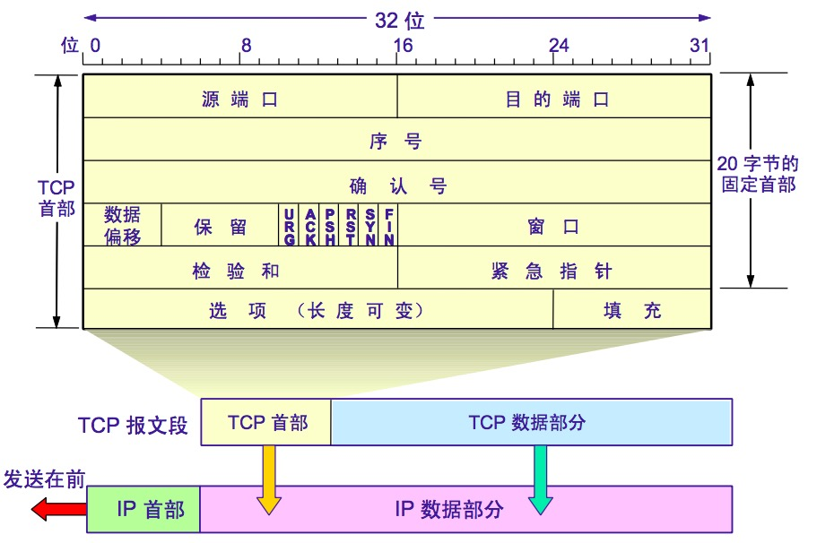
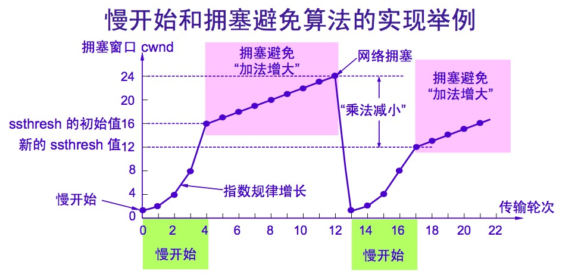
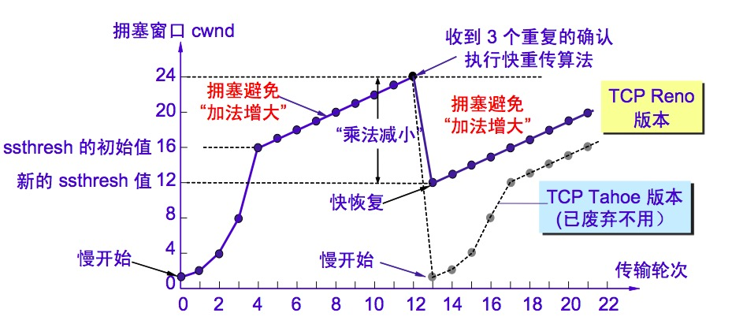
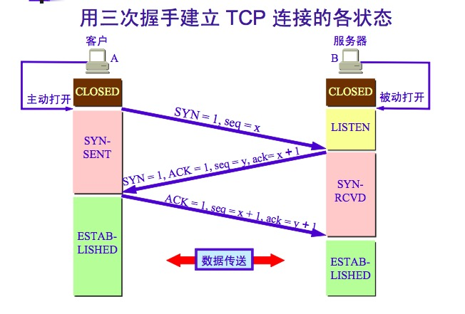

## 数据链路层

数据链路层是网络的底层，主要使用两种信道：点对点信道、广播信道

### 点对点信道

#### 三个基本问题

* 封装成帧

  在数据前后添加首部和尾部，数据报： SOH数据部分EOT

* 透明传输

  如果数据部分也出现SOH或者EOT，则在其前面添加转义字符ESC；如果数据中本身有ESC，则再加一个ESC。

* 差错检测

  循环冗余检测

#### MAC帧格式

源地址（6字节）、目的地址（6字节）、类型（2字节）、数据报（46—1500）、FCS帧检验序列（4）

## 网络层

网际协议IP，与之配套使用的三个协议：

* 地址解析协议（ARP）
* 网际控制报文协议（ICMP）
* 网际组管理协议（IGMP）

#### IP地址划分

IP地址={网络号，主机号}

A类地址：网络号8位且以0开头，主机号24位 0.0.0.0—127.255.255.255

B类地址：网络号16位且以10开头，主机号16位 128.0.0.0—191.255.255.255

C类地址：网络号24位且以110开头，主机号8位 192.0.0.0—223.255.255.255

D类地址：以1110开头，用于多播  224.0.0.0—239.255.255.255

E类地址：以1111开头，保留地址 240.0.0.0—255.255.255.255

#### ARP协议

ARP协议适用于同一局域网上的主机或者路由器的IP地址和硬件地址的映射问题。

每个主机都设有一个ARP高速缓存，里面存放了本局域网中IP地址到Mac地址之间的映射。

主机A通过ARP查找主机B的MAC地址步骤：

1. 如果ARP高速缓存中存在这个IP地址到Map地址的映射，则直接查找Mac地址
2. 如果不存在，则在局域网上广播一个ARP请求，请求内容大致是“我的IP地址是“12.23.121.23，我的Mac地址是00-34-45-23-45-34，我想知道IP地址是23.54.23.45的Mac地址”。
3. 本局域网上的所有主机运行的ARP进程都能收到此ARP请求分组。
4. 主机B发现这个ARP请求的IP地址和自己的相同，就收下这个ARP请求，并向主机A发送ARP相应分组，并在这个响应分组中写入自己的MAC地址，同时将A的IP和MAC地址写入自己的APR高速缓存中。
5. 其他的主机发现IP地址和自己的不一致，因此全都不理睬。
6. 主机A收到响应之后，将B的MAC地址写入高速缓存中。

ARP高速缓存中的每一个映射项目都设置一个生存时间，超过这个时间就将该项目删除。

#### 子网划分

IP地址={网络号，子网号，主机号}

**子网掩码**：将子网掩码与IP地址逐位进行与（and）运算，可立即得出网络地址。

## 运输层

#### UDP（用户数据报协议）

* UDP无连接的
* 最大努力交互，不保证可靠交互
* UDP是面向报文的
* UDP不使用拥塞控制
* UDP支持一对一、一对多、多对一和多对多的交互通信
* UDP的首部开销小，只有8个字节

#### TCP传输控制协议

* TCP是面向连接的运输层协议
* 每一条TCP连接只能有两个端点，每条连接只能是点对点的
* TCP是可靠交付服务
* TCP提供全双工通信
* TCP是面向字节流的

#### 停止等待协议

* 无差错情况：A向B发送数据M1，B收到M1后，向A发送确认，A收到确认后，就发送下一个分组M2
* 出现差错：A向B发送分组M1，在传输过程出现差错，B收到后检测数据出错直接丢弃而不做其他任何操作。A过一段时间还没有收到确认报文，就认为前面发送的报文出错了，会重新发送报文M1。这就是**超时重传**，在每次发送完数据都设置一个超时重传计时器。超时重传的时间应当比数据在分组传输的平均往返时间更长一些。
* 确认丢失和确认迟到：B发送的对M1的确认丢失了，A在超时计时器到期后会对M1进行重传，B再次收到M1时应进行两步操作，一是丢弃这个数据分组M1，二是想A发送确认报文M1。

这种确认重传机制叫做 **自动重传ARQ**。

#### TCP报文首部格式

* 序号：本报文段发送的数据的第一个字节序号
* 确认号：是期望下收到对方下一个报文段的第一个数据字节序号
* 数据偏移：是指TCP报文段的数据起始处距离TCP报文段的起始处多远，即可知道首部的长度。数据偏移最大值15，单位是4字节，故最大偏移是60字节，即首部最长为64字节
* URG紧急：URG=1时，表明仅仅指针字段有效
* 确认ACK：ACK=1时确认号字段才有效
* 同步SYN：在连接建立时用来同步序号。SYN=1 ACK=0时，表明这是一个连接请求报文段；SYN=1，ACK=1 表明这是一个同意建立连接报文
* 终止FIN：用来释放一个连接。当FIN=1，表明此报文段的发送方的数据已经发送完毕，并要求释放连接。
* 窗口：接收窗口的大小。

#### TCP拥塞控制

**慢开始和拥塞避免**

1. 初始化是拥塞窗口cwnd=1(单位是报文个数)，慢开始门限ssthresh=16
2. 执行慢开始是，cwnd是以指数增大2，4，8……，当大于ssthresh时，采用拥塞避免算法，即每次增加一个。
3. 当出现拥塞时，ssthresh变成当前cwnd的一半，cwnd从1开始，重复2步骤。

**快重传和快恢复**

1. 初始化是拥塞窗口cwnd=1(单位是报文个数)，慢开始门限ssthresh=16
2. 执行慢开始是，cwnd是以指数增大2，4，8……，当大于ssthresh时，采用拥塞避免算法，即每次增加一个。
3. 当出现拥塞时，ssthresh变成当前cwnd的一半，cwnd从ssthresh开始，每次窗口值加1。

#### TCP三次握手

* SYN=1，ACK=0 表示这是一个建立连接的请求
* SYN=1，ACK=1 表示这是一个同意创建连接的报文 （ACK=1时，确认号才有用）

**为什么要采用三次握手**：

主要是为了防止已失效的连接请求报文段突然又传送到了B，因而产生错误。例如：A发送连接请求，但中途丢失，于是又发送一个连接请求，数据发送完毕连接关闭。此时丢失的连接请求又来到B，B误认为A又发送了连接请求，于是向A发送确认报文同意建立连接。此时A不知道建立了连接，因此不理睬A的确认请求；而B建立了连接，浪费了资源

#### TCP四次挥手

* FIN=1 表示数据已经发送完毕，请求关闭连接。
* MSL最长报文段寿命，一般建议是2分钟

**为什么TIME-WAIT必须等待2MSL？**

* 保证A发送的最后一个ACK报文段能够到达B
* 防止已失效的连接请求报文段出现在本连接中。

