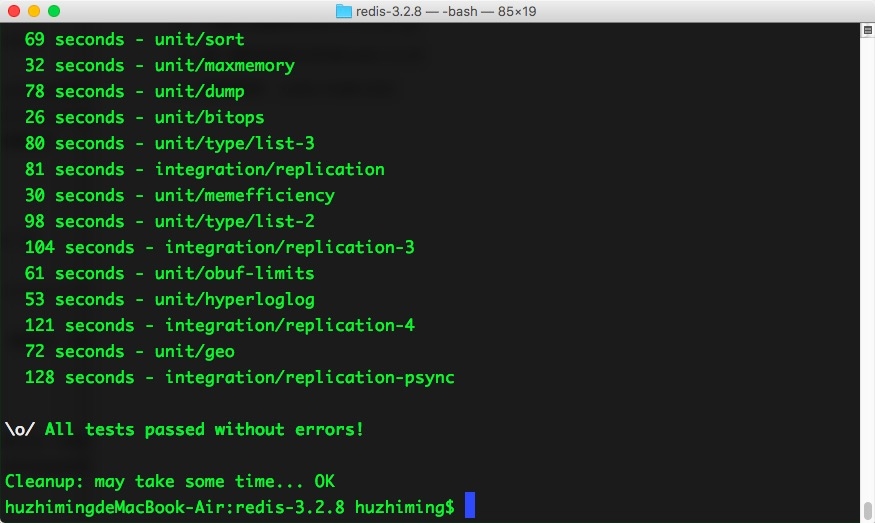
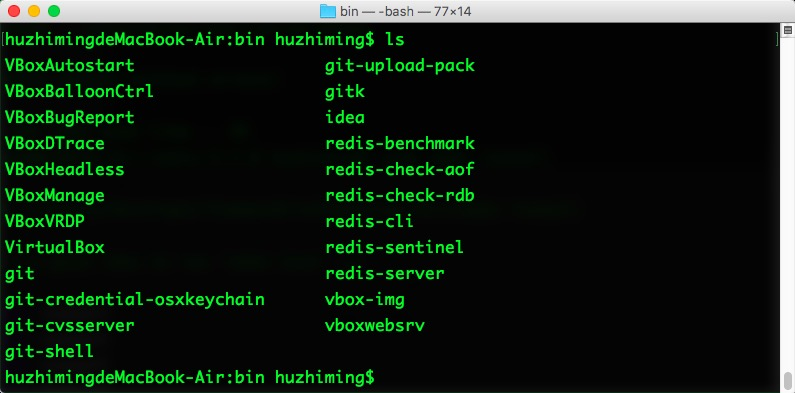
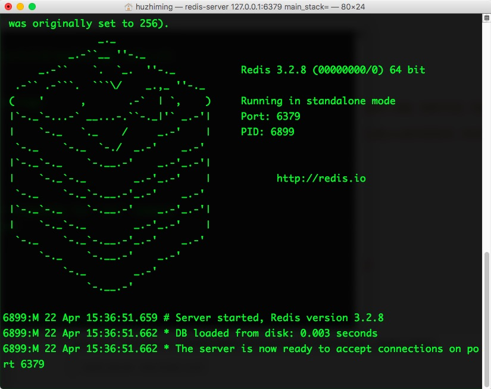
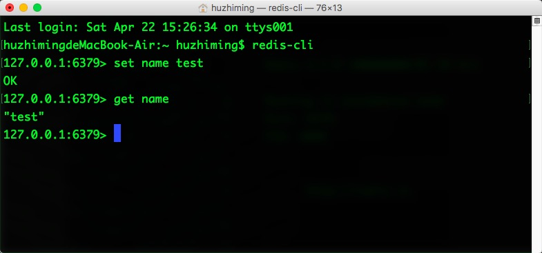

# Mac redis 安装教程

#### redis环境搭建

1. 到官网下载最新版本的redis，本次下载的版本是redis-3.2.8

2. 下载之后解压redis-3.2.8.tar.gz

3. 进入解压后的文件夹redis-3.2.8

4. 编译测试：sudo make test

   

   编译成功！

5. redis安装：sudo make install

   redis默认安装在usr/local/bin 目录下，可以进入usr/local/bin目录下查看这些工具

   

   主要包含以下几个工具：

   * ./redis-benchmark //用于进行redis性能测试的工具
   * ./redis-check-dump //用于修复出问题的dump.rdb文件
   * ./redis-cli //redis的客户端
   * ./redis-server //redis的服务端
   * ./redis-check-aof //用于修复出问题的AOF文件
   * ./redis-sentinel //用于集群管理

6. 将文件夹中redis.conf配置文件复制到/etc/目录下面，对配置文件进行修改

   ```toml
   #修改为守护模式
    
   daemonize yes
    
   #设置进程锁文件
    
   pidfile /usr/local/redis/redis.pid
    
   #端口
    
   port 6379
    
   #客户端超时时间
    
   timeout 300
    
   #日志级别
    
   loglevel debug
    
   #日志文件位置
    
   logfile /usr/local/redis/log-redis.log
    
   #设置数据库的数量，默认数据库为0，可以使用SELECT <dbid>命令在连接上指定数据库id
    
   databases 8
    
   ##指定在多长时间内，有多少次更新操作，就将数据同步到数据文件，可以多个条件配合
    
   #save <seconds> <changes>
    
   #Redis默认配置文件中提供了三个条件：
    
   save 900 1
    
   save 300 10
    
   save 60 10000
    
   #指定存储至本地数据库时是否压缩数据，默认为yes，Redis采用LZF压缩，如果为了节省CPU时间，
    
   #可以关闭该#选项，但会导致数据库文件变的巨大
    
   rdbcompression yes
    
   #指定本地数据库文件名
    
   dbfilename dump.rdb
    
   #指定本地数据库路径
    
   dir /usr/local/redis/db/
    
   #指定是否在每次更新操作后进行日志记录，Redis在默认情况下是异步的把数据写入磁盘，如果不开启，可能
    
   #会在断电时导致一段时间内的数据丢失。因为 redis本身同步数据文件是按上面save条件来同步的，所以有
    
   #的数据会在一段时间内只存在于内存中
    
   appendonly no
    
   #指定更新日志条件，共有3个可选值：
    
   #no：表示等操作系统进行数据缓存同步到磁盘（快）
    
   #always：表示每次更新操作后手动调用fsync()将数据写到磁盘（慢，安全）
    
   #everysec：表示每秒同步一次（折衷，默认值）
    
   appendfsync everysec
   ```

7. 启动redis：redis-server ,如果要加载我们修改后的配置文件则在后面加上配置文件路径

   > redis-server  /etc/redis.conf

   启动后如图所示：

   

8. 启动redis客户端。另外打开一个终端，输入 

   > redis-cli

   

9. 关闭redis服务器，在客户端中输入

   > 127.0.0.1:6379> shutdown

#### redis卸载删除

进入redis安装目录usr/local/bin。只需将redis安装文件删除即可。删除该目录下所有redis开头的文件

> sudo rm -f redis.*