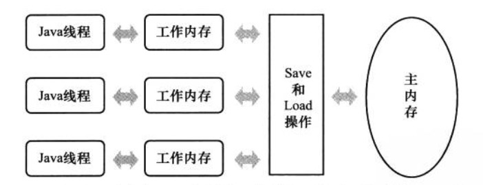

[TOC]

## Java基础

### 基础

#### 面向对象的三大特性、六大原则

特性：封装、继承、多态

六大原则：单一责任原则、开放封闭原则、里氏替换原则、依赖倒置原则、接口分离原则、组合聚合复用原则

参考：  [面向对象基本原则](https://huzhiming12.github.io/2017/05/20/java/%E9%9D%A2%E5%90%91%E5%AF%B9%E8%B1%A1%E7%9A%84%E5%9F%BA%E6%9C%AC%E5%8E%9F%E5%88%99/)

#### Java反射机制

Class类，通过Class类可以获取一个类中所有信息，包括构造函数、成员变量、方法等信息。同时通过Class类可以生成一个类的实例。

Java反射中主要涉及到到的类有Class、Constructor、Filed、Method。

#### Java强软弱虚引用

* 强引用：只要引用存在，垃圾回收机就不会回收，JVM宁愿报OutOfMemory错误
* 软引用：在内存溢出之前回收，垃圾回收时扫描到这个对象会做上标记，但不会立即回收，当内存要溢出时才会进行垃圾回收
* 弱引用：只要垃圾回收器扫描到就会立刻回收。
* 虚引用：只是用来判断对象是否还在内存中，因为通过get方法无法获取到值

#### 依赖、关联、组合、聚合

* 依赖

  可以简单的理解为一个类A使用了另一个类B，而这种使用关系是具有偶然性、临时性的，但是B类的变化会影响到A。在代码层面上就是B类作为一个参数被A类在某个方法中实现。

  ```Java
  class A
  {
    	void dependMethod(B b)
    	{
        ……
    	}
  }
  ```

* 关联

  它体现在两个类之间语义级别的一种强依赖关系。这种关系比依赖更强，不存在偶然性、临时性，一般指长期性的。在代码层面上，被关联的B以成员的形式出现在关联类A中。

  ```java
  class A
  {
    	private B b;
  }
  ```

* 聚合

  组合是关联关系的一种特例，它体现的是整体与部分、拥有关系，即has-a的关系。此时整体与部分之间是可分离的，他们可以具有各自的生命周期。比如雁群与大雁之间的关系，雁群是由很多大雁组成，但是大雁也可以和雁群分离。

* 组合

  组合也是关联关系的一种特例，它体现的是一种contains-a的关系，这种关系比聚合更强，也成为强聚合。它同样体现整体与部分间的关系，但此时整体与部分是不可分的，整体的生命周期借宿也就意味着部分的生命周期的结束；比如大雁的一对翅膀与大雁之间的关系，翅膀脱离了大雁无法单独存在。

#### java8 新特性

* 接口默认方法与静态方法

  Java8允许给接口添加一个非抽象方法的实现，只需在方法前使用Default关键字即可

  ```Java
  interface Formula {
      double calculate(int a);
      default double sqrt(int a) {
          return Math.sqrt(a);
      }
  }
  ```

  还可以在接口中定义静态方法，只需在方法前添加Default关键字

  ```Java
  public interface StaticFunctionInterface 
  {
  	static String staticFunction() {
  		return "static function";
  	}
  }
  ```

* Lambda表达式

* ​

### Java容器

#### HashMap底层实现

hashMap底层存储是用一个Entry<Object,Object>数组，数据中每个Entry都是一个链表，当新元素添加时，直接添加到链表头即可。

hashMap可以设定初始容量，不设定的话初始容量为16，默认加载因子是**loadFactor=0.75**，当map中的元素个数n>=table.length\*0.75时，Map会发生扩容，扩容机制是原来数组长度的两倍：**resize(2 * table.length)**。

hashMap 解决冲突的办法是将数组元素设计成一个链表，当同一个有多个元素映射到同一个数组元素中，直接将其添加到链表头，更好的解决冲突的办法是将链表设计成一颗红黑树。

详细参考： [Java集合_Map介绍](https://huzhiming12.github.io/2017/05/10/java/Java%E9%9B%86%E5%90%88-Map%E4%BB%8B%E7%BB%8D/)

#### ArrayList和LinkedList区别

* arrrayList底层实现是用的数组，而LinkedList用的是链表。

* ArrayList的查找效率更高，但是LinkedList的添加和删除元素更快

* ArrayList的默认容量是10，扩容比例是：1.5倍

  ```java
  int newCapacity = oldCapacity + (oldCapacity >> 1);
  ```

详细请参考：[Java集合_List介绍](https://huzhiming12.github.io/2017/05/08/java/Java%E9%9B%86%E5%90%88-List%E4%BB%8B%E7%BB%8D/)

#### TreeSet如何实现排序

TreeSet底层是通过TreeMap实现的，TreeMap实现排序是通过红黑树。


### Java虚拟机

#### Java内存管理

Java虚拟机将内存分为：堆、方法区、虚拟机栈、本地方法栈、程序计数器 五块区域。其中虚拟机栈、本地方法栈和程序计数器是线程隔离的；堆和方法区是线程共享区域。

详细参考:[Java内存管理](https://huzhiming12.github.io/2017/03/22/java/Java内存管理/)

#### Java垃圾回收机制

**如何确定一个对象是否是垃圾？**

* 引用计数法
* 可达性分析

**常见的垃圾回收算法**

* 标记清除算法

* 标记整理算法

* 复制算法

* 分代收集算法

  新生代采用复制算法，老年代采用标记整理算法

**典型的垃圾收集器**

* serial收集器（适用于新生代）

  这是一个单线程的收集器，在进行垃圾回收时必须暂停其他所有的工作线程。

* parnew收集器（适用于新生代）

  serial收集器的多线程版本，除了使用多条线程进行垃圾收集之外，其余行为和serial收集器一样。

* parallel scavengel 收集器（适用于新生代）

  和parnew收集器比较相似，不同之处在于ps更多关注的是系统吞吐量，最求系统吞吐量的最大化。

  系统吞吐量=运行用户代码时间/(运行用户代码时间+垃圾收集时间)；

  这个收集器无法与CMS收集器配合使用。

* serial old 收集器

  是serial收集器的老年代版本，同样是一个单线程收集器。采用的是标记整理算法。

* parallel old收集器

  是parallel scavenge收集器的老年代版本，使用多线程和标记整理算法。

* cms收集器

  cms收集器是一种以获取最短回收停顿时间为目标的收集器。是基于标记清除算法实现的。主要包括四个步骤：

  * 初始标记：暂停所有用户线程，仅仅只是标记一个GC Root能直接关联到的对象。
  * 并发标记：就是进行GC Root Tracing的过程。
  * 重新标记：修正并发标记期间因用户程序继续运作而导致标记产生变动的那一部分对象的标记记录。这个时间比初始标记的时间稍长，但远小于并发标记的时间
  * 并发清除：并发清除所有未标记过的对象。

* G1收集器

  G1将堆内存分割成若干个大小相同的Region区域，一部分是Eden、一部分是survivor、一部分是old，还有一部分是Humongous区域，Humongous是存放大对象的地方（一个对象大于等于Region/2）。在young GC时，判定对象是否存活的时候，为了避免扫描整个Java堆，引入Remembered Set。young gc时会扫描所有的Eden和survivor区域，因此他们之间的引用不用考虑，但是old区域到新生代的引用需要记录。用Card Table将一个Region在逻辑上划分为固定大小的连续区域，每个区域称之为卡，卡通常较小，介于128到512字节之间。Card Table通常为字节数组，由Card的索引（即数组下标）来标识每个分区的空间地址。默认情况下，每个卡都未被引用。当一个地址空间被引用时，这个地址空间对应的数组索引的值被标记为”0″，即标记为脏被引用，此外RSet也将这个数组下标记录下来。一般情况下，这个RSet其实是一个Hash Table，Key是别的Region的起始地址，Value是一个集合，里面的元素是Card Table的Index。


参考： [Java垃圾回收机制](https://huzhiming12.github.io/2017/03/22/java/Java%E5%9E%83%E5%9C%BE%E5%9B%9E%E6%94%B6%E6%9C%BA%E5%88%B6/)

#### Java内存模型

Java内存模型规定所有变量都存储在主内存中（可以类比物理硬件中的内存），没条线程还有自己的工作内存（与处理器的高速缓存类似），线程的工作内存中保存了被该线程使用到的变量的主内存副本拷贝，线程对变量的所哟操作都必须在工作内存中进行，而不能直接读取内存中的变量。

这里所说的主内存、工作内存与Java内存区域划分中的Java堆、栈、方法区不是同一个曾是的内存划分。




#### JVM参数配置

参考：[JVM参数配置大全](http://www.cnblogs.com/edwardlauxh/archive/2010/04/25/1918603.html)

####  JVM频繁FullGC及应对策略

参考：[JVM频繁Full GC的情况及应对策略](http://blog.csdn.net/endlu/article/details/51144918)

#### JVM性能调优和监控工具

* jps 查看JVM中运行的进程状态信息

  * -q 不输出类名、jar名和传入main方法的参数
  * -m 输出传入main方法的参数
  * -l 输出main类或jar的全名
  * -v 输出传入JVM的参数

* jstack查看某个Java进程的线程堆栈信息

* jmap 用来查看内存使用状况

  * 用jmap把进程内存使用情况dump到文件中，可以用MAT或visualVM查看

    ```shell
    jmap -dump:format=b,file=dumpFileName pid
    ```

  * 查看进程内存使用情况

    ```shell
    jmap -heap 2378  
    //输出结果
    Heap Configuration:
       MinHeapFreeRatio = 0
       MaxHeapFreeRatio = 100
       MaxHeapSize      = 1073741824 (1024.0MB)
       NewSize          = 1310720 (1.25MB)
       MaxNewSize       = 17592186044415 MB
       OldSize          = 5439488 (5.1875MB)
       NewRatio         = 2
       SurvivorRatio    = 8
       PermSize         = 21757952 (20.75MB)
       MaxPermSize      = 85983232 (82.0MB)
       G1HeapRegionSize = 0 (0.0MB)

    Heap Usage:
    PS Young Generation
    Eden Space:
       capacity = 17301504 (16.5MB)
       used     = 2101464 (2.0041122436523438MB)
       free     = 15200040 (14.495887756347656MB)
       12.146134810014205% used
    From Space:
       capacity = 2621440 (2.5MB)
       used     = 0 (0.0MB)
       free     = 2621440 (2.5MB)
       0.0% used
    To Space:
       capacity = 2621440 (2.5MB)
       used     = 0 (0.0MB)
       free     = 2621440 (2.5MB)
       0.0% used
    PS Old Generation
       capacity = 57147392 (54.5MB)
       used     = 26782288 (25.541580200195312MB)
       free     = 30365104 (28.958419799804688MB)
       46.865284771000574% used
    PS Perm Generation
       capacity = 22020096 (21.0MB)
       used     = 7535448 (7.186363220214844MB)
       free     = 14484648 (13.813636779785156MB)
       34.220777239118306% used
    ```

* Jstat JVM统计工具，统计Survivor、Eden、Old使用情况

  * jstat -gc pid：GC堆的状态

  ```
  S0C    S1C    S0U    S1U      EC       EU        OC         OU       PC     PU    YGC     YGCT    FGC    FGCT     GCT   
  19968.0 2560.0  0.0    0.0   16896.0   3047.6   72192.0    38157.8   21504.0 7292.4      5    0.132   3      0.710    0.842
  ```

  * jstat -gcutil pid：GC汇总

参考： [JVM调优工具](https://my.oschina.net/feichexia/blog/196575)


### Java并发编程

#### 实现线程安全方式

* 加锁

  通过对线程共享资源加锁，使得资源一次只能有一个线程访问。加锁的方式有lock和synchronized。

* ThreadLocal

  为每个线程提供变量的一个副本，实质是用空间换时间。ThreadLocal通过维护Thread类中的ThreadLocalMap，以实现对同一变量不同线程提供不同的副本。Map中，ThreadLocal作为key值，Value是每个线程对应的变量副本。

  ```Java
  public void set(T value) {
  	Thread t = Thread.currentThread();
  	//获取线程Thread中的ThreadLocalMap变量
  	ThreadLocalMap map = getMap(t);
  	if (map != null)
  		map.set(this, value);
  	else
  	createMap(t, value);
  }

  ThreadLocalMap getMap(Thread t) {
  	return t.threadLocals;
  }
  ```

  ```Java
  //Thread类中对threadLocals的定义
  ThreadLocal.ThreadLocalMap threadLocals = null;
  ```

 ThreadLocal详细参考：[ThreadLocal](https://huzhiming12.github.io/2017/05/19/java/ThreadLocal/)

#### Lock与synchronized比较

**synchronized**

* 获取锁的线程执行完代码，然后线程自动释放对锁的占有
* 线程执行发生异常，此时JVM会让线程自动释放锁

**Lock**

* Lock不是Java语言内置的，synchronized是Java语言的关键字，因此是内置特性。Lock是一个类，通过这个类可以实现同步访问；
* Lock和synchronized有一点非常大的不同，采用synchronized不需要用户去手动释放锁，当synchronized方法或者synchronized代码块执行完之后，系统会自动让线程释放对锁的占用；而Lock则必须要用户去手动释放锁，如果没有主动释放锁，就有可能导致出现死锁现象。
* 当通过lockInterruptibly()方法获取某个锁时，如果不能获取到，只有进行等待的情况下，是可以响应中断的。而用synchronized修饰的话，当一个线程处于等待某个锁的状态，是无法被中断的，只有一直等待下去。
* tryLock()方法是有返回值的，它表示用来尝试获取锁，如果获取成功，则返回true，如果获取失败（即锁已被其他线程获取），则返回false，也就说这个方法无论如何都会立即返回。在拿不到锁时不会一直在那等待。

#### volatile关键字

* 保证了线程对变量的修改是内存可见的，即一个线程对变量的修改，会立刻会更新到主内存中，其他线程想要读取变量值必须到主内存中读取，而不能在线程的工作内存中读，保证其他线程能够立刻看到修改值
* 禁止指令的重排序。
  * 指令重排序：处理器为了提高程序运行效率，可能会对输入的代码进行优化，它不保证程序中各个语句的执行先后顺序同代码中的顺序一致，但是他会保证程序执行结果和代码顺序执行的结果是一致的。处理器进行指令重排序时，会考虑指令之间的数据依赖性。虽然重排序不会影响单个线程的执行结果，但是对多线程却是有影响的。

  * 如果变量声明为volatile，则代码中这个变量所在的顺序就是其执行的顺序，即它前面语句执行顺序可能会变，后面的语句执行顺序会变，但是它本身执行不会变

    ```Java
    a=2;//语句1
    b=3;//语句2
    c=5;//语句3 c是volatile变量，1和2执行顺序可能交换，4和5的执行顺序也可能交换，但是3一定是第三个执行
    d=2;//语句4
    e=6;//语句5
    ```


#### 线程池


## spring 框架

### SpringMVC

#### Spring MVC运行原理


1.http请求：客户端请求提交到DispathcherServlet.

2.寻找处理器：DispatcherServlet控制器查询一个或多个HandlerMaping，找到处理请求的Controller(我们俗称Controller，实际是Handler)。

3.调用处理器：DispatcherServlet将请求提交到Controller中。

4.5.调用处理业务和返回结果：Controller调用业务逻辑处理后，返回ModelAndView

6.7处理视图映射并返回模型：DispathcerServlet查询一个或多个ViewResoler视图解析器，找到ModelAndView指定的视图

8.Http响应：视图复制将结果显示到客户端


## 数据库

### 数据库相关知识点

#### 数据库事务的理解

事务：用户定义的一个数据库操作序列，要么全都做，要么全都不做，是一个不可分割的工作单位。

事务的四个特性：原子性、一致性、隔离性、持续性。

**原子性：**事务中的操作要么全都做，要么全都不做。

**一致性：**事务的执行结果必须是从一个状态变到另一个状态。当数据库只包含成功事务提交的结果时，就说数据库处于一致性状态。

**隔离性**：一个事务的执行不能被其他事务干扰。

**持续性：**一个事务一旦提交，他对数据库中数据的改变就应该是永久的。


#### 数据库的隔离级别

* Read Uncommited

  如果一个事务已经开始写数据，则另外一个事务则不允许同时进行写操作，但允许其他事务读此行数据。该隔离级别可以通过“排他写锁”实现。

* ReadCommited

  写事务的时候不允许其他事务，读事务的时候可以其他事务

* RepeatableRead

  读取数据的事务将会禁止写事务（但允许读事务），写事务则禁止任何其他事务。

* serializable(序列化)

  它要求事务序列化执行，事务只能一个接着一个地执行，但不能并发执行

|                 |  脏读  | 不可重复读 |  幻读  |
| --------------- | :--: | :---: | :--: |
| read Uncommited | yes  |  yes  | yes  |
| read Commited   |  no  |  yes  | yes  |
| repeatableRead  |  no  |  no   | yes  |
| serializable    |  no  |  no   |  no  |


#### 数据库索引

索引的主要目的是加快检索表中数据。索引是对数据库表中的一列或者多列的值进行排序的结构。

**索引的分类**

* 普通索引：没有任何的限制，可以对表中的没一列添加索引

```sql
create index in_username on student(name);
```

* 唯一索引：索引列的值必须唯一，但允许有空值

```sql
create unique index in_username on student(name);
```

* 主键索引：它是一种特殊的唯一索引，不允许有空值。一般是在建表的时候同时创建主键索引

```sql
create table tt (
id int auto_increment,
name varchar(16),
address varchar(20),
primary key(id)
);
```

* 组合索引：对多个列同时添加索引

```sql
create index in_co on tt(id,name);
```

详细介绍可参考：http://www.jb51.net/article/49346.htm

**索引的实现方式**

* B+树索引
* Hash索引

详细介绍可参考：http://www.cnblogs.com/heiming/p/5865101.html

**聚集索引和非聚集索引**

* 聚集索引

  聚集索引也称聚簇索引、聚类索引。聚集索引是指数据库表中数据的物理顺序与键值的逻辑顺序相同。一个表中只能有一个聚集索引，因为一个表的物理顺序只有一种情况。逻辑顺序决定表中的物理顺序。一般索引是通过树来描述，聚集索引的叶子结点就是最终的数据结点。

  

* 非聚集索引

  该索引的逻辑顺序与磁盘上行的物理存储顺序不同。叶子结点存储的只是数据域的地址，而不是真正的数据。

  


#### 乐观锁和悲观锁

* 乐观锁

  乐观锁认为数据一般情况下是不会造成冲突的，所以在数据进行提交更新时，才会正式对数据的是否冲突进行检测，如果发生冲突了，则让返回错误信息，让用户决定如何去做。可以通过版本号和时间戳等方法判断数据是否冲突。

  **适用场景：**冲突比较少的时候，这样可以减少加锁的开销。如果冲突交多，则会不断进行retry，反而降低了系统的吞吐量。	

* 悲观锁

  悲观锁是指对数据被外界修改保持保守的态度，每次去拿数据都认为别人会修改，所以每次在拿数据库的时候都会上锁，这样别人想拿这个数据就会阻塞，知道拿到这个锁。

  适用场景：冲突比较多的时候。

## 架构

### session

#### 分布式部署架构下如何设计session

1. session复制

   应用服务器开启web容器的session复制功能，在集群中的几台服务器之间同步session对象，使得每台服务器上都不存所有用户的session信息。

   **缺点：**

   当服务器集群较大时，需要大量的通信进行session复制，占用服务器和网络资源。而且用户数量很多时，服务器内存远不够存储这些session信息。

2. session绑定

   可以利用负载均衡将源地址做Hash运算映射其中一台服务器上，同样的IP地址总是分配同一个web服务器。

   **缺点：**

   当某一台服务器宕机时，那么该机器上的session全部消失，用户请求切换到其他服务器后也没有session信息，进而无法完成业务处理。

3. 利用Cookie记录session

   将session信息记录到本地cookie。

   缺点：cookie有大小限制，能记录的信息有限；每次请求都要传输cookie，影响 性能；本地cookie容易被劫持复制，不安全。

4. session服务器

   独立部署session服务器集群，同一管理session。应用服务器没戏读写session时，都访问session服务器。

参考： [分布式环境下5种session处理策略](http://blog.csdn.net/u010028869/article/details/50773174)


## 数据结构

### 树

#### 红黑树

* 根节点是黑色的
* 树中只有结点要么是黑色，要么是红色
* 每个叶子结点都是黑色的
* 红色结点的两个子节点都是黑色的（从叶子结点到根节点的所有路径上不能有两个连续的红色结点）
* 从任意结点到期每个叶子结点的所有路径都包含相同数目的黑色结点。


#### 二叉搜索树（B树）

* 所有非叶子结点至多拥有两个儿子儿子结点
* 父节点的值大于左儿子结点的值，小于右儿子结点的值
* 二叉搜索树中序遍历是一个递增序列


## 网络

### 工具

#### ping命令返回结果

常见的三种错误：

* unknown host：不知名主机，主机名无法被DNS解析
* Destinationn host Unreachable：主机不可达，一般是线路中断。
* Request time out：在规定时间内没有返回结果，可能是防火墙阻隔。

联通时返回结果：

```shell
huzhimingdeMacBook-Air:~ huzhiming$ ping www.baidu.com
PING www.a.shifen.com (119.75.216.20): 56 data bytes
64 bytes from 119.75.216.20: icmp_seq=0 ttl=244 time=70.714 ms
64 bytes from 119.75.216.20: icmp_seq=1 ttl=244 time=74.515 ms
64 bytes from 119.75.216.20: icmp_seq=2 ttl=244 time=64.175 ms
64 bytes from 119.75.216.20: icmp_seq=3 ttl=244 time=63.792 ms
64 bytes from 119.75.216.20: icmp_seq=4 ttl=244 time=64.381 ms
^C
--- www.a.shifen.com ping statistics ---
5 packets transmitted, 5 packets received, 0.0% packet loss
round-trip min/avg/max/stddev = 63.792/67.515/74.515/4.338 ms
```

119.75.216.20：解析出的ping的IP地址

64：返回数据包大小

ttl:Time To LIve 生存时间，防止数据报在网络中形成广播风暴

time：返回数据所耗费的时间

参考： [ping命令使用解析](https://wenku.baidu.com/view/017fd52c647d27284b7351fe.html)


## 操作系统：

### 基础

#### 进程与线程的区别与联系

**进程**：进程是具有一定独立功能的程序关于某个数据集合上的一次运行活动，进程是系统进行资源分配和调度的基本单位

**线程：**是进程的一个实体，是CPU调度和分配的基本单位。它是比进程更小的能独立运行的基本单位，线程基本上不拥有系统资源，只拥有一点在运行中必不可杀的资源。

**区别：**

1. 简而言之,一个程序至少有一个进程,一个进程至少有一个线程.
2. 线程的划分尺度小于进程，使得多线程程序的并发性高。
3. 另外，进程在执行过程中拥有独立的内存单元，而多个线程共享内存，从而极大地提高了程序的运行效率。
4. 线程在执行过程中与进程还是有区别的。每个独立的线程有一个程序运行的入口、顺序执行序列和程序的出口。但是线程不能够独立执行，必须依存在应用程序中，由应用程序提供多个线程执行控制。
5. 从逻辑角度来看，多线程的意义在于一个应用程序中，有多个执行部分可以同时执行。但操作系统并没有将多个线程看做多个独立的应用，来实现进程的调度和管理以及资源分配。**这就是进程和线程的重要区别。**

#### 进程间通信的方法

1. 无名管道：管道是一种半双工的通信方式，数据只能单向流动，而且只能在具有亲缘关系的进程间使用。进程的亲缘关系通常是指父子进程关系。
2. 高级管道：将另一个程序当做一个新的进程在当前程序进程中启动，则它算是当前程序的子进程，这种方式我们成为高级管道方式。
3. 有名管道：有名管道也是半双工的通信方式，但是它允许无亲缘关系进程间的通信。
4. 消息队列： 消息队列是由消息的链表，存放在内核中并由消息队列标识符标识。消息队列克服了信号传递信息少、管道只能承载无格式字节流以及缓冲区大小受限等缺点。
5. 信号量： 信号量是一个计数器，可以用来控制多个进程对共享资源的访问。它常作为一种锁机制，防止某进程正在访问共享资源时，其他进程也访问该资源。因此，主要作为进程间以及同一进程内不同线程之间的同步手段。
6. 信号：信号是一种比较复杂的通信方式，用于通知接收进程某个事件已经发生
7. 共享内存：共享内存就是映射一段能被其他进程所访问的内存，这段共享内存由一个进程创建，但多个进程都可以访问。
8. 套接字（socket）：套解口也是一种进程间通信机制，与其他通信机制不同的是，它可用于不同机器间的进程通信。

#### 死锁的必要条件避免和解除方法

**必要条件**

1. 互斥条件：一个资源每次只能被一个进程使用
2. 请求保持条件：一个进程因请求资源二阻塞时，对已获得的资源保持不放
3. 不剥夺条件：进程已获得的资源，在未使用完之前，不能强行剥夺
4. 循环等待条件：若干进程之间形成一种头尾相接的循环等待资源关系


**预防死锁的办法**：

1. 摒弃请求保持条件，规定所有进程在开始之前，都必须一次性申请其在整个运行过程中所需的全部资源，只要有一种不够，便不分配
2. 摒弃不剥夺条件，进程可以逐个申请资源，一旦申请资源无法满足，立即释放已经保持的所有资源。
3. 摒弃环路等待条件

避免死锁的算法：银行家算法

**解决死锁的办法**：

1. 剥夺资源
2. 撤销进程

#### 自旋锁和互斥锁

自旋锁：但是自旋锁不会引起调用者睡眠，如果自旋锁已经被别的执行单元保持，调用者就一直循环在那里看是否该自旋锁的保持者已经释放了锁，"自旋"一词就是因此而得名。

互斥锁：对于互斥锁，如果资源已经被占用，资源申请者只能进入睡眠状态。

## 算法

### 动态规划

1. [最长回文子串问题](https://segmentfault.com/a/1190000003914228)
2. ​


