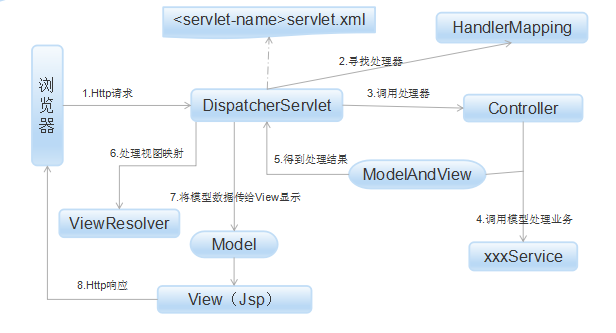

[TOC]

## Java基础

### 基础

#### 面向对象的三大特性、六大原则

特性：封装、继承、多态

六大原则：单一责任原则、开放封闭原则、里氏替换原则、依赖倒置原则、接口分离原则、组合聚合复用原则

参考：  [面向对象基本原则](https://huzhiming12.github.io/2017/05/20/java/%E9%9D%A2%E5%90%91%E5%AF%B9%E8%B1%A1%E7%9A%84%E5%9F%BA%E6%9C%AC%E5%8E%9F%E5%88%99/)

#### Object方法

```java
class Object
{
  	private static native void registerNatives();
    static {
        registerNatives();
    }
    public final native Class<?> getClass();
    public native int hashCode();
  	//重写equals方法时，必须重写hashCode，否则在使用HashMap、HashSet等时会出现问题
    public boolean equals(Object obj) {
        return (this == obj);
    }
    protected native Object clone() throws CloneNotSupportedException;
    public String toString() {
        return getClass().getName() + "@" + Integer.toHexString(hashCode());
    }
    public final native void notify();
    public final native void notifyAll();
    public final native void wait(long timeout) throws InterruptedException;
    public final void wait(long timeout, int nanos) throws InterruptedException {
        if (timeout < 0) {
            throw new IllegalArgumentException("timeout value is negative");
        }
        if (nanos < 0 || nanos > 999999) {
            throw new IllegalArgumentException(
                                "nanosecond timeout value out of range");
        }
        if (nanos >= 500000 || (nanos != 0 && timeout == 0)) {
            timeout++;
        }
        wait(timeout);
    }
  	public final void wait() throws InterruptedException {
        wait(0);
    }
  	protected void finalize() throws Throwable { }
}
```

#### Java反射机制

Class类，通过Class类可以获取一个类中所有信息，包括构造函数、成员变量、方法等信息。同时通过Class类可以生成一个类的实例。

Java反射中主要涉及到到的类有Class、Constructor、Filed、Method。

```Java
public native boolean isInstance(Object obj);
//获取类加载器
public ClassLoader getClassLoader();
//返回父类Class
public native Class<? super T> getSuperclass();
//获取包信息
public Package getPackage();
//返回这个类实现了哪些接口
public native Class<?>[] getInterfaces();
//返回所有接口
 Annotation[] getAnnotations() ;
//返回由这个类直接实现的接口
Type[] getGenericInterfaces() 
//获取构造函数
Constructor<T>	getConstructor(Class<?>... parameterTypes);
//获取所有构造函数
Constructor<?>[]	getConstructors()
//返回直接存在本类中的注解
Annotation[]	getDeclaredAnnotations() 
//返回在本类中的所有构造函数
Constructor<?>[]	getDeclaredConstructors()；
//获取本类中的所有值域
Field[]	getDeclaredFields()；
// 获取所有方法
Method[] getDeclaredMethods();
```


#### Java强软弱虚引用

* 强引用：只要引用存在，垃圾回收机就不会回收，JVM宁愿报OutOfMemory错误
* 软引用：在内存溢出之前回收，垃圾回收时扫描到这个对象会做上标记，但不会立即回收，当内存要溢出时才会进行垃圾回收
* 弱引用：只要垃圾回收器扫描到就会立刻回收。
* 虚引用：只是用来判断对象是否还在内存中，因为通过get方法无法获取到值

#### 依赖、关联、组合、聚合

* 依赖

  可以简单的理解为一个类A使用了另一个类B，而这种使用关系是具有偶然性、临时性的，但是B类的变化会影响到A。在代码层面上就是B类作为一个参数被A类在某个方法中实现。

  ```Java
  class A
  {
    	void dependMethod(B b)
    	{
        ……
    	}
  }
  ```

* 关联

  它体现在两个类之间语义级别的一种强依赖关系。这种关系比依赖更强，不存在偶然性、临时性，一般指长期性的。在代码层面上，被关联的B以成员的形式出现在关联类A中。

  ```java
  class A
  {
    	private B b;
  }
  ```

* 聚合

  聚合是关联关系的一种特例，它体现的是整体与部分、拥有关系，即has-a的关系。此时整体与部分之间是可分离的，他们可以具有各自的生命周期。比如雁群与大雁之间的关系，雁群是由很多大雁组成，但是大雁也可以和雁群分离。

* 组合

  组合也是关联关系的一种特例，它体现的是一种contains-a的关系，这种关系比聚合更强，也成为强聚合。它同样体现整体与部分间的关系，但此时整体与部分是不可分的，整体的生命周期借宿也就意味着部分的生命周期的结束；比如大雁的一对翅膀与大雁之间的关系，翅膀脱离了大雁无法单独存在。

#### java8 新特性

* Lambda表达式


* 接口默认方法与静态方法

  Java8允许给接口添加一个非抽象方法的实现，只需在方法前使用Default关键字即可

  ```Java
  interface Formula {
      double calculate(int a);
      default double sqrt(int a) {
          return Math.sqrt(a);
      }
  }
  ```

  还可以在接口中定义静态方法，只需在方法前添加Static关键字

  ```Java
  public interface StaticFunctionInterface 
  {
  	static String staticFunction() {
  		return "static function";
  	}
  }
  ```

* 重复注解，注解本身需要添加@Repeatable元注解

* 扩展了注解支持，几乎可以为任何东西添加注解

#### java类加载器

##### 类加载过程

1. 装载：查找并加载类的二进制文件
2. 链接
   * 验证：确保被加载类的正确性
   * 准备：为静态变量分配内存，并将其初始化默认值
   * 解析：把类中的符号引用转换为直接引用
3. 初始化：为类的静态变量赋予正确的初始值

##### 加载器

1. 启动类加载器（Bootstrap ClassLoader）：负责加载HOME\jre\lib\目录下的rt.jar中的类
2. 扩展类加载器（Extendsion ClassLoader）：负责加载HOME\jre\lib\ext\目录下的类
3. 应用程序类加载器：这个类加载器负责加载CLASSPATH下的类库，一般我们编写的类都是这个类加载器负责加载。也叫做系统类加载器。
4. 用户自定义加载器：用户自己编写的类加载器

##### 类加载器的双亲委派模型

​	双亲委派模型是一种组织类加载器之间关系的一种规范,他的工作原理是:如果一个类加载器收到了类加载的请求,它不会自己去尝试加载这个类,而是把这个请求委派给父类加载器去完成,这样层层递进,最终所有的加载请求都被传到最顶层的启动类加载器中,只有当父类加载器无法完成这个加载请求(它的搜索范围内没有找到所需的类)时,才会交给子类加载器去尝试加载.

　　这样的好处是:java类随着它的类加载器一起具备了带有优先级的层次关系.这是十分必要的,比如java.langObject,它存放在\jre\lib\rt.jar中,它是所有java类的父类,因此无论哪个类加载都要加载这个类,最终所有的加载请求都汇总到顶层的启动类加载器中,因此Object类会由启动类加载器来加载,所以加载的都是同一个类,如果不使用双亲委派模型,由各个类加载器自行去加载的话,系统中就会出现不止一个Object类,应用程序就会全乱了.


#### java异常

java异常Throwable，包括Error和Exception。

**Error：**是程序无法处理的错误，表示运行程序中的严重问题。一般是代码运行时JVM出现的问题，例如内存溢出等问题。

**Exception**：是程序本身可以处理的异常。Exception有一个重要的子类RuntimeException，表示运行时异常。通常java异常分为可检查的异常和不可查的异常。

**可查异常**（编译器要求必须处置的异常）：正确的程序在运行中，很容易出现的、情理可容的异常状况。可查异常虽然是异常状况，但在一定程度上它的发生是可以预计的，而且一旦发生这种异常状况，就必须采取某种方式进行处理。

**不可查异常**(编译器不要求强制处置的异常):包括运行时异常（RuntimeException与其子类）和错误（Error）。

**运行时异常**：都是RuntimeException类及其子类异常，如NullPointException、IndexOutOfBoundException等

**编译时异常：**是RuntimeException以外的异常，类型上都属于Exception类及其子类。从程序语法角度讲是必须进行处理的异常，如果不处理，程序就不能编译通过。如IOException、SQLException等

#### Java检测死锁

通过jstack命令导出线程堆栈信息。

```shell
##将进程2745 的线程堆栈信息导出到info.txt文件中
jstack 2745 > info.txt
```

```shell
Found one Java-level deadlock:
=============================
"Thread-1999":
  waiting to lock monitor 0x00007fb92480b558 (object 0x00000007ecb88510, a java.lang.Integer),
  which is held by "Thread-441"
"Thread-441":
  waiting to lock monitor 0x00007fb92480a0b8 (object 0x00000007ecb98068, a java.lang.Integer),
  which is held by "Thread-444"
"Thread-444":
  waiting to lock monitor 0x00007fb92480b558 (object 0x00000007ecb88510, a java.lang.Integer),
  which is held by "Thread-441"

Java stack information for the threads listed above:
===================================================
"Thread-1999":
	at pers.concurrent.DeadLock.run(DeadLock.java:23)
	- waiting to lock <0x00000007ecb88510> (a java.lang.Integer)
"Thread-441":
	at pers.concurrent.DeadLock.run(DeadLock.java:25)
	- waiting to lock <0x00000007ecb98068> (a java.lang.Integer)
	- locked <0x00000007ecb88510> (a java.lang.Integer)
"Thread-444":
	at pers.concurrent.DeadLock.run(DeadLock.java:25)
	- waiting to lock <0x00000007ecb88510> (a java.lang.Integer)
	- locked <0x00000007ecb98068> (a java.lang.Integer)

Found 1 deadlock.
```

死锁信息。

#### 方法重写规则

```java
class A
{
    protected A test()
    {
        return null;
    }
}

class B extends A
{
    public B test()
    {
        return null;
    }
}
```

子类重写父类方法时，访问权限应该相同或者更大，返回类型应该相同或者是其子类.

方法重写遵循 **两同两小一大原则**，方法名相同，形参列表相同，两小是，子类方法的返回值类型应当比父类方法的返回值类型更小或者相同，子类方法声明抛出的异常要比父类方法抛出的异常更小或者相等，一大是子类的方法访问权限要大于父类方法的访问权限。


```java
public static void main(String[] args)
    {
        int i = 0;
        Integer i1 = 0;
        Integer i2 = new Integer(0);
        Integer i3 = 0;
        System.out.println(i == i1); //true
        System.out.println(i == i2); //true
        System.out.println(i1 == i2); //false
        System.out.println(i1 == i3); //true
    }
```

#### java内存泄漏原因

* 静态集合类引起内存泄漏。像HashMap、Vector等的使用最容易出现内存泄漏，这些静态变量的生命周期和应用程序一致，他们所引用的所有的兑现Object也不能被释放
* 监听器，添加监听器后，不用的时候要尽快释放
* 各种连接，比如数据库连接，网络连接socket和IO连接
* 内部类的使用，如果使用了内部类但没有释放，则外部类也无法释放，后面对外部类引用的一切对象都无法被释放
* 单例模式。单例对象在被初始化后将在JVM的整个生命周期中存在，如果单例对象持有外部对象的引用，那么这个外部对象将不能被JVM正常回收，导致内存泄漏。


#### switch支持的数据类型

byte、char、short、int、enum、String（1.7开始支持）以及Byte、Character、Short、Integer


### Java容器

#### HashMap底层实现

hashMap底层存储是用一个Entry<Object,Object>数组，数据中每个Entry都是一个链表，当新元素添加时，直接添加到链表头即可。

hashMap可以设定初始容量，不设定的话初始容量为16，默认加载因子是**loadFactor=0.75**，当map中的元素个数n>=table.length\*0.75时，Map会发生扩容，扩容机制是原来数组长度的两倍：**resize(2 * table.length)**。

hashMap 解决冲突的办法是将数组元素设计成一个链表，当同一个有多个元素映射到同一个数组元素中，直接将其添加到链表头，更好的解决冲突的办法是将链表设计成一颗红黑树。

##### HashMap多线程下扩容问题

会出现死循环问题 http://coolshell.cn/articles/9606.html

详细参考： [Java集合_Map介绍](https://huzhiming12.github.io/2017/05/10/java/Java%E9%9B%86%E5%90%88-Map%E4%BB%8B%E7%BB%8D/)

#### ArrayList和LinkedList区别

* arrrayList底层实现是用的数组，而LinkedList用的是链表。

* ArrayList的查找效率更高，但是LinkedList的添加和删除元素更快

* ArrayList的默认容量是10，扩容比例是：1.5倍

  ```java
  int newCapacity = oldCapacity + (oldCapacity >> 1);
  ```

详细请参考：[Java集合_List介绍](https://huzhiming12.github.io/2017/05/08/java/Java%E9%9B%86%E5%90%88-List%E4%BB%8B%E7%BB%8D/)

#### TreeSet如何实现排序

TreeSet底层是通过TreeMap实现的，TreeMap实现排序是通过红黑树。


### Java虚拟机

#### Java内存管理

Java虚拟机将内存分为：堆、方法区、虚拟机栈、本地方法栈、程序计数器 五块区域。其中虚拟机栈、本地方法栈和程序计数器是线程隔离的；堆和方法区是线程共享区域。

**程序计数器**：程序计数器是一块比较小的内存空间，它的作用可以看做是当前线程所执行的字节码的行号指示器。

**虚拟机栈**：虚拟机栈描述的是Java方法执行的内存模型，每个方法执行的时候都会同时创建一个栈帧，用于存储局**部变量表**、**操作栈**、**动态链接**、**方法出口**等信息。

**本地方法栈**：本地方法栈和虚拟机栈很类似，区别就是虚拟机栈是为Java方法服务，而本地方法栈是为虚拟机使用的**Native**方法服务。

**方法区**：方法区和Java堆一样，是各个线程共享的内存区域，它用于存储已被虚拟机加载的类信息、常量、静态变量、即时编译器编译后的代码等数据。

**堆**：此内存区域的唯一目的就是存放对象实例，几乎所有对象实例都在这里分配内存。所有对象和数组都要在堆上分配。

详细参考:[Java内存管理](https://huzhiming12.github.io/2017/03/22/java/blog/Java%E5%86%85%E5%AD%98%E7%AE%A1%E7%90%86/)

#### Java垃圾回收机制

**如何确定一个对象是否是垃圾？**

* 引用计数法
* 可达性分析

**常见的垃圾回收算法**

* 标记清除算法

* 标记整理算法

* 复制算法

* 分代收集算法

  新生代采用复制算法，老年代采用标记整理算法

**典型的垃圾收集器**

* serial收集器（适用于新生代）

  这是一个单线程的收集器，在进行垃圾回收时必须暂停其他所有的工作线程。

* parnew收集器（适用于新生代）

  serial收集器的多线程版本，除了使用多条线程进行垃圾收集之外，其余行为和serial收集器一样。

* parallel scavengel 收集器（适用于新生代）

  和parnew收集器比较相似，不同之处在于ps更多关注的是系统吞吐量，最求系统吞吐量的最大化。

  系统吞吐量=运行用户代码时间/(运行用户代码时间+垃圾收集时间)；

  这个收集器无法与CMS收集器配合使用。

* serial old 收集器

  是serial收集器的老年代版本，同样是一个单线程收集器。采用的是标记整理算法。

* parallel old收集器

  是parallel scavenge收集器的老年代版本，使用多线程和标记整理算法。

* cms收集器

  cms收集器是一种以获取最短回收停顿时间为目标的收集器。是基于标记清除算法实现的。主要包括四个步骤：

  * 初始标记：暂停所有用户线程，仅仅只是标记一个GC Root能直接关联到的对象。
  * 并发标记：就是进行GC Root Tracing的过程。
  * 重新标记：修正并发标记期间因用户程序继续运作而导致标记产生变动的那一部分对象的标记记录。这个时间比初始标记的时间稍长，但远小于并发标记的时间
  * 并发清除：并发清除所有未标记过的对象。

* G1收集器

  G1将堆内存分割成若干个大小相同的Region区域，一部分是Eden、一部分是survivor、一部分是old，还有一部分是Humongous区域，Humongous是存放大对象的地方（一个对象大于等于Region/2）。在young GC时，判定对象是否存活的时候，为了避免扫描整个Java堆，引入Remembered Set。young gc时会扫描所有的Eden和survivor区域，因此他们之间的引用不用考虑，但是old区域到新生代的引用需要记录。用Card Table将一个Region在逻辑上划分为固定大小的连续区域，每个区域称之为卡，卡通常较小，介于128到512字节之间。Card Table通常为字节数组，由Card的索引（即数组下标）来标识每个分区的空间地址。默认情况下，每个卡都未被引用。当一个地址空间被引用时，这个地址空间对应的数组索引的值被标记为”0″，即标记为脏被引用，此外RSet也将这个数组下标记录下来。一般情况下，这个RSet其实是一个Hash Table，Key是别的Region的起始地址，Value是一个集合，里面的元素是Card Table的Index。


参考： [Java垃圾回收机制](https://huzhiming12.github.io/2017/03/22/java/blog/Java垃圾回收机制/)

#### Java内存模型

Java内存模型规定所有变量都存储在主内存中（可以类比物理硬件中的内存），每条线程还有自己的工作内存（与处理器的高速缓存类似），线程的工作内存中保存了被该线程使用到的变量的主内存副本拷贝，线程对变量的所哟操作都必须在工作内存中进行，而不能直接读取内存中的变量。

这里所说的主内存、工作内存与Java内存区域划分中的Java堆、栈、方法区不是同一个曾是的内存划分。


#### JVM参数配置

- -Xms：初始堆大小 
- -Xmx：最大堆大小
- -Xmn：年轻代大小
- -XX:PermSize：永久代大小
- -XX:NewRatio：年轻代和老年代的比例
- -XX:SurvivorRatio=4：设置Eden和survivor的大小比值

参考：[JVM参数配置大全](http://www.cnblogs.com/edwardlauxh/archive/2010/04/25/1918603.html)

####  JVM频繁FullGC及应对策略

参考：[JVM频繁Full GC的情况及应对策略](http://blog.csdn.net/endlu/article/details/51144918)

#### JVM性能调优和监控工具

* jps 查看JVM中运行的进程状态信息

  * -q 不输出类名、jar名和传入main方法的参数
  * -m 输出传入main方法的参数
  * -l 输出main类或jar的全名
  * -v 输出传入JVM的参数

* jstack查看某个Java进程的线程堆栈信息

* jmap 用来查看内存使用状况

  * 用jmap把进程内存使用情况dump到文件中，可以用MAT或visualVM查看

    ```shell
    jmap -dump:format=b,file=dumpFileName pid
    ```

  * 查看进程内存使用情况

    ```shell
    jmap -heap 2378  
    //输出结果
    Heap Configuration:
       MinHeapFreeRatio = 0
       MaxHeapFreeRatio = 100
       MaxHeapSize      = 1073741824 (1024.0MB)
       NewSize          = 1310720 (1.25MB)
       MaxNewSize       = 17592186044415 MB
       OldSize          = 5439488 (5.1875MB)
       NewRatio         = 2
       SurvivorRatio    = 8
       PermSize         = 21757952 (20.75MB)
       MaxPermSize      = 85983232 (82.0MB)
       G1HeapRegionSize = 0 (0.0MB)

    Heap Usage:
    PS Young Generation
    Eden Space:
       capacity = 17301504 (16.5MB)
       used     = 2101464 (2.0041122436523438MB)
       free     = 15200040 (14.495887756347656MB)
       12.146134810014205% used
    From Space:
       capacity = 2621440 (2.5MB)
       used     = 0 (0.0MB)
       free     = 2621440 (2.5MB)
       0.0% used
    To Space:
       capacity = 2621440 (2.5MB)
       used     = 0 (0.0MB)
       free     = 2621440 (2.5MB)
       0.0% used
    PS Old Generation
       capacity = 57147392 (54.5MB)
       used     = 26782288 (25.541580200195312MB)
       free     = 30365104 (28.958419799804688MB)
       46.865284771000574% used
    PS Perm Generation
       capacity = 22020096 (21.0MB)
       used     = 7535448 (7.186363220214844MB)
       free     = 14484648 (13.813636779785156MB)
       34.220777239118306% used
    ```

* Jstat JVM统计工具，统计Survivor、Eden、Old使用情况

  * jstat -gc pid：GC堆的状态

  ```
  S0C    S1C    S0U    S1U      EC       EU        OC         OU       PC     PU    YGC     YGCT    FGC    FGCT     GCT   
  19968.0 2560.0  0.0    0.0   16896.0   3047.6   72192.0    38157.8   21504.0 7292.4      5    0.132   3      0.710    0.842
  ```

  * jstat -gcutil pid：GC汇总

参考： [JVM调优工具](https://my.oschina.net/feichexia/blog/196575)


### JMM(java内存模型)

参考：http://www.cnblogs.com/nexiyi/p/java_memory_model_and_thread.html

#### volatile关键字

- 保证了线程对变量的修改是内存可见的，即一个线程对变量的修改，会立刻会更新到主内存中，其他线程想要读取变量值必须到主内存中读取，而不能在线程的工作内存中读，保证其他线程能够立刻看到修改值

- 禁止指令的重排序。

  - 指令重排序：处理器为了提高程序运行效率，可能会对输入的代码进行优化，它不保证程序中各个语句的执行先后顺序同代码中的顺序一致，但是他会保证程序执行结果和代码顺序执行的结果是一致的。处理器进行指令重排序时，会考虑指令之间的数据依赖性。虽然重排序不会影响单个线程的执行结果，但是对多线程却是有影响的。

  - 如果变量声明为volatile，则代码中这个变量所在的顺序就是其执行的顺序，即它前面语句执行顺序可能会变，后面的语句执行顺序会变，但是它本身执行不会变

    ```java
    a=2;//语句1
    b=3;//语句2
    c=5;//语句3 c是volatile变量，1和2执行顺序可能交换，4和5的执行顺序也可能交换，但是3一定是第三个执行
    d=2;//语句4
    e=6;//语句5
    ```

#### 先行发生原则（happen before）

- **程序次序规则**：在一个线程内，按照程序代码顺序，书写在前面的操作先行发生于后面的操作。准确的说是控制流顺序而不是程序代码，因为要考虑分支、循环等结构。
- **锁定规则**：一个unlock曹组先行发生与后面对同一个锁的Lock操作。后面是指时间顺序
- **volatile变量规则**：对于一个volatile变量的写操作现行发生于后面对这个变量的读操作。
- **线程启动规则**：Thread对象的start()方法先行发生于此线程的每一个动作。
- **线程终止规则**：线程中的所有操作都先行发生于对此线程的终止检测。
- **线程中断规则**：对线程的interrupt()方法的调用现行发生于被中断线程的代码检测到中断事件的发生，可以通过Thread.interrupted()方法检测到是否有中断发生。
- **对象终结规则**：一个对象的初始化完成（构造函数执行结束）现行发生于它的finalize()方法的开始
- **传递性**：如果操作A先行发生于操作B，操作B先行发生于操作C，那操作A也先行发生于操作C

#### 原子性、可见性、有序性

- **原子性**：由java内存模型来直接保证的原子性操作包括read、load、assign、use、store和write。我们大致可以认为基本数据类型的访问读写是具备原子性的。
- **可见性**：可见性是指当一个线程修改了共享变量的值，其他线程能够立即得知这个修改。java内存模型是通过在变量修改后将新值同步回主内存，在变量读取前从主内存刷新变量值，将主内存作为传递媒介来实现可见性。
- **有序性**：在本线程内观察，所有的操作都是有序的，在另一个线程观察，所有操作都是无序的。前面是指线程内表现为串行有序，后半句是指"指令重排序"现象和工作内存和主内存同步延时现象。

#### java内存间交互操作

* Lock（锁定）：作用于主内存的变量，它把一个变量标识为一条线程独占的状态
* unlock（解锁）：作用于主内存的变量，他把一个处于锁定状态的变量释放出来，释放后的变量才可以被其他线程锁定
* read（读取）：作用于主内存的变量，它吧一个变量的值从主内存传输到线程的工作内存中，以便随后的load动作使用
* load（载入）：作用于工作内存的变量，它把read操作从主内存中得到的变量值放入工作内存的变量副本中
* use（使用）：作用于工作内存的变量，他把工作内存中的一个变量的值传递给执行引擎。
* assign（赋值）：作用于工作内存的变量，他把一个从执行引擎收到的值赋给工作内存的变量。
* store（存储）：作用于工作内存的变量，他把工作内存中的一个变量的值传递到主内存中，以便随后的write操作使用。
* write（写入）：作用于主内存的变量，他把store操作从工作内存中得到的变量的值翻入主内存的变量中。


### Java并发编程

#### 创建线程的三种方式

* 继承Thread类

* 实现Runable接口

* 通过FutureTask和CallAble

  ```java
  class MyCallable implements Callable<Integer>
  {
      @Override
      public Integer call() throws Exception
      {
          System.out.println("调用call方法创建线程");
          return 1;
      }
  }

  public class ThreadDemo
  {
      public static void main(String[] args) throws Exception
      {
          FutureTask<Integer> futureTask = new FutureTask<Integer>(new MyCallable());
          new Thread(futureTask).start();
          System.out.println(futureTask.get());
      }
  }
  ```

##### Callable和Runnable的区别

1. CallAble规定的是call方法，二runnable规定是run方法
2. CallAble的任务执行完成后可返回值，而Runnable的任务是没有返回值的
3. call方法可以抛出异常，run方法不可以


#### 实现线程安全方式

* 加锁

  通过对线程共享资源加锁，使得资源一次只能有一个线程访问。加锁的方式有lock和synchronized。

* ThreadLocal

  为每个线程提供变量的一个副本，实质是用空间换时间。ThreadLocal通过维护Thread类中的ThreadLocalMap，以实现对同一变量不同线程提供不同的副本。Map中，ThreadLocal作为key值，Value是每个线程对应的变量副本。

  ```Java
  public void set(T value) {
  	Thread t = Thread.currentThread();
  	//获取线程Thread中的ThreadLocalMap变量
  	ThreadLocalMap map = getMap(t);
  	if (map != null)
  		map.set(this, value);
  	else
  	createMap(t, value);
  }

  ThreadLocalMap getMap(Thread t) {
  	return t.threadLocals;
  }
  ```

  ```Java
  //Thread类中对threadLocals的定义
  ThreadLocal.ThreadLocalMap threadLocals = null;
  ```

 ThreadLocal详细参考：[ThreadLocal](https://huzhiming12.github.io/2017/05/19/java/ThreadLocal/)

#### Lock与synchronized比较

**synchronized**

* 获取锁的线程执行完代码，然后线程自动释放对锁的占有
* 线程执行发生异常，此时JVM会让线程自动释放锁

**Lock**

* Lock不是Java语言内置的，synchronized是Java语言的关键字，因此是内置特性。Lock是一个类，通过这个类可以实现同步访问；
* Lock和synchronized有一点非常大的不同，采用synchronized不需要用户去手动释放锁，当synchronized方法或者synchronized代码块执行完之后，系统会自动让线程释放对锁的占用；而Lock则必须要用户去手动释放锁，如果没有主动释放锁，就有可能导致出现死锁现象。
* 当通过lockInterruptibly()方法获取某个锁时，如果不能获取到，只有进行等待的情况下，是可以响应中断的。而用synchronized修饰的话，当一个线程处于等待某个锁的状态，是无法被中断的，只有一直等待下去。
* tryLock()方法是有返回值的，它表示用来尝试获取锁，如果获取成功，则返回true，如果获取失败（即锁已被其他线程获取），则返回false，也就说这个方法无论如何都会立即返回。在拿不到锁时不会一直在那等待。

#### Thread中的几种状态

- new：用new 操作符创建一个新线程时状态，如new Thread(r);
- runnable：当线程调用start()方法后，就处于这种状态。可运行状态可能正在运行，也可能没有运行。这取决于操作系统提供的运行时间。
- Blocked：被阻塞状态，IO操作等待资源锁等
- waiting：等待状态，调用了Object.wait()方法或者join()方法（不带时间参数）
- Timed waiting：计时等待，sleep()，wait(time),join(time)这些带时间参数的方法
- Terminated：终止状态，run方法运行结束，或者线程发生异常

#### Thread中的方法

- join():当某个程序执行流中调用其他线程的join()方法，调用其他线程的线程本身会被阻塞，直到被调用的线程执行完毕为止。如A线程中调用了B线程中的join()方法，则A线程会被阻塞，直到B线程执行完

  ```Java
  public static void main(String[] args) throws InterruptedException {  
          Thread t1 = new Thread(new ThreadTesterA());  
          Thread t2 = new Thread(new ThreadTesterB());  
          t1.start();  
          t1.join(); // wait t1 to be finished  
          t2.start();  
          t2.join(); // in this program, this may be removed  
      }  
  ```

- yield()：线程让步，yield会让出执行权限，让系统重新从优先级大于或等于当前线程的这些线程选择（包括当前线程），也就是说可能还会选择当前线程继续执行

- interrupt()：只是改变中断状态而已，interrupt()不会中断一个正在运行的线程。这一方法实际上完成的是，在线程受到阻塞时抛出一个中断信号，这样线程就得以退出阻塞的状态。更确切的说，如果线程被Object.wait, Thread.join和Thread.sleep三种方法之一阻塞，那么，它将接收到一个中断异常（InterruptedException），从而提早地终结被阻塞状态.如果线程没有被阻塞，这时调用interrupt()将不起作用；仅仅是设置中断标志位为true

- sleep()：睡眠

#### 乐观锁、悲观锁

悲观锁(Pessimistic Lock), 顾名思义，就是很悲观，每次去拿数据的时候都认为别人会修改，所以每次在拿数据的时候都会上锁，这样别人想拿这个数据就会block直到它拿到锁。传统的关系型数据库里边就用到了很多这种锁机制，比如行锁，表锁等，读锁，写锁等，都是在做操作之前先上锁。

乐观锁(Optimistic Lock), 顾名思义，就是很乐观，每次去拿数据的时候都认为别人不会修改，所以不会上锁，但是在更新的时候会判断一下在此期间别人有没有去更新这个数据，可以使用版本号等机制。乐观锁适用于多读的应用类型，这样可以提高吞吐量，像数据库如果提供类似于write_condition机制的其实都是提供的乐观锁。

### j2ee

#### servlet和jsp的区别

servlet是java提供的用于开发web服务器应用程序的一个组件，运行在服务端，由servlet容器所管理，用于生成动态内容。

jsp是servlet的扩展，在没有jsp之前，就已经出现了servlet技术。servlet是利用输出流动态生成HTML页面，包括每一个HTML标签和每一个在HTML页面中出现的内容。

事实上，jsp是servlet的一种特殊形式，每一个jsp页面就是一个servlet实例，jsp由系统编译成servlet,再由servlet负责响应用户请求。

servlet和jsp的不同之处在于，servlet的响应逻辑在java文件中，并且完全从表示层中的HTML里分离，而jsp是java和HTML组合成一个扩展名为.jsp的文件。jsp侧重于视图，servlet侧重于控制逻辑。

servlet 生命周期：

* init（）：初始化，每个servlet只能初始化一遍，在第一次创建的时候被调用，在后续用户每次请求时不再调用。
* service（）：是执行实际任务的主要方法，servlet调用service方法来处理来自客户端的请求，每次产生一个新线程调用doGet、doPost等方法
* doGet()\doPost()：具体的业务方法
* destroy()：servlet生命周期结束


#### session 和Cookie的区别

* Cookie保存在本地，session保存在服务器端
* 存取方式不同，Cookie中只能保存ASCALL字符串，Cookie中也不能存取java对象；而session中能够存取任何类型的数据，session中也能够直接保存java对象，相当于一个java容器。
* 服务器压力的不同，session保存在服务端。每个用户都会产生一个session。假如并发访问的用户十分多，会产生很多的session，耗费大量的内存。而Cookie保存在客户端，不占用服务器资源，如果并发用户多的话。Cookie是很好的选择。
* 浏览器支持上不同。Cookie需要客户端浏览器的支持，如果客户端禁用Cookie的话，Cookie回话跟踪会失效，需要使用session和URL重写。

参考文章：http://www.lai18.com/content/407204.html


#### POST和GET的区别

* GET请求数据会附在URL之后，POST把提交数据放置在HTTP包的BODY里面
* GET方式提交的数据最多是1024字节，POST理论上是没有限制的，可以传送大量的数据
* POST的安全性要比GET高。


#### RESTful

简单的定义：URL定位资源，用HTTP动词（GET、POST、DELETE、PUT）来描述操作。

* REST描述的是网络中Client客户端和Server的一种交互形式，REST本身没什么意义，只是提供了一种设计RESTful API(网络接口)的约束。
* Server提供的RESTful API中，URL中只能使用名词来指定资源，原则上不能使用动词。比如：
  * http://api.qc.com/v1/newfriends: 获取某人的新鲜; 
  * http://api.qc.com/v1/friends： 获取某人的好友列表;
  * http://api.qc.com/v1/profile： 获取某人的详细信息;
* 通过http协议中的动词来添加、修改、删除资源
  * GET 用来获取资源
  * POST 用来新建资源
  * PUT 用来更新资源
  * DELETE 用来删除资源


#### jsp 九大内置对象和其作用详解

   JSP中一共预先定义了9个这样的对象，分别为：request、response、session、application、out、pagecontext、config、page、exception

* request对象：request 对象是 javax.servlet.httpServletRequest类型的对象。 该对象代表了客户端的请求信息，主要用于接受通过HTTP协议传送到服务器的数据。（包括头信息、系统信息、请求方式以及请求参数等）。request对象的作用域为一次请求。


* response对象：response 代表的是对客户端的响应，主要是将JSP容器处理过的对象传回到客户端。response对象也具有作用域，它只在JSP页面内有效。
* session对象：session 对象是由服务器自动创建的与用户请求相关的对象。服务器为每个用户都生成一个session对象，用于保存该用户的信息，跟踪用户的操作状态。session对象内部使用Map类来保存数据，因此保存数据的格式为 “Key/value”。 session对象的value可以使复杂的对象类型，而不仅仅局限于字符串类型。
* application对象： application 对象可将信息保存在服务器中，直到服务器关闭，否则application对象中保存的信息会在整个应用中都有效。与session对象相比，application对象生命周期更长，类似于系统的“全局变量”。
* out 对象：out 对象用于在Web浏览器内输出信息，并且管理应用服务器上的输出缓冲区。在使用 out 对象输出数据时，可以对数据缓冲区进行操作，及时清除缓冲区中的残余数据，为其他的输出让出缓冲空间。待数据输出完毕后，要及时关闭输出流。
* pageContext 对象：pageContext 对象的作用是取得任何范围的参数，通过它可以获取 JSP页面的out、request、reponse、session、application 等对象。pageContext对象的创建和初始化都是由容器来完成的，在JSP页面中可以直接使用 pageContext对象。
* config 对象：config 对象的主要作用是取得服务器的配置信息。通过 pageConext对象的 getServletConfig() 方法可以获取一个config对象。当一个Servlet 初始化时，容器把某些信息通过 config对象传递给这个 Servlet。 开发者可以在web.xml 文件中为应用程序环境中的Servlet程序和JSP页面提供初始化参数。
* page 对象：page 对象代表JSP本身，只有在JSP页面内才是合法的。 page隐含对象本质上包含当前 Servlet接口引用的变量，类似于Java编程中的 this 指针。
* exception 对象：exception 对象的作用是显示异常信息，只有在包含 isErrorPage="true" 的页面中才可以被使用，在一般的JSP页面中使用该对象将无法编译JSP文件。excepation对象和Java的所有对象一样，都具有系统提供的继承结构。exception 对象几乎定义了所有异常情况。在Java程序中，可以使用try/catch关键字来处理异常情况； 如果在JSP页面中出现没有捕获到的异常，就会生成 exception 对象，并把 exception 对象传送到在page指令中设定的错误页面中，然后在错误页面中处理相应的 exception 对象。


## SSH框架

### SpringMVC

#### Spring MVC运行原理




1.http请求：客户端请求提交到DispathcherServlet.

2.寻找处理器：DispatcherServlet控制器查询一个或多个HandlerMaping，找到处理请求的Controller(我们俗称Controller，实际是Handler)。

3.调用处理器：DispatcherServlet将请求提交到Controller中。

4.5.调用处理业务和返回结果：Controller调用业务逻辑处理后，返回ModelAndView

6.7处理视图映射并返回模型：DispathcerServlet查询一个或多个ViewResoler视图解析器，找到ModelAndView指定的视图

8.Http响应：视图复制将结果显示到客户端


#### 拦截器与过滤器的区别

1. 拦截器是基于java的反射机制，而过滤器是基于函数回调
2. 拦截器不依赖于servlet容器，而过滤器依赖于servlet容器
3. 拦截器只能对Action请求起作用，而过滤器则可以对几乎所有请求起作用
4. 拦截器可以访问Action上下文，值栈里的对象，而过滤器不能访问
5. 在Action的生命周期中，拦截器可以多次调用，而过滤器只能在容器初始化时被调用一次


#### springMVC和Struts2的区别

1. Struts2是类级别的拦截，一个类对应一个request上下文；springMVC是方法级别的拦截，一个方法对应一个request上下文。
2. springMVC方法之间基本上是独立的，独享request和response数据，请求数据通过参数获取处理结果通过modelMap交回给框架，方法之间不共享变量。而Struts2比较混乱，虽然方法之间也是独立的，但其所有Action变量是共享的，
3. 拦截器实现机制上，Struts2有自己的interceptor机制；springMVC采用的是独立的AOP方式。
4. springMVC的入口是servlet,而Struts2是Filter。
5. springMVC和Spring是无缝的，从项目管理和安全上也比Struts2高
6. springMVC开发效率和性能高于Struts2


### Hibernate

#### Hibernate缓存

Hibernate缓存包括两大类：一级缓存和二级缓存

**一级缓存**：一级缓存又称为session缓存，session缓存是事务范围的缓存，只存在与session的生命周期中。当程序调用session接口的save、update、saveOrUpdate、get、load等方法时，如果session缓存中没有响应的对象，Hibernate就会把对象加入到一级缓存中，当session关闭时，该session所管理的一级缓存也会立即被清除。

**二级缓存**：二级缓存是sessionFactory级别的缓存，又称应用缓存，使用第三方插件，可插拔的。缓存的范围是所有session共享，缓存的生命周期依赖于应用的生命周期，应用结束了缓存也就结束了。

#### Hibernate的三态

**瞬时态(临时态)**：对象刚被创建但没有被持久化。

特点：不和session实例关联；在数据库中没有和瞬时对象关联的记录

**持久态**：持久化对象就是已经保存进数据库的实体对象，并且这个实体对象现在还处于Hibernate的session缓存管理之中。这时对实体对象的任何修改，都会在清理缓存时同步到数据库中。

特点：持久的实例在数据库中有对应的记录，并拥有一个持久化标识；和session相关联的对象

**游离态**：当一个持久化对象脱离Hibernate的缓存管理后，它就处于游离状态

特点：本质上和瞬时对象相同；比瞬时对象多了一个数据库记录标识值ID

#### Hibernate与Mybatis的优缺点对比

1. SQL优化方面，Hibernate的查询会将表中的所有字段查询出来，这一点会有性能消耗。Hibernate也可以自己写SQL来指定需要查询的字段，但这样就破坏了Hibernate开发的简洁性。而mybatis的SQL是手动表写的，所以可以按需求指定查询的字段
2. 扩展方面，Hibernate与具体的数据库无关，只需配置XML文件即可，所有的HQL语句与具体使用的数据库无关，移植性好。mybatis项目中的所有SQL语句都是依赖数据库的，所以不同的数据库类型支持不好
3. 开发工作量来说，mybatis需要手动编写SQL语句，以及ResultMap。而Hibernate有良好的映射机制，无需开发者关心SQL的生成与结果映射。

**优势对比**

mybatis优势：

1. mybatis可以更为细致的SQL优化，可以减少查询字段
2. mybatis容易掌握，而Hibernate门槛较高

Hibernate优势：

1. Hibernate的DAO层开发比mybatis简单，mybatis需要维护SQL和结果映射
2. Hibernate对对象的维护和缓存比mybatis好，对增删改查的对象的维护要方便
3. Hibernate数据库移植性很好，mybatis的数据库移植性不好，不同的数据库要写不同的SQL

**应用场景**

Hibernate：需求明确、业务固定的项目，例如OA项目、ERP项目等

mybatis：需求多变的互联网项目，例如电商项目


### Spring

#### Spring事务传播特性

|         事务传播行为类型          | 说明                                       |
| :-----------------------: | :--------------------------------------- |
|   PROPAGATION_REQUIRED    | 如果当没有事务，就创建一个新的事务，如果已经存在一个事务，就加入这个事务。这是默认设置 |
|   PROPAGATION_SUPPORTS    | 支持当前事务，如果当前没有事务，就以非事务方式执行                |
|   Propagation_mandatory   | 使用当前事务，如果没有事务，就抛出异常                      |
| PROPAGATION_REQUIRES_NEW  | 新建事务，如果当前有事务，则把当前事务挂起                    |
| PROPAGATION_NOT_SUPPORTED | 以非事务方式执行，如果当前有事务，则把当前事务挂起                |
|     PROPAGATION_NEVER     | 以非事务方式执行，如果当前存在事务，则抛出异常                  |
|    PROPAGATION_Nested     | 如果当前存在事务，则在嵌套事务内执行。如果当前没有事务，则执行与PROPAGATION_REQUIRED类似的操作。 |


#### Spring事务失效的原因

1. 如使用mysql且引擎是MyISAM，则事务会不起作用，原因是MyISAM不支持事务，可以改成InnoDB。
2. 如果使用了spring+mvc，则context:component-scan重复扫描问题可能会引起事务失败。 
3. @Transactional 注解开启配置，必须放到listener里加载，如果放到DispatcherServlet的配置里，事务也是不起作用的。（即开启事务配置必须在Spring配置文件中，而不是在springMVC的配置文件中）
4. @Transactional 注解只能应用到 public 可见度的方法上。 如果你在 protected、private 或者 package-visible 的方法上使用 @Transactional 注解，它也不会报错，事务也会失效。
5. Spring团队建议在具体的类（或类的方法）上使用 @Transactional 注解，而不要使用在类所要实现的任何接口上。

#### Spring自动注入的三种方式

```java
//注意 get和Set方法省略
class OrderItem
{
  	private String goodsName;
}
class Order
{
  	private String orderNum;
  	private OrderItem orderItem;
}
```

* 接口注入

* setter注入

  * default

    ```XML
    <beans>  
        <bean id="item" class="org.jia.OrderItem">  
            <property name="goodsName" value="球拍"></property>  
        </bean>  
        <bean id="order" class="org.jia.Order" >  
            <!-----注入变量 名字必须与类中的名字一样------->  
            <property name="orderNum" value="20170638994"></property>  
             <!--注入对象id和前面的OrderItem的id一样-->  
            <property name="orderitem" ref="item"></property>  
    	</bean>  
    </beans>  
    ```

  * byName

    ```XML
    <beans>  
        <!--此时的id就必须与Order.java中所定义的OrderItem的对象名称一样了，不然就会找不到-->  
        <bean id="orderItem" class="org.jia.OrderItem">  
            <property name="goodsName" value="item00001"></property>  
        </bean>  
        <bean id="order" class="org.jia.Order" autowire="byName">  
            <property name="orderNum" value="20170638994"></property>  
        </bean>  
    </beans>  
    ```

  * byType

    ```xml
    <beans>  
        <!--按照byType注入则就与id没有关系，可以随便定义id ！！！但是不能出现多个此类的id-->  
        <bean id="orderitdfadafaem" class="org.jia.OrderItem">  
            <property name="orderdec" value="item00001"></property>  
        </bean>  
        <bean id="order" class="org.jia.Order" autowire="byType">  
            <property name="orderNum" value="20170638994"></property>  
        </bean>  
    </beans>  
    ```

* 构造方法注入

  ```java
  public Order(OrderItem item)
  {
    	this.orderItem=item;
  }
  ```

  构造方法注入需要在原来类的基础之上添加构造函数

  ```xml
  <beans>  
      <bean id="orderItem" class="org.jia.OrderItem">  
          <property name="orderdec" value="item00001"></property>  
      </bean>  
      <bean id="order" class="org.jia.Order" autowire="constructor">  
          <property name="orderNum" value="order000007"></property>  
      </bean>  
  </beans>  
  ```

## 数据库

### 数据库相关知识点

#### 数据库事务的理解

事务：用户定义的一个数据库操作序列，要么全都做，要么全都不做，是一个不可分割的工作单位。

事务的四个特性：原子性、一致性、隔离性、持续性。

**原子性：**事务中的操作要么全都做，要么全都不做。

**一致性：**事务的执行结果必须是从一个状态变到另一个状态。当数据库只包含成功事务提交的结果时，就说数据库处于一致性状态。

**隔离性**：一个事务的执行不能被其他事务干扰。

**持续性：**一个事务一旦提交，他对数据库中数据的改变就应该是永久的。


#### 数据库的隔离级别

* Read Uncommited

  如果一个事务已经开始写数据，则另外一个事务则不允许同时进行写操作，但允许其他事务读此行数据。该隔离级别可以通过“排他写锁”实现。

* ReadCommited

  写事务的时候不允许其他事务，读事务的时候可以其他事务

* RepeatableRead

  读取数据的事务将会禁止写事务（但允许读事务），写事务则禁止任何其他事务。

* serializable(序列化)

  它要求事务序列化执行，事务只能一个接着一个地执行，但不能并发执行

|                 |  脏读  | 不可重复读 |  幻读  |
| --------------- | :--: | :---: | :--: |
| read Uncommited | yes  |  yes  | yes  |
| read Commited   |  no  |  yes  | yes  |
| repeatableRead  |  no  |  no   | yes  |
| serializable    |  no  |  no   |  no  |

#### 脏读、幻读、不可重复读

**脏读**：一个事务正在读数据库进行修改，而这种修改还没有提交到数据库中。这时另外一个事务也访问这个数据，然后使用了这个数据。前面这个事务可能进行回滚。即一个事务读取了另一个事务未提交的数据，而这个数据是有可能回滚的。

**不可重复读**：一个事务内多次读同一个数据却返回了不同的数据，这是由于读取数据过程中，其他事务对这个数据进行了修改。

**幻读**：A对表中的所有数据进行修改，B这时又插入一条新数据。A发现还有一条数据没有修改，就好像发生了幻觉一样。例如：系统管理员A将数据库中所有学生的成绩从具体分数改为ABCDE等级，但是系统管理员B就在这个时候插入了一条具体分数的记录，当系统管理员A改结束后发现还有一条记录没有改过来，就好像发生了幻觉一样。这就叫幻读。

参考： [数据库的脏读、不可重复读、幻读以及不可重复读和幻读的区别](http://blog.csdn.net/stu_hsj/article/details/46603681)

#### 数据库索引

索引的主要目的是加快检索表中数据。索引是对数据库表中的一列或者多列的值进行排序的结构。

**索引的分类**

* 普通索引：没有任何的限制，可以对表中的没一列添加索引

```sql
create index in_username on student(name);
```

* 唯一索引：索引列的值必须唯一，但允许有空值

```sql
create unique index in_username on student(name);
```

* 主键索引：它是一种特殊的唯一索引，不允许有空值。一般是在建表的时候同时创建主键索引

```sql
create table tt (
id int auto_increment,
name varchar(16),
address varchar(20),
primary key(id)
);
```

* 组合索引：对多个列同时添加索引

```sql
create index in_co on tt(id,name);
```

详细介绍可参考：http://www.jb51.net/article/49346.htm

**索引的实现方式**

* B+树索引
* Hash索引

详细介绍可参考：http://www.cnblogs.com/heiming/p/5865101.html

**聚集索引和非聚集索引**

* 聚集索引

  聚集索引也称聚簇索引、聚类索引。聚集索引是指数据库表中数据的物理顺序与键值的逻辑顺序相同。一个表中只能有一个聚集索引，因为一个表的物理顺序只有一种情况。逻辑顺序决定表中的物理顺序。一般索引是通过树来描述，聚集索引的叶子结点就是最终的数据结点。

  

* 非聚集索引

  该索引的逻辑顺序与磁盘上行的物理存储顺序不同。叶子结点存储的只是数据域的地址，而不是真正的数据。

  


#### 乐观锁和悲观锁

* 乐观锁

  乐观锁认为数据一般情况下是不会造成冲突的，所以在数据进行提交更新时，才会正式对数据的是否冲突进行检测，如果发生冲突了，则让返回错误信息，让用户决定如何去做。可以通过版本号和时间戳等方法判断数据是否冲突。

  **适用场景：**冲突比较少的时候，这样可以减少加锁的开销。如果冲突交多，则会不断进行retry，反而降低了系统的吞吐量。	

* 悲观锁

  悲观锁是指对数据被外界修改保持保守的态度，每次去拿数据都认为别人会修改，所以每次在拿数据库的时候都会上锁，这样别人想拿这个数据就会阻塞，知道拿到这个锁。

  适用场景：冲突比较多的时候。

#### 内连接和外连接

**内连接**：包括等值连接和自然连接，内接接只有两个表相匹配的行才能输出在结果集中

**外连接**：包括左外连接、右外连接和完整外部连接

   左外连接：结果集中不仅是连接中匹配的行，如果坐标的某行在右表中没有匹配，则右表中属性列显示null

   完整外部连接：返回左表和右表的中的所有行，当某行在另一个表中没有匹配时，则另一个表选中列显示null

#### Innodb与MyIASM引擎比较

**Innodb引擎**

　　Innodb引擎提供了对数据库ACID事务的支持，并且实现了SQL标准的四种隔离级别。该引擎还提供了行级锁和外键约束，它的设计目标是处理大容量数据库系统，它本身其实就是基于MySQL后台的完整数据库系统，MySQL运行时Innodb会在内存中建立缓冲池，用于缓冲数据和索引。但是该引擎不支持FULLTEXT类型的索引，而且它没有保存表的行数，当SELECT COUNT(*) FROM TABLE时需要扫描全表。当需要使用数据库事务时，该引擎当然是首选。由于锁的粒度更小，写操作不会锁定全表，所以在并发较高时，使用Innodb引擎会提升效率。但是使用行级锁也不是绝对的，如果在执行一个SQL语句时MySQL不能确定要扫描的范围，InnoDB表同样会锁全表。

名词解析：

ACID

- A  事务的原子性(Atomicity)：指一个事务要么全部执行,要么不执行.也就是说一个事务不可能只执行了一半就停止了.比如你从取款机取钱,这个事务可以分成两个步骤:1划卡,2出钱.不可能划了卡,而钱却没出来.这两步必须同时完成.要么就不完成.
- C 事务的一致性(Consistency)：指事务的运行并不改变数据库中数据的一致性.例如,完整性约束了a+b=10,一个事务改变了a,那么b也应该随之改变.
- I 独立性(Isolation）:事务的独立性也有称作隔离性,是指两个以上的事务不会出现交错执行的状态.因为这样可能会导致数据不一致.
- D 持久性(Durability）:事务的持久性是指事务执行成功以后,该事务所对数据库所作的更改便是持久的保存在数据库之中，不会无缘无故的回滚.

**MyIASM引擎**

　　MyIASM没有提供对数据库事务的支持，也不支持行级锁和外键，因此当INSERT(插入)或UPDATE(更新)数据时即写操作需要锁定整个表，效率便会低一些。不过和Innodb不同，MyIASM中存储了表的行数，于是SELECT COUNT(*) FROM TABLE时只需要直接读取已经保存好的值而不需要进行全表扫描。如果表的读操作远远多于写操作且不需要数据库事务的支持，那么MyIASM也是很好的选择。

**两种引擎的选择**

　　大尺寸的数据集趋向于选择InnoDB引擎，因为它支持事务处理和故障恢复。数据库的大小决定了故障恢复的时间长短，InnoDB可以利用事务日志进行数据恢复，这会比较快。主键查询在InnoDB引擎下也会相当快，不过需要注意的是如果主键太长也会导致性能问题，关于这个问题我会在下文中讲到。大批的INSERT语句(在每个INSERT语句中写入多行，批量插入)在MyISAM下会快一些，但是UPDATE语句在InnoDB下则会更快一些，尤其是在并发量大的时候。


### redis缓存

#### redis数据类型

String、List、Set、Hash、ZSet(sorted Set)

#### memcache和redis的区别

1. 存储方式不同，MenCache吧所有数据全部存在内存之中，断电后会挂掉，数据不能超过内存的大小；redis有部分存在磁盘上，这样能保证数据的持久性
2. 数据支持类型不同，MenCache对数据类型支持相对简单；redis有5种数据类型，相对复杂。
3. 使用的底层模型不同，它们底层的实现方式以及客户端之间的应用协议不一样，redis直接构建了VM机制，因为一般的调用系统函数会浪费一定的时间去移动和请求。
4. Value的大小不同，redis最大可以达到1GB，而MenCache只有1M

#### redis数据淘汰策略

1. volatile-lru：从已设置过期时间的数据集（server.db[i].expires）中挑选最近最少使用的数据淘汰
2. volatile-ttl：从已设置过期时间的数据集（server.db[i].expires）中挑选将要过期的数据淘汰
3. volatile-random：从已设置过期时间的数据集（server.db[i].expires）中任意选择数据淘汰
4. allkeys-lru：从数据集（server.db[i].dict）中挑选最近最少使用的数据淘汰
5. allkeys-random：从数据集（server.db[i].dict）中任意选择数据淘汰
6. no-enviction（驱逐）：禁止驱逐数据

#### redis常见性能问题和解决方案

1. Master最好不要做任何持久化工作，如RDB内存快照和AOF日志文件
2. 如果数据比较重要，某个Slave开启AOF备份数据，策略设置为每秒同步一次
3. 为了主从复制的速度和连接的稳定性，Master和Slave最好在同一个局域网内
4. 尽量避免在压力很大的主库上增加从库
5. 主从复制不要用图状结构，用单向链表结构更为稳定，即：Master <- Slave1 <- Slave2 <- Slave3，这样的结构方便解决单点故障问题，实现Slave对Master的替换。如果Master挂了，可以立刻启用Slave1做Master，其他不变。


## 架构

### session

#### 分布式部署架构下如何设计session

1. session复制

   应用服务器开启web容器的session复制功能，在集群中的几台服务器之间同步session对象，使得每台服务器上都不存所有用户的session信息。

   **缺点：**

   当服务器集群较大时，需要大量的通信进行session复制，占用服务器和网络资源。而且用户数量很多时，服务器内存远不够存储这些session信息。

2. session绑定

   可以利用负载均衡将源地址做Hash运算映射其中一台服务器上，同样的IP地址总是分配同一个web服务器。

   **缺点：**

   当某一台服务器宕机时，那么该机器上的session全部消失，用户请求切换到其他服务器后也没有session信息，进而无法完成业务处理。

3. 利用Cookie记录session

   将session信息记录到本地cookie。

   缺点：cookie有大小限制，能记录的信息有限；每次请求都要传输cookie，影响 性能；本地cookie容易被劫持复制，不安全。

4. session服务器

   独立部署session服务器集群，同一管理session。每次调用session时，都访问session服务器。

参考： [分布式环境下5种session处理策略](http://blog.csdn.net/u010028869/article/details/50773174)


## 数据结构

### 树

#### 红黑树

* 根节点是黑色的
* 树中只有结点要么是黑色，要么是红色
* 每个叶子结点都是黑色的
* 红色结点的两个子节点都是黑色的（从叶子结点到根节点的所有路径上不能有两个连续的红色结点）
* 从任意结点到期每个叶子结点的所有路径都包含相同数目的黑色结点。


#### 二叉搜索树

* 所有非叶子结点至多拥有两个儿子儿子结点
* 父节点的值大于左儿子结点的值，小于右儿子结点的值
* 二叉搜索树中序遍历是一个递增序列


#### B+树


#### B-树(B树)

### Hash

#### 解决冲突的办法

* 开发定址法 f(x)= (H(x)+d)%m;当有冲突时，改变d的值
* 再Hash法 
* 链地址法  HashMap的实现方式
* 建立一个公共溢出区


## 网络

### 基础

#### OSI七层模型协议

| OSI分层 |      功能       |          相关协议           |
| :---: | :-----------: | :---------------------: |
|  应用层  |   用户接口、应用程序   |  HTTP、Telnet、FTP、TFTP   |
|  表示层  |  数据表示、压缩和加密   |    JPEG、ASCALL、MPEG     |
|  会话层  |  回话的建立、管理、终止  |       SQL、NFS、RPC       |
|  传输层  |   提供端到端数据传输   |         TCP、UDP         |
|  网络层  | 负责数据包从源到宿的传递  |    IP、ARP、ICMP、IGMP     |
| 数据链路层 | 将比特组装成帧和点对点传输 |         PPP、MAC         |
|  物理层  |     传输比特流     | V.35、X.21、RS-232、RS-449 |

#### GET和POST的区别

* get请求的数据会附在URL之后，而POST把提交的数据则放在Http包的包体中
* get方法提交数据最多是1024字节，理论上POST没有限制，可以上传大量数据。
* POST的安全性要比get安全性高


### 工具

#### ping命令返回结果

常见的三种错误：

* unknown host：不知名主机，主机名无法被DNS解析
* Destinationn host Unreachable：主机不可达，一般是线路中断。
* Request time out：在规定时间内没有返回结果，可能是防火墙阻隔。

联通时返回结果：

```shell
huzhimingdeMacBook-Air:~ huzhiming$ ping www.baidu.com
PING www.a.shifen.com (119.75.216.20): 56 data bytes
64 bytes from 119.75.216.20: icmp_seq=0 ttl=244 time=70.714 ms
64 bytes from 119.75.216.20: icmp_seq=1 ttl=244 time=74.515 ms
64 bytes from 119.75.216.20: icmp_seq=2 ttl=244 time=64.175 ms
64 bytes from 119.75.216.20: icmp_seq=3 ttl=244 time=63.792 ms
64 bytes from 119.75.216.20: icmp_seq=4 ttl=244 time=64.381 ms
^C
--- www.a.shifen.com ping statistics ---
5 packets transmitted, 5 packets received, 0.0% packet loss
round-trip min/avg/max/stddev = 63.792/67.515/74.515/4.338 ms
```

119.75.216.20：解析出的ping的IP地址

64：返回数据包大小

ttl:Time To LIve 生存时间，防止数据报在网络中形成广播风暴

time：返回数据所耗费的时间

参考： [ping命令使用解析](https://wenku.baidu.com/view/017fd52c647d27284b7351fe.html)


### Http协议相关

#### HTTP1.0 与HTTP1.1的区别

- 引入持久化连接，即TCP连接默认不关闭，可以被多个请求复用，不用声明`Connection: keep-alive`。
- 引入管道机制，即在同一个TCP连接里面，客户端可以同时发送多个请求。这样就进一步改进了HTTP协议的效率。
- 增加了Host头域，使多个Server同时共享一个IP地址和端口号
- 增加状态码100，客户端先发送一个只有请求头的数据，测试地址是否可以访问，可以访问随后再发送含有包含body字段的请求

#### Http状态码

- 1xx：指示信息，表示请求已经接收，继续处理
- 2xx：成功，表示请求已经被成功接收、理解、接受
- 3xx：重定向，表示完成请求必须进行更进一步的操作
- 4xx：客户端错误，请求有语法错误或者请求无法实现
- 5xx：服务器端错误，服务器未能实现合法的请求

**常见的状态码：**

- 100：Continue 请求继续，客户端应当继续发送请求的其余部分
- 200：OK——客户端请求成功
- 202：Accepted 请求已经接受，但尚未处理
- 300： Multiple Choices 客户端请求的文档可以在多个位置找到，这些位置已经在返回的文档内列出
- 301：Moved Permanently 客户端请求的文档在其他地方，新的URL在location中给出，浏览器应该自动访问新的URL
- 304：服务器端内容未修改
- 400：Bad request——客户端请求有语法错误，不能被服务器解析
- 401：unauthorized——请求未经授权，这个状态代码必须和WWW-Authenticate报头域一起使用 
- 403：Forbidden——服务器收到请求，但是拒绝提供服务
- 404：Not found——请求资源不存在 如URL输入错误
- 500：Internal Server Error——服务器发生了不可预料的错误
- 502：网关错误
- 503：Server Unavailable——服务器当前不能处理客户端的请求，一段时间后可能恢复正常

#### 301与302的区别

302重定向是暂时的重定向，搜索引擎会抓取新的内容而保留旧的网址。因为服务器返回302代码，搜索引擎认为新的网址只是暂时的。

301重定向是永久的重定向，搜索引擎在抓取新内容的同时也将旧的网址替换为重定向之后的网址。

#### Request请求头常见字段：

- Host：请求的web服务器域名地址
- User-Agent：Http客户端浏览器类型的详细信息
- Accept：指定客户端能够接收的内容类型 text/xml、text/html
- Accept-Language：指定客户端浏览器用来显示返回信息所优先选择的语言
- Accept-Encoding：指定客户端浏览器可以支持服务器返回内容的压缩编码类型，表示客户端浏览器所能支持的返回压缩格式
- Accept-CharSet：浏览器可以接受的字符编码集
- Content-type：此请求提交的内容类型，一般只有post提交时才需要设置该属性
- Connection：表示是否需要持久连接，如果值是keep-Alive或者协议版本是HTTP1.1，就会进行持久连接
- Cookie：http请求发送时，会把保存在该请求域名下的所有cookie值一起发送给web服务器
- Date：请求发送的日期时间

#### Http Response响应头字段：

- Cache-Control：缓存机制,no-cache,private,public,
- Connection:是否要保持持久连接
- Content-Encoding：返回来数据的压缩格式
- Content-Language：相应体的语言
- Content-type：返回资源文件的类型
- Date：服务器发送资源时的服务器时间
- Expiers:告诉客户端在这个时间前可以直接访问缓冲副本，相应过期时间
- Last-Modifed:请求资源的最后修改时间


#### http缓存策略

**强制缓存**


**对比缓存**


##### expires

expires值为缓存的到期时间，当前时间小于expires值时，会直接使用缓存。expires是http1.0里的内容，现在基本使用http1.1，故其作用基本可以忽略。

##### Cache-control

Cache-Control 是最重要的规则。常见的取值有private、public、no-cache、max-age，no-store，默认为private。
**private**：客户端可以缓存
**public**：客户端和代理服务器都可缓存（前端的同学，可以认为public和private是一样的）
**max-age=xxx**：缓存的内容将在 xxx 秒后失效
**no-cache**：强制将请求需要使用对比缓存来验证缓存数据
**no-store**：所有内容都不会缓存，强制缓存，对比缓存都不会触发

当使用max-age且未超出时间限制时，则使用强制缓存。

当使用max-age且超出时间限制时，使用对比缓存

**Etag  /  If-None-Match**

使用对比缓存时，首先检测response的header中是否用Etag字段，Etag表示当前资源在服务器中的唯一标识符，再次请求服务器时，通过此字段通知服务器客户段缓存数据的唯一标识。服务器收到请求后发现有头If-None-Match 则与被请求资源的唯一标识进行比对，不同，说明资源又被改动过，则响应整片资源内容，返回状态码200；相同，说明资源无新修改，则响应HTTP 304，告知浏览器继续使用所保存的cache。

**Last-Modified  /  If-Modified-Since**（优先级比etag低）

服务器在响应请求时，告诉浏览器资源的最后修改时间。再次请求服务器时，通过此字段通知服务器上次请求时，服务器返回的资源最后修改时间。服务器收到请求后发现有头If-Modified-Since 则与被请求资源的最后修改时间进行比对。若资源的最后修改时间大于If-Modified-Since，说明资源又被改动过，则响应整片资源内容，返回状态码200；若资源的最后修改时间小于或等于If-Modified-Since，说明资源无新修改，则响应HTTP 304，告知浏览器继续使用所保存的cache。

### 运输层

#### TCP和UDP的区别

##### UDP（用户数据报协议）

- UDP无连接的
- 最大努力交互，不保证可靠交互
- UDP是面向报文的
- UDP不使用拥塞控制
- UDP支持一对一、一对多、多对一和多对多的交互通信
- UDP的首部开销小，只有8个字节

##### TCP传输控制协议

- TCP是面向连接的运输层协议
- 每一条TCP连接只能有两个端点，每条连接只能是点对点的
- TCP是可靠交付服务
- TCP提供全双工通信
- TCP是面向字节流的


#### TCP和UPD的应用层协议

TCP：

Http、FTP、SSH、Telnet、SMTP、

UDP：

DNS、TFTP、RIP、NFS


## 操作系统：

### 进程管理

#### 进程与线程的区别与联系

**进程**：进程是具有一定独立功能的程序关于某个数据集合上的一次运行活动，进程是系统进行资源分配和调度的基本单位

**线程：**是进程的一个实体，是CPU调度和分配的基本单位。它是比进程更小的能独立运行的基本单位，线程基本上不拥有系统资源，只拥有一点在运行中必不可杀的资源。

**区别：**

1. 简而言之,一个程序至少有一个进程,一个进程至少有一个线程.
2. 线程的划分尺度小于进程，使得多线程程序的并发性高。
3. 另外，进程在执行过程中拥有独立的内存单元，而多个线程共享内存，从而极大地提高了程序的运行效率。
4. 线程在执行过程中与进程还是有区别的。每个独立的线程有一个程序运行的入口、顺序执行序列和程序的出口。但是线程不能够独立执行，必须依存在应用程序中，由应用程序提供多个线程执行控制。
5. 从逻辑角度来看，多线程的意义在于一个应用程序中，有多个执行部分可以同时执行。但操作系统并没有将多个线程看做多个独立的应用，来实现进程的调度和管理以及资源分配。**这就是进程和线程的重要区别。**

#### 进程间通信的方法

1. 无名管道：管道是一种半双工的通信方式，数据只能单向流动，而且只能在具有亲缘关系的进程间使用。进程的亲缘关系通常是指父子进程关系。
2. 高级管道：将另一个程序当做一个新的进程在当前程序进程中启动，则它算是当前程序的子进程，这种方式我们称为高级管道方式。
3. 有名管道：有名管道也是半双工的通信方式，但是它允许无亲缘关系进程间的通信。
4. 消息队列： 消息队列是由消息的链表，存放在内核中并由消息队列标识符标识。消息队列克服了信号传递信息少、管道只能承载无格式字节流以及缓冲区大小受限等缺点。
5. 信号量： 信号量是一个计数器，可以用来控制多个进程对共享资源的访问。它常作为一种锁机制，防止某进程正在访问共享资源时，其他进程也访问该资源。因此，主要作为进程间以及同一进程内不同线程之间的同步手段。
6. 信号：信号是一种比较复杂的通信方式，用于通知接收进程某个事件已经发生
7. 共享内存：共享内存就是映射一段能被其他进程所访问的内存，这段共享内存由一个进程创建，但多个进程都可以访问。
8. 套接字（socket）：套解字也是一种进程间通信机制，与其他通信机制不同的是，它可用于不同机器间的进程通信。

#### 死锁的必要条件避免和解除方法

**必要条件**

1. 互斥条件：一个资源每次只能被一个进程使用
2. 请求保持条件：一个进程因请求资源二阻塞时，对已获得的资源保持不放
3. 不剥夺条件：进程已获得的资源，在未使用完之前，不能强行剥夺
4. 循环等待条件：若干进程之间形成一种头尾相接的循环等待资源关系


**预防死锁的办法**：

1. 摒弃请求保持条件，规定所有进程在开始之前，都必须一次性申请其在整个运行过程中所需的全部资源，只要有一种不够，便不分配
2. 摒弃不剥夺条件，进程可以逐个申请资源，一旦申请资源无法满足，立即释放已经保持的所有资源。
3. 摒弃环路等待条件

避免死锁的算法：银行家算法

**解决死锁的办法**：

1. 剥夺资源
2. 撤销进程

#### 自旋锁和互斥锁

自旋锁：但是自旋锁不会引起调用者睡眠，如果自旋锁已经被别的执行单元保持，调用者就一直循环在那里看是否该自旋锁的保持者已经释放了锁，"自旋"一词就是因此而得名。

互斥锁：对于互斥锁，如果资源已经被占用，资源申请者只能进入睡眠状态。

### 存储管理

#### 内存碎片

采用分区存储管理的系统，在存储分配过程中产生的不能供用户进程使用的小分区称为“内存碎片”，内存碎片分为内部碎片和外部碎片。

##### 内部碎片

内部碎片就是已经分配出去（明确指出属于哪个进程）却不能被利用的内存空间。

单道连续分配只有内部碎片，固定分区分配即有内部碎片也有外部碎片

##### 外部碎片

外部碎片是指还没有被分配出去（不属于任何进程），但由于太小了无法分配给申请内存空间的新进程的内存空闲区域。

动态分区分配只有外部碎片。

#### 分页和分段的区别

* 页是信息的物理单位，分页是为实现离散分配方式，以消减内存的外部碎片，提高内存的利用率。或者说分页只是由于系统管理的需要而不是用户的需要。而段是信息的逻辑单位，它含有一组意义相对完整的信息。分段的目的是为了更好的满足用户的需要
* 页的大小固定且由系统决定，把逻辑地址划分为页号和页内地址两部分。而段的长度是不固定的，决定于用户所编写的程序。


#### 页面抖动

系统一直忙于页面的调入**/**调出，以致大部分**CPU**时间都用于处理缺页中断和页面淘汰上，很少能顾及到用户进程的实际执行的现象称为抖动


## 算法

### 动态规划

1. [最长回文子串问题](https://segmentfault.com/a/1190000003914228)
2. ​


